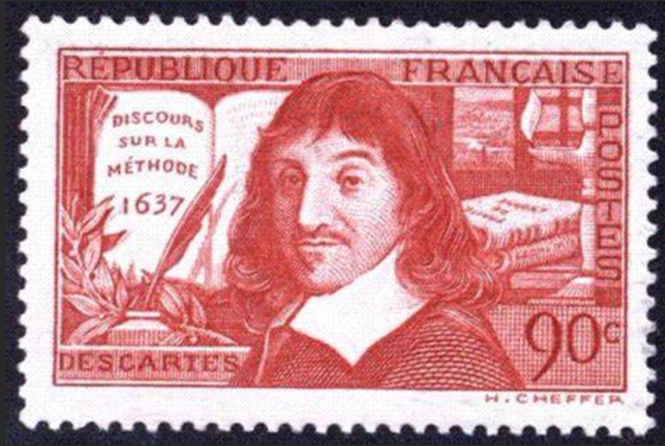
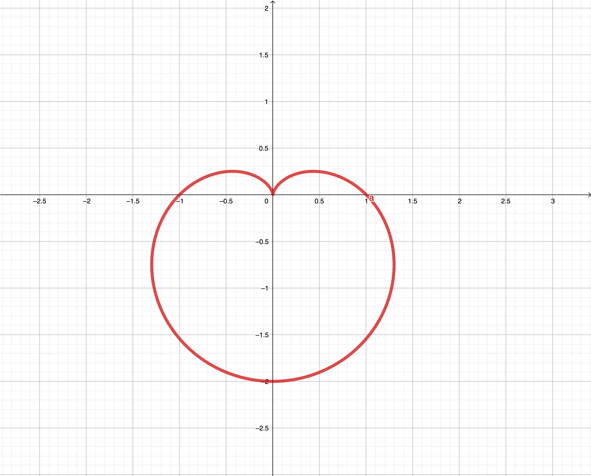

大人物，小故事！
大舞台，小板凳！

## 我思故我在(Cogito ergo sum. I think therefore I am)

---

笛卡兒(Rene Descartes,1596-1650 )名言。主張對每一件事情都進行**懷疑**。

  笛卡兒說：
  >  - 「當我們作夢時，以為自己處於真實世界之中。那麼，我們清醒時與作夢時的感覺之間有何區別？」
  
  
  >  - 「當我仔細思索這個問題時，我發現人在清醒時與作夢時的狀態並不一定有所分別。」
  
  
  >  - 「你怎能確定你的生命不是一場夢？」
  
  
  > -  「一切迄今我以為最接近於『真實』的東西都來自感覺和對感覺的傳達。但是，我發現這些東西常常欺騙我們。因此，唯一明智的是：再也不完全信賴那些哪怕僅僅欺騙過我們一次的東西。」

  對於「科學」為主的理性知識，笛卡兒認為看起來似乎是確定的，但也是可以被「懷疑」的。譬如為何1 + 1 = 2 ？**連全知全能的上帝都要加以懷疑。**

  笛卡兒說：
  > -  「我願意假定，一切真理的源泉不是仁慈的上帝，而是一個同樣狡猾、同樣有法力的惡魔，施盡全身的解數，要將我引上歧途。我願假定，天空、空氣、土地、形狀、色彩、聲音和一切外在事物都不過是那欺人的夢境的呈現，而那個惡魔就是要利用這些來換取我的輕信。我要這樣來觀察自己：好像我既沒有雙手，也沒有雙眼，也沒有肉體，也沒有血液，也沒有一切的器官，而僅僅是糊塗地相信這些的存在。」

+於是，笛卡兒完成了懷疑一切，可是，在此同時，有一件事卻是不可被懷疑的，那就是：

**我正在「懷疑」這件事，也就是「懷疑本身」。**

換句話說， 我正在思考。既然肯定我在思考，就必須肯定思想的主體我必然是某種東西，此便肯定了我這主體是存在著。如果肯定一個正在思考的東西正在思考，卻不肯定他的存在，顯然是矛盾的。由此，笛卡兒找到一個堅實的立足點：

**「我思故我在」(Cogito ergo sum)。**

笛卡兒將此作為形上學中最基本的出發點，從這裡他得出結論，「我」必定是一個獨立於肉體的、在思維的東西。笛卡兒還試圖從該出發點證明出上帝的存在。他認為，我們都具有對完美實體的概念，由於我們不可能從不完美的實體上得到完美的概念，因此有一個完美實體──既上帝──必定存在。

## 笛卡兒生平

---

笛卡兒出身於一個地位較低的貴族家庭，父親Joachim是布列塔尼議會的議員。1歲多時母親患肺結核去世，而他也受到傳染，造成體弱多病。母親去世後，父親移居他鄉並再婚，而把笛卡兒留給了他的外祖母帶大，自此父子很少見面，但是父親一直提供金錢方面的幫助，使他能夠受到良好的教育。

　　在他8歲時笛卡兒就進入拉夫賴士(La Flèche)的耶穌會學校接受教育，受到良好的古典學以及數學訓練。1613年到普瓦捷大學學習法律，1616年畢業。畢業後笛卡兒一直對職業選擇不定，又決心游歷歐洲各地，專心尋求“世界這本大書”中的智慧。因此他於1618年在荷蘭入伍，隨軍遠游。

　　笛卡兒對結合數學與物理學的興趣，是在荷蘭當兵期間產生的。1618年11月10日，他偶然在路旁公告欄上，看到用佛萊芒語提出的數學問題徵答。這引起了他的興趣，並且讓身旁的人，將他不懂的佛萊芒語翻譯成拉丁語。這位身旁的人就是大他八歲的以撒‧貝克曼(Isaac Beeckman)。貝克曼在數學和物理學方面有很高造詣，很快成為了他的心靈導師。4個月後，他寫信給貝克曼，“你是將我從冷漠中喚醒的人...”，並且告訴他，自己在數學上有了4個重大發現。可惜的是這些發現現在已經無從知道了。

　　1621年笛卡兒退伍，併在1628年移居荷蘭，在那裡住了20多年。在此期間，笛卡兒專心致力於哲學研究，並逐漸形成自己的思想。他在荷蘭寫作且發表了多部重要的文集，包括了《方法論》、《形而上學的沉思》(Méditations métaphysiques)和《哲學原理》(Les Principes de la philosophie)等。

　　1622年，當他26歲時，笛卡兒變賣掉父親留下的資產，用4年時間游歷歐洲，其中在義大利住了2年，隨後定居巴黎。

　　1649年笛卡兒受瑞典女王之邀來到斯德哥爾摩，但不幸在這片“熊、冰雪與岩石的土地”上得了肺炎，併在1650年2月去世。1663年他的著作在羅馬和巴黎被列入禁書之列。1740年，巴黎才解除了禁令，那是為了對當時在法國流行起來的牛頓世界體系提供一個替代的東西。

## 數學中的情人

---

十七世紀出生於法國的笛卡兒是第一個發現直角坐標的人，這對後人的貢獻相當大，可惜一生窮困潦倒。一直到52歲，仍一直默默無名。當時法國流行黑死病，笛卡兒不得不逃離， 流浪到瑞典。某天，他在市場乞討時，有一群少女經過，其中一名少女發現他的口音不像是瑞典人，她對笛卡兒非常好奇，於是上前問他： 「你從哪來的啊?」「法國。」「你是做什麼的啊?」「我是數學家。」這名少女叫克麗絲汀，18歲，是位公主，她和其它女孩不同，克麗絲汀不喜歡文學，而是熱衷數學。當她聽到笛卡兒說明身份後，感到相當大的興趣，於是把笛卡兒邀請回宮。笛卡兒就成了她的數學老師，將一生的研究傾囊相授，而克麗絲汀的數學也日益進步，直角坐標當時也只有笛卡兒這對師生才懂。後來，他們之間產生了不一樣的情愫，發生喧騰一時的師生戀。然而這件事傳到國王耳中，讓國王相當憤怒！下令將笛卡兒處死，克麗絲汀以自縊相逼，國王害怕寶貝女兒真的會想不開，於是將笛卡兒放逐回法國，也將克麗絲汀軟禁。笛卡兒一回到法國沒多久就染上黑死病，躺在床上奄奄一息。笛卡兒不斷地寫信到瑞典給克麗絲汀，都被國王攔截沒收。克麗絲汀也就不曾收到過笛卡兒寫來的信……就在笛卡兒快要死去的時候，他寄出了第13封信，當他寄出去沒多久後就氣絕身亡。這封信的內容只有短短的一行：

$$r = a(1 - \sin \theta)$$

 國王攔截到這封信後拆開看，發現並不是一如往常的情話。於是找來城裡所有科學家來研究，但都沒有任何人能夠解開。國王心想，反正笛卡兒就快要死了，而且公主被軟禁時都悶悶不樂，便把信交給克麗絲汀。當克麗絲汀收到這封信時，雀躍無比，她很高與她的愛人還是想念她。她立刻動手研究這行字的秘密。沒多久就解出來了，用的就是「直角坐標圖」。當$\theta = 0$度時，$r=a(1-0)=a$，當$ θ=90$度時，$r=a(1-1)=0$，當$ θ=180$度時，$r=a(1-0)=a$當$ θ=270$度時，$r=a(1+1)=2a$ 其中$a$為四截距的比值，再將所有的點連接起來...就是有名的**心臟線。**
 
 

 
## 參考文獻

1. https://wiki.mbalib.com/zh-tw/%E5%8B%92%E5%86%85%C2%B7%E7%AC%9B%E5%8D%A1%E5%B0%94 
2. http://math1.ck.tp.edu.tw/%E6%9E%97%E4%BF%A1%E5%AE%89/%E5%AD%B8%E8%A1%93%E7%A0%94%E7%A9%B6/%E6%95%B8%E5%AD%B8%E5%B0%88%E9%A1%8C/%E6%B7%BA%E8%AB%87%E5%B9%BE%E5%80%8B%E6%95%B8%E5%AD%B8%E8%A7%A3%E9%A1%8C%E7%9A%84%E7%AD%96%E7%95%A5.doc

 
 
