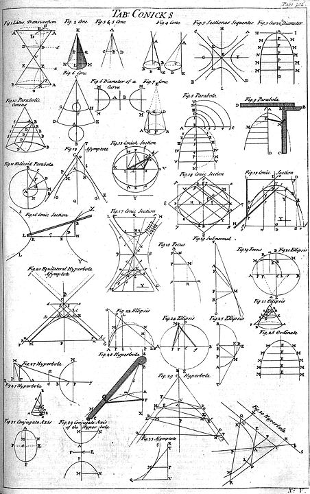

[Quote](https://zh.wikipedia.org/wiki/%E5%9C%86%E9%94%A5%E6%9B%B2%E7%BA%BF)

> 圓錐曲線（英語：conic section），又稱圓錐截痕、圓錐截面、二次平面曲線，
是數學、幾何學中通過平切圓錐（嚴格為一個正圓錐面和一個平面完整相切）得到
的曲線，包括圓，橢圓，拋物線，雙曲線及一些退化類型。

圓錐曲線在約公元前200年時就已被命名和研究了，其發現者為古希臘的數學家阿波羅尼奧斯，
那時阿波羅尼阿斯對它們的性質已做了系統性的研究。

圓錐曲線應用最廣泛的定義為（橢圓，拋物線，雙曲線的統一定義）：動點到一定點（焦點）
的距離與其到一定直線（準線）的距離之比為常數（離心率$\displaystyle e$)的點的集合是
圓錐曲線。對於$\displaystyle 0<e<1$得到橢圓，對於$\displaystyle e=1$得到拋物線，
對於$\displaystyle e>1$得到雙曲線。

