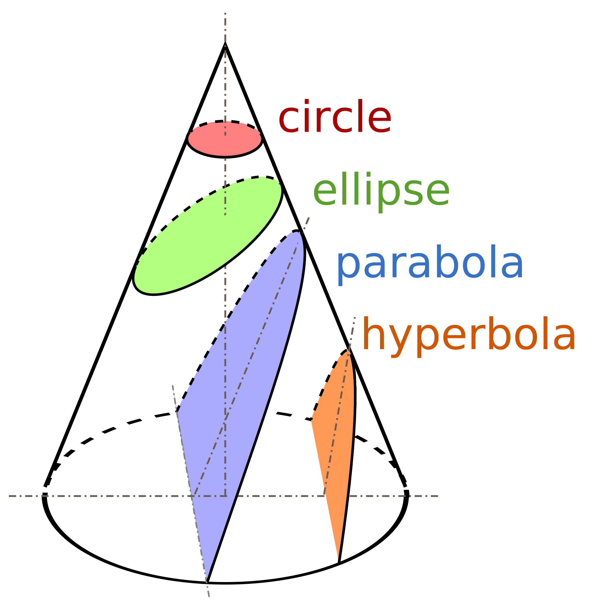
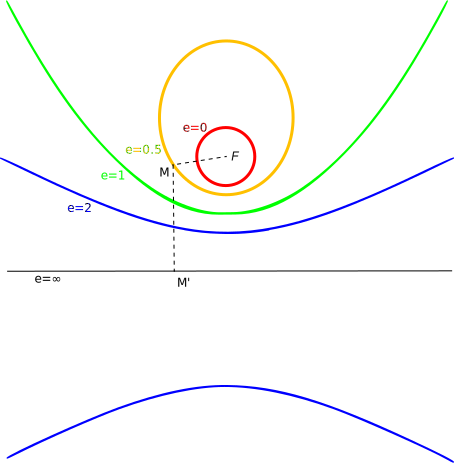
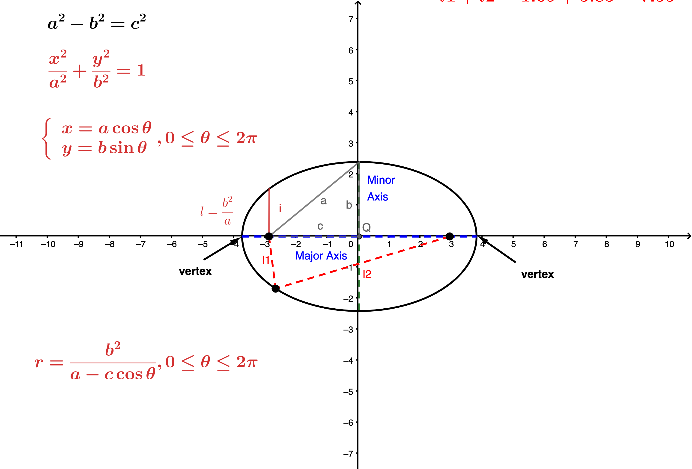
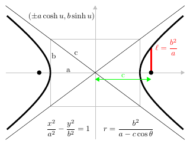
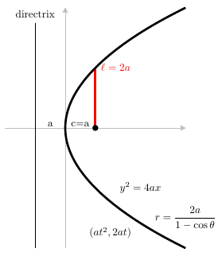

[Quote](https://zh.wikipedia.org/wiki/%E5%9C%86%E9%94%A5%E6%9B%B2%E7%BA%BF)

> 圓錐曲線（英語：conic section），又稱圓錐截痕、圓錐截面、二次平面曲線，
是數學、幾何學中通過平切圓錐（嚴格為一個正圓錐面和一個平面完整相切）得到
的曲線，包括圓，橢圓，拋物線，雙曲線及一些退化類型。

圓錐曲線在約公元前200年時就已被命名和研究了，其發現者為古希臘的數學家阿波羅尼奧斯(Apollonius)，
那時阿波羅尼阿斯對它們的性質已做了系統性的研究。

圓錐曲線應用最廣泛的定義為（橢圓，拋物線，雙曲線的統一定義）：動點到一定點（焦點）
的距離與其到一定直線（準線）的距離之比為常數（離心率$\displaystyle e$)的點的集合是
圓錐曲線。對於$\displaystyle 0<e<1$得到橢圓，對於$\displaystyle e=1$得到拋物線，
對於$\displaystyle e>1$得到雙曲線。

---

## 圓錐曲線的定義

### 作為圓錐面和平面的交線 

如上圖所示，有三種圓錐曲線：橢圓(ellipse)、拋物線(parabola)和雙曲線(hyperbola)。圓作為橢圓
的一種特殊形式可以看作橢圓。

  - 橢圓線：當平面切割圓錐面為一個閉合曲線時，該曲線為一個橢圓或者圓周；

  - 拋物線：當切割平面與圓錐面的母線平行時截得到的曲線；

  - 雙曲線：其它情形，相交曲線為雙曲線。

---

### 平面幾何定義

圓錐曲線在平面幾何中可以用到定點(焦點,focus)的距離等於常數倍的到定直線(對稱軸, directrix)的距離的所有點的軌跡。
這個常數定義為離心率(eccentricity $e$)。

  - 當$0<e<1$時為橢圓;

  - 當$e=1$ 時為拋物線;

  - 當$e>1$時為雙曲線。

---

## 圓錐曲線在直角坐標下的標準方程

  - 橢圓：$\dfrac{x^2}{a^2} + \dfrac{y^2}{b^2} = 1$

  

  - 雙曲線：$\dfrac{x^2}{a^2} - \dfrac{y^2}{b^2} = 1$

  

  - 拋物線：$y=4ax$

  

---

## 圓錐曲線的一般形式及其類型判定方法

圓錐曲線的一般形式為：

$$
  Ax^2 + Bxy + Cy^2 + Dx + Ey + F = 0
$$

寫為矩陣的形式為：

\begin{equation}
  \begin{pmatrix} x & y \end{pmatrix} \begin{pmatrix} A & B/2 \newline B/2 & C \end{pmatrix} 
  \begin{pmatrix} x \\newline y \end{pmatrix} + \begin{pmatrix} D & E \end{pmatrix} \begin{pmatrix} x \newline y 
  \end{pmatrix} + F = 0
\end{equation}

或者

\begin{equation}
    \begin{pmatrix} x & y & 1 \end{pmatrix} \begin{pmatrix} A & B/2 & D/2 \newline B/2 & C & E/2 \newline D/2 & E/2 & F\end{pmatrix} \begin{pmatrix} x \newline y \newline 1 \end{pmatrix} = 0
\end{equation}

