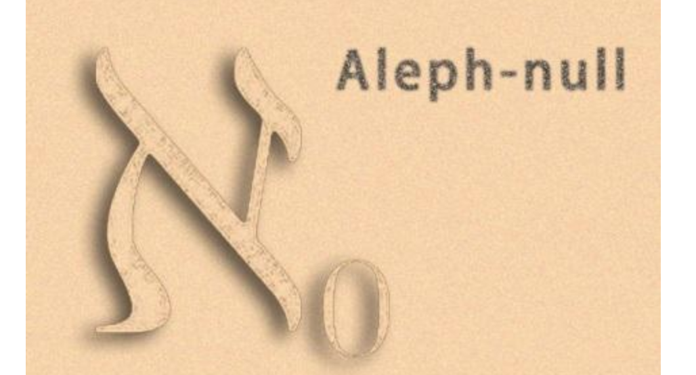

以下三篇小短文介紹無窮和康托的故事，希望對您有所幫助！

</a>

+ [無窮大也能「比較」大小！（上）——超窮理論的歷史故事!](https://kknews.cc/science/4vrv49g.html)

+ [無窮大也能「比較」大小！（中）——你真的理解無窮大嗎？](https://kknews.cc/science/nvzv2g8.html)

+ [無窮大也能「比較」大小！（下）——超窮數理論！](https://kknews.cc/essay/y2q2j9k.html)
