This paper mainly concentrated on the electricity and magnetism: 
statics and its visualization. Gradient, divergence and curl are 
visualized. Hopefully, this paper will give  visualizations of many 
mathematical and physical concepts.

# Electricity

## Single Charge
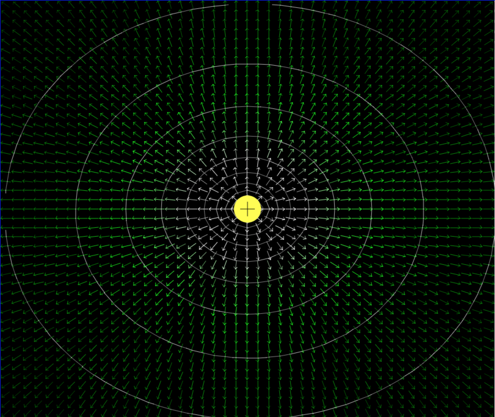

## Double Charge
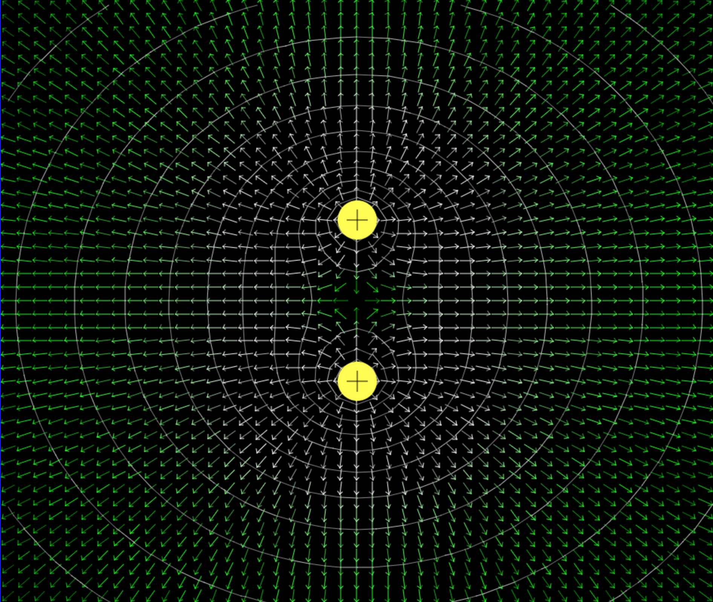

## Dipole Charge
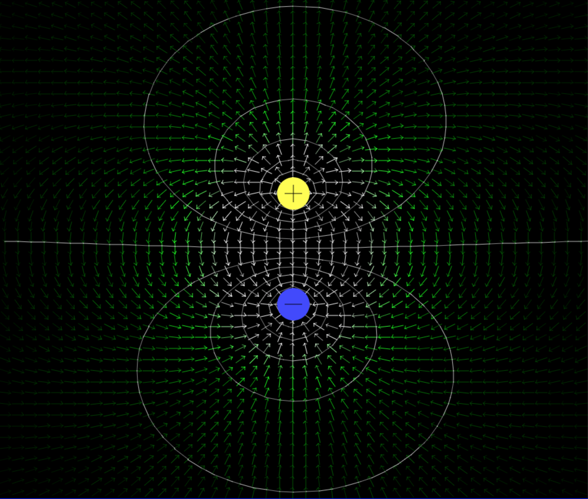

## Quadrupole Charge

## Electric Line

## Electric Lines
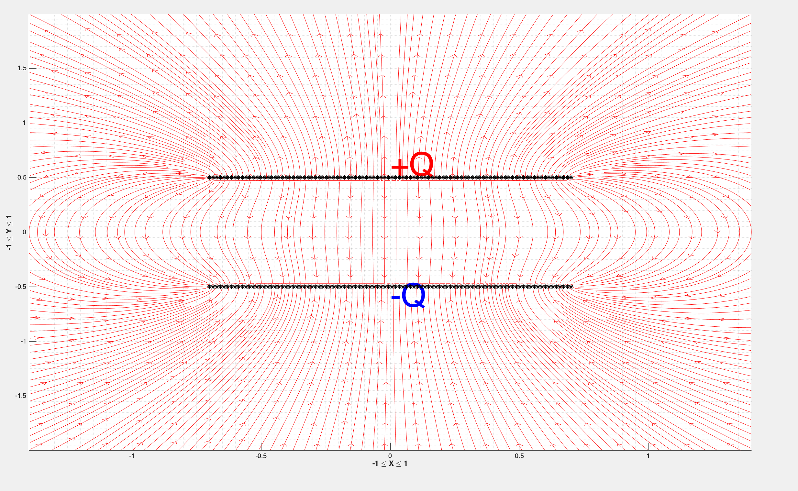

## Electric Potential
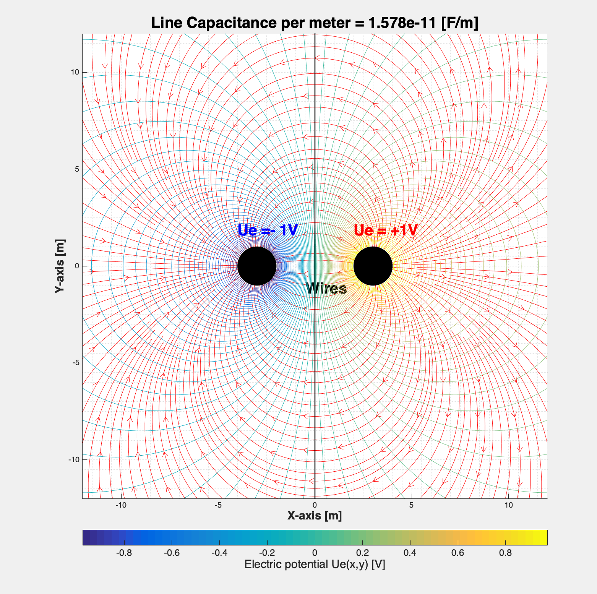
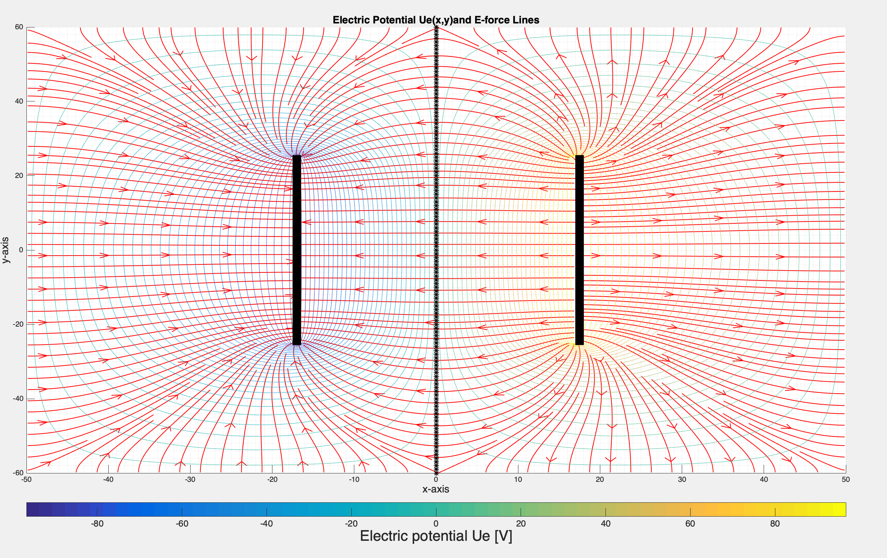

## Dipole 

## Quadrupole 

## Charge Plate Pair
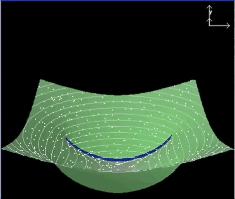

## 3D Point Charge

## 3D Dipole Charge
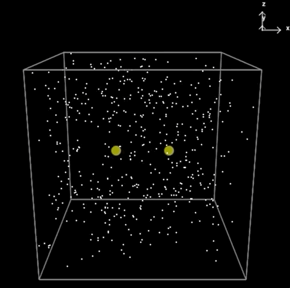

## 3D  Charge Plate Pair

# Magnetism
## Current Line
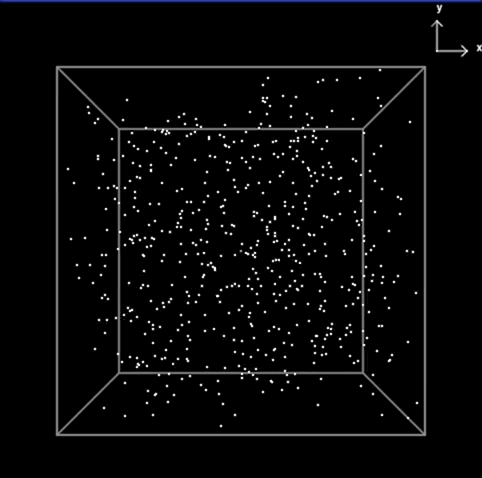

## Current Line Double

## Current Loop

## Current Loop Line
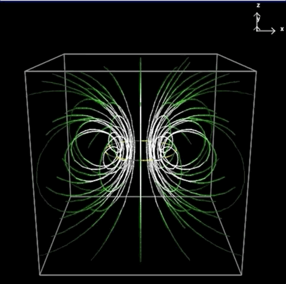

## Current Loop Opposing
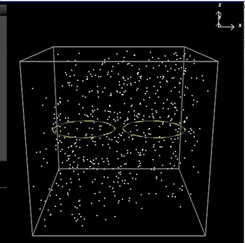

## Magnetic Sphere

# Vector Calculus
## Double Convergence
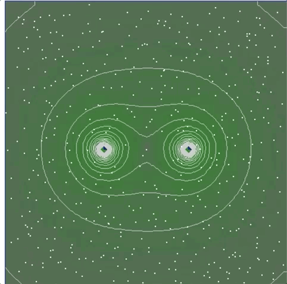

## Rotational Dipole
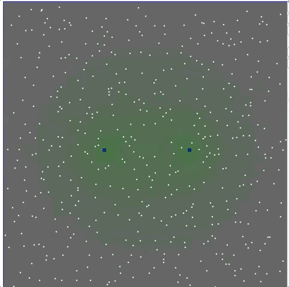

## Rotational Dipole Vector
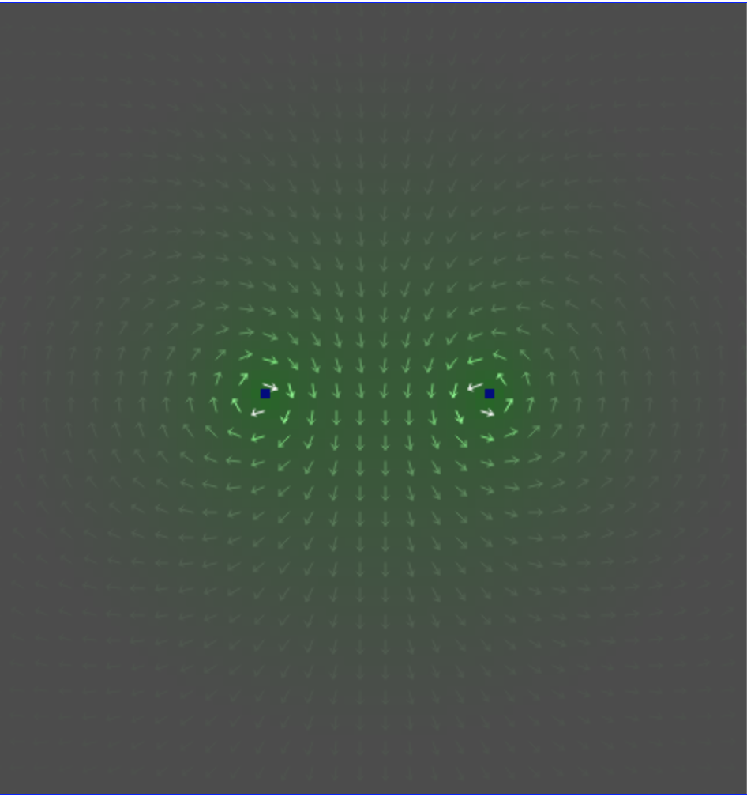

## Constant Rotation
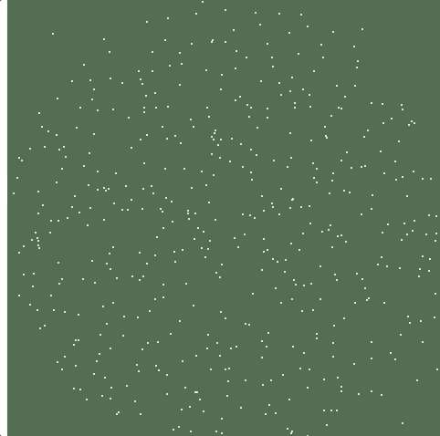

## Constant Rotation Vector
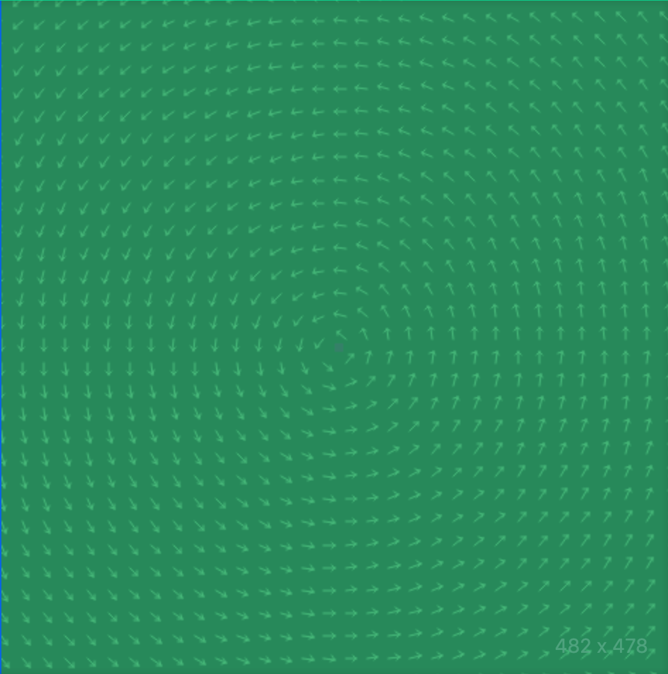

## Gradient

## Divergence

## Curl

## E-Force Line
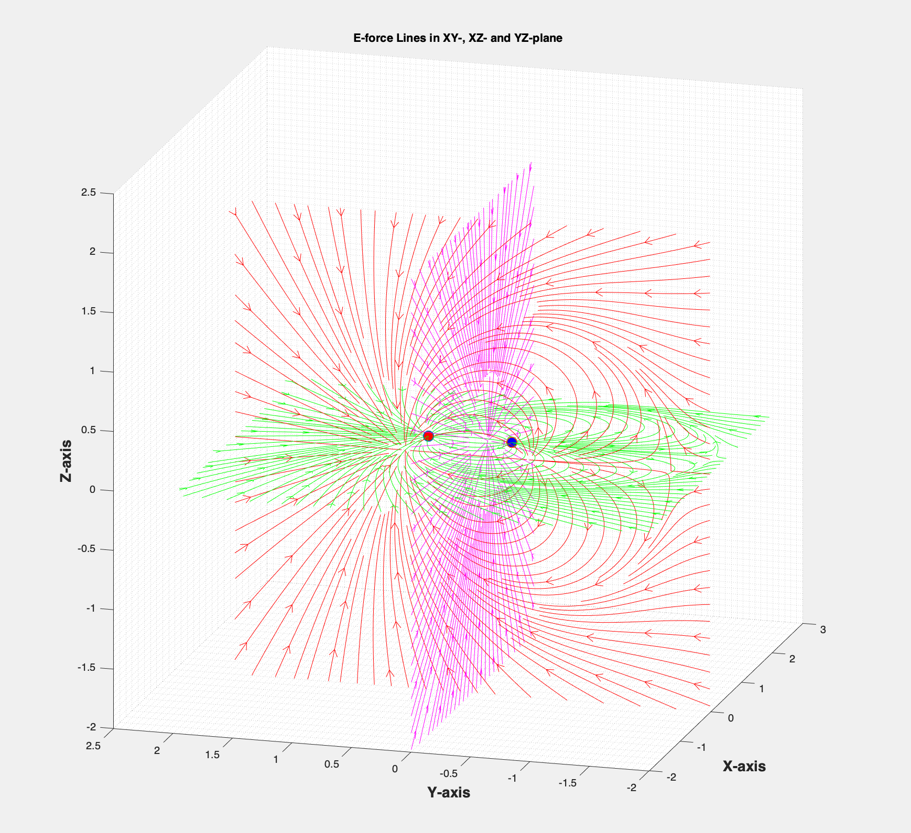

# Conclusion

# References

