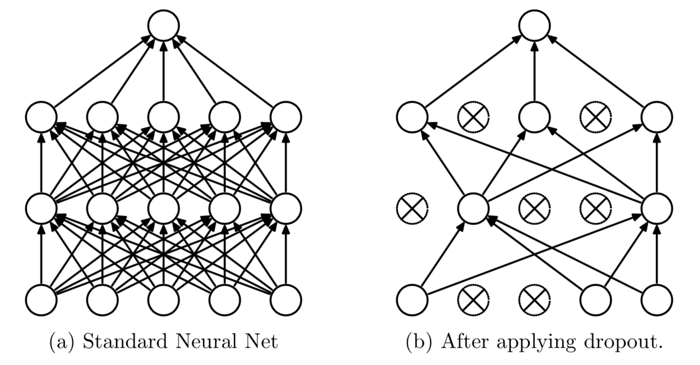

This talk is about the regularization methods in deep learning.

## Methods for prohibiting over-fitting 

* 提前终止
* L1 and L2 regularization methods
* Soft weight sharing
* dropout

## 为什么Dropout可以解决过拟合现象

1. **平均作用** 每次应用Dropout时，相当于从原始网络中找到一个苗条(slim)的网络，如下图所示
||
|:--:|
|* Dropout Neural Network *|
2. **减少神经元之间复杂的共适应关系**
3. **Dropout类似与性别在生物进化中的角色**
