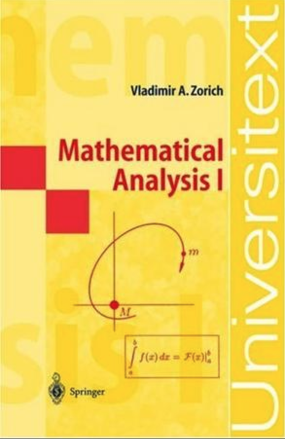
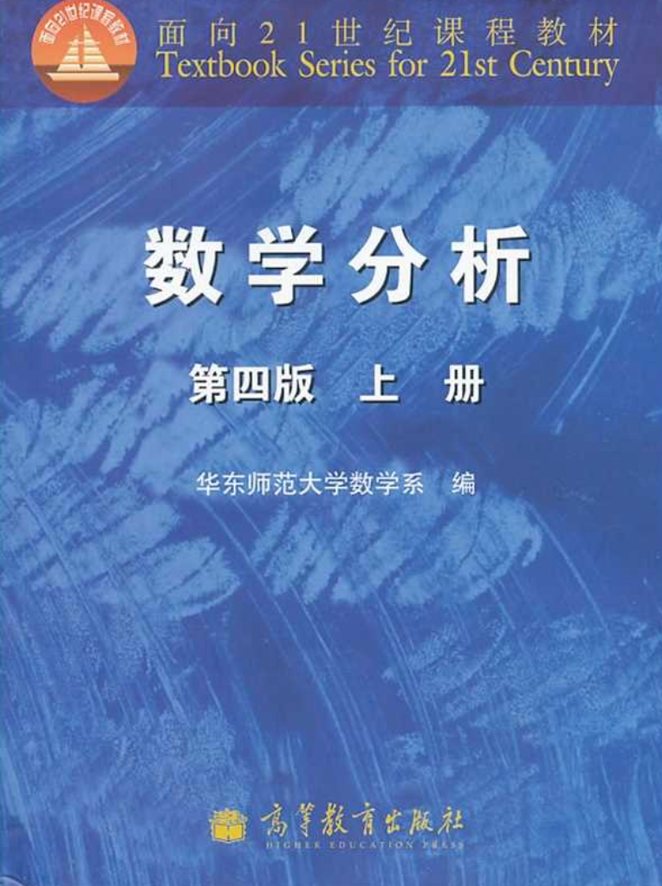

This Lectures basically based on the books below:

Real Analysis I
======
1. Introduction.
[Download lecture notes here](http://wuguoning.github.io/files/introduction.pdf)
2. Limit of Sequence.
[Download lecture notes here](http://wuguoning.github.io/files/limits.pdf)
3. Continuity.
[Download lecture notes here](http://wuguoning.github.io/files/continuity.pdf)
4. Derivative of One Variable Function.
[Download lecture notes here](http://wuguoning.github.io/files/derivative.pdf)
5. Primitive.
[Download lecture notes here](http://wuguoning.github.io/files/primitive.pdf)

Real Analysis II
======
1. Definite Integral.
[Download lecture notes here](http://wuguoning.github.io/files/integral.pdf)
2. Multiple Variable Function.
[Download lecture notes here](http://wuguoning.github.io/files/mul_var_fun.pdf)
2. Differentiation of Multiple Variable Function.
[Download lectures here](http://wuguoning.github.io/files/diff_multi_var.pdf)

Real Analysis III
======

