这部分主要介绍笛卡尔解析几何。

## 教学日历:

  + [2019-2020-2高等数学A](http://wuguoning.github.io/files/calculus/docs/2019-2020-2-A-syllabus.docx)

  + [2019-2020-2高等数学B](http://wuguoning.github.io/files/calculus/docs/2019-2020-2-B-syllabus.pdf)

## 目录
+ [第一节 向量及其运算](#cotes1)
+ [第二节 数量积、向量积、混合积](#cotes2)
+ [第三节 空间平面](#cotes3)
+ [第四节 空间直线及其方程](#cotes4)
+ [第五节 旋转曲面、柱面和锥面](#cotes5)
+ [第六节 三元二次曲面](#cotes6)
+ [第七节 空间曲线](#cotes7)

### 第一节 向量及其运算
---

📌**1. 向量和标量**

“速度”和“位移”是向量，“速率”和“长度”是标量。几何上向量是有大小和方向的有向线段。向量描述事物间的位移和相对位置，向量不包括“位置”的概念。“点”有位置，但没有大小和厚度。

向量的表示：$\bf{a, b, c,} \cdots $

或者: $\vec{a}, \vec{b}, \vec{c}, \cdots$

两个向量的夹角:  $<\widehat{\bf{a},\bf{b}}> = \phi$

---

📌**2. 向量的线性运算**

**向量的加法和减法**：

  <a href="https://www.geogebra.org/classic/rjccuqws">
  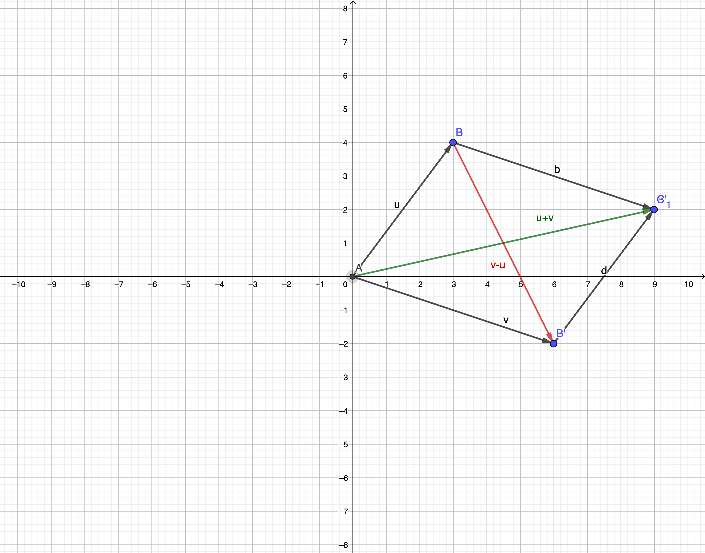
  </a>

向量的加法符合以下规律：

  + 交换律： $\bf{a + b = b + a} $;

  + 结合律：$\bf{(a + b) + c = a + (b + c)}$   

**数乘**

向量与数的乘积满足以下运算规律：

  + 结合律：$\lambda (\mu \bf{a}) = (\lambda \mu)\bf{a}$;

  + 分配律：$(\lambda + \mu)\bf{a} = \lambda \bf{a} + \mu \bf{a}$,  $\lambda (\bf{a + b}) = \lambda \bf{a} + \lambda \bf{b}$.

---

 **定理1**
设向量$\bf{a} \ne \bf{0}$，则向量$\bf{b}$平行于$\bf{a}$的充分必要条件为：$\bf{b} = \lambda \bf{a}$.

---

**📌3. 空间直角坐标系**

在空间取定一定点$O$和三个两两相互垂直的单位向量$\bf{i, j, k}$就确定了三条都以$O$为原点的两两相互垂直的数轴，依次记为$x$轴(横轴)，$y$轴(纵轴)，$z$轴(竖轴)，统称为**坐标轴**。它们构成空间的一个**直角坐标系**，如下图所示：

  <a href="https://www.geogebra.org/classic/pmheaygy">
    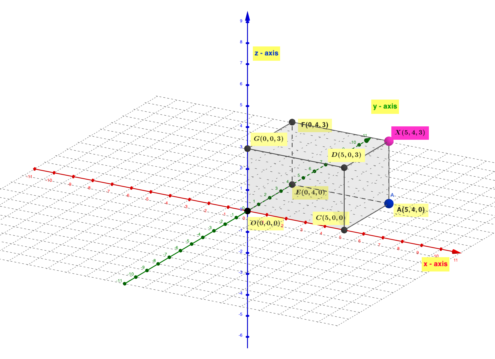
  </a>

三条坐标轴的任意两条可以确定一个平面，这样确定的三个坐标平面统称为**坐标平面**。$x$轴及$y$轴所确定的坐标平面叫做$xOy$面等等。坐标平面把空间分割为8个**卦限**。如下图所示：

  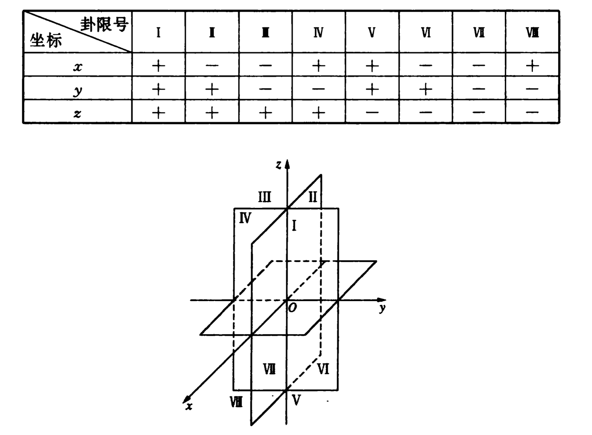

---

**📌4. 向量坐标表示**

$$M \leftrightarrow \bf{r} \leftrightarrow \vec{OM} = x\bf{i} + y\bf{j} + z\bf{k} \leftrightarrow (x, y, z) $$

例如向量：$\bf{r} = \vec{OM} = 3\bf{i} + 4\bf{j} + 5\bf{k}$

  <a href="https://www.geogebra.org/classic/umvuxkaj">
    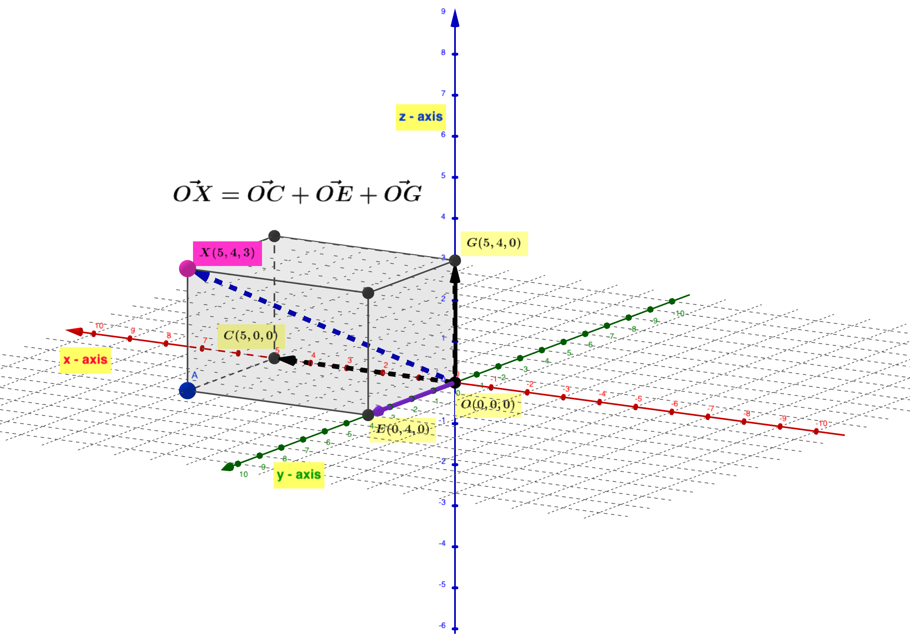
  </a>

$n$维空间向量的Enstein表示为：

$M \leftrightarrow \bf{r} \leftrightarrow \vec{OM} = x^1\bf{e_1} + x^2\bf{e_2} + \cdots +  x^n\bf{e_n} \leftrightarrow (x^1, x^2, \cdots, x^n) = x^i \bf{e_i}$

---

**📌5. 利用坐标作向量的线形运算、向量的模、方向角、投影**

设向量$\bf{a} = a_x\bf{i} + a_y\bf{j} + a_z\bf{k}$, $\bf{b} = b_x\bf{i} + b_y\bf{j} + b_z\bf{k}$，则有：
  
  + $\bf{a} + \bf{b}= (a_x + b_x)\bf{i} + (a_y + b_y)\bf{j} + (a_z + b_z)\bf{k}$;
  
  + $\bf{a} - \bf{b}= (a_x - b_x)\bf{i} + (a_y - b_y)\bf{j} + (a_z - b_z)\bf{k}$;
  
  + $\lambda\bf{a} = (\lambda a_x )\bf{i} + (\lambda a_y )\bf{j} + (\lambda a_z )\bf{k}$;
  
  + $(a_x, a_y, a_z) + (b_x, b_y, b_z) = (a_x+b_x, a_y+b_y, a_z+b_z)$;

  + $(a_x, a_y, a_z) - (b_x, b_y, b_z) = (a_x-b_x, a_y-b_y, a_z-b_z)$;

  + $\lambda (a_x, a_y, a_z)  = (\lambda a_x, \lambda a_y, \lambda a_z)$

  <a href="https://www.geogebra.org/3d/vdheapjg">
    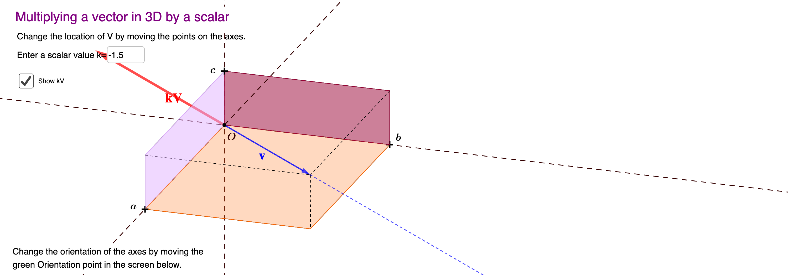
  </a>

 

---
**例子**
已知两点$A(x_1, y_1, z_1), B(x_2, y_2, z_2)$以及$\lambda \ne -1$，在直线$AB$上求点$M$，使
$$\vec{AM} = \lambda \vec{MB}$$

⬇️ Click to expand!

解： $\vec{AM} = \vec{OM} - \vec{OA}$, $\vec{MB} = \vec{OB} - \vec{OM}$，所以有：

$$\vec{OM} - \vec{OA} = \lambda (\vec{OB} - \vec{OM})$$，

故

$$\vec{OM} = \dfrac{1}{1+\lambda}\left(\vec{OA} + \lambda \vec{OB}\right)$$

将坐标带入得到：

$$\vec{OM} = \left(\dfrac{x_1 + \lambda x_2}{1 + \lambda}, \dfrac{y_1 + \lambda y_2}{1 + \lambda}, \dfrac{z_1 + \lambda z_2}{1 + \lambda}\right)$$

---
**向量长度**

设向量$\bf{a} = (a_x, a_y, a_z)$，则向量的长度为：

$$\|\bf{a}\| = \sqrt{a_x^2 + a_y^2 + a_z^2}$$

---
**方向余弦**

$$\left(\cos \alpha, \cos \beta, \cos \gamma\right) = \left(\dfrac{a_x}{\|a\|}, \dfrac{a_y}{\|a\|}, \dfrac{a_z}{\|a\|}\right) = \dfrac{1}{\|a\|}\left(a_x, a_y, a_z\right)$$

$$\cos^2 \alpha + \cos^2 \beta + \cos^2 \gamma = \dfrac{\|a\|^2}{\|a\|^2} = 1 $$

---
**方向角**

上式中的$\alpha, \beta, \gamma$称为向量$\bf{a}$的方向角。

---
**例子**
已知两点$M_1(2, 2, \sqrt{2}), M_2(1, 3, 0)$，计算向量$\vec{M_1 M_2}$的模、方向余弦和方向角。

⬇️ Click to expand!

解： 
$$\|\vec{M_1 M_2}\| = \|(-1, 1, -\sqrt{2})\| = 2$$

$$\left(\cos \alpha, \cos \beta, \cos \gamma\right) = \left(-\dfrac{1}{2}, \dfrac{1}{2}, -\dfrac{\sqrt{2}}{2}\right)$$

$$\alpha = \dfrac{2\pi}{3}, \beta = \dfrac{\pi}{3}, \gamma = \dfrac{3\pi}{4}$$

---
**投影**

  <a href="https://www.geogebra.org/graphing/zg5s38n4">
    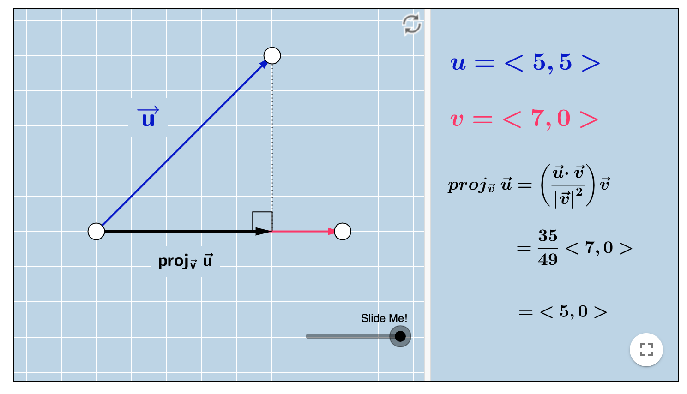
  </a>

 

---
   + 同济大学高等数学书中的投影是一个标量，也就这上图中的分数$\dfrac{35}{49}$。其实，向量$Proj_{\vec{v}}\vec{u}$若看成一个向量更符合实际的几何意义。
 
   + 若按照同济大学教科书，投影的计算方法为：$$Proj_{\vec{v}}\vec{u} = \dfrac{\vec{u}\cdot \vec{v}}{\|\vec{v}\|}$$

---
📚 
**第一次作业:**

1. 已知两点$M_1(0, 1, 2)$和$M_2(1, -1, 0)$，试用坐标表示向量$\vec{M_1M_2}, -2\vec{M_1M_2}$.

2. 求点$P(a, b, c)$关于(1)各坐标平面;(2)各坐标轴;(3)坐标原点的对称点的坐标。

3. 证明以三点$A(4, 1, 9), B(10, -1, 6), C(2, 4, 3)$为顶点的三角形是等腰直角三角形。

4. 设已知两点$M_1(4, \sqrt{2}, 1)$和$M_2(3, 0, 2)$，计算向量$\vec{M_1M_2}$的模、方向余弦和方向角。

---

### 第二节 数量积、向量积、混合积
---
**📌 数量积**
由物理学知识知道：物体在常力$\bf{F}$的作用下产生了直线位移$\bf{S}$，则力所做的功为：

$$W = \|\bf{F}\|\|\bf{S}\|\cos <\widehat{\bf{F},\bf{S}}>$$

受此启发，我们定义向量 $\bf{a}$ 和 $\bf{b}$ 的数量积(内积, scalar product)为: 

$\|\bf{a}\|\|\bf{b}\|\cos <\widehat{\bf{a},\bf{b}}>$

记为：

$$\bf{a} \cdot \bf{b} = \|\bf{a}\|\|\bf{b}\|\cos <\widehat{\bf{a},\bf{b}}>$$

**由定义可以推出数量积具有以下性质**：

  + $\bf{a} \cdot \bf{a} = \|a\|^2$;

  + $\bf{a} \cdot \bf{b} = \bf{b} \cdot \bf{a} $;

  + $(\bf{a} + \bf{b} ) \cdot \bf{c} = \bf{a} \cdot \bf{c} + \bf{b} \cdot \bf{c} $;

  + $(\lambda\bf{a}) \cdot \bf{b} = \lambda (\bf{a} \cdot \bf{b} )$.

**数量积在坐标下的计算方法**

设$\bf{a} = (a_x, a_y, a_z), \bf{b} = (b_x, b_y, b_z)$，则有：
$$\bf{a} \cdot \bf{b} = (a_x \bf{i} + a_y \bf{j} + a_z \bf{k}) \cdot (b_x \bf{i} + b_y \bf{j} + b_z \bf{k})$$

⬇️ Click to expand!

$
\begin{split} & = a_xb_x\bf{i}\cdot\bf{i} + a_xb_y\bf{i}\cdot\bf{j} + a_xb_z\bf{i}\cdot\bf{k} \newline
               & +  a_yb_x\bf{j}\cdot\bf{i} + a_yb_y\bf{j}\cdot\bf{j} + a_yb_z\bf{j}\cdot\bf{k} \newline
               & + a_zb_x\bf{k}\cdot\bf{i} + a_zb_y\bf{k}\cdot\bf{j} + a_zb_z\bf{k}\cdot\bf{k}
\end{split}
$

$=(a_xb_x + a_yb_y + a_zb_z)$

下图展示了向量的数量积概念。

  <a href="https://www.geogebra.org/graphing/ux9zuwtd">
    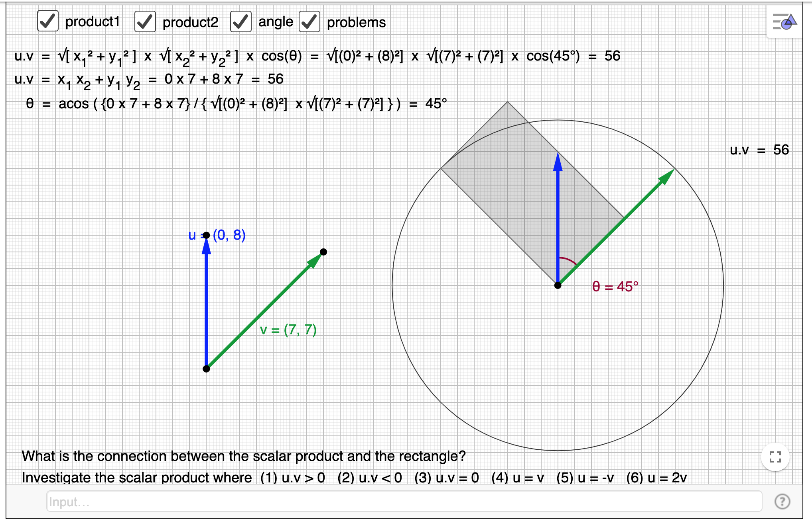
  </a>

 

---
**例子**
已知三点$M(1,1,1), A(2,2,1), B(2,1,2)$，求$\angle{AMB}$

Click to expand!

$\cos \angle{AMB} = \dfrac{\vec{MA} \cdot \vec{MB}}{\|\vec{MA}\|\|\vec{MB}\|} = \dfrac{1}{\sqrt{2}\sqrt{2}} = \dfrac{1}{2}$

所以有，
$$\angle{AMB} = \dfrac{\pi}{3}$$

---

**📌2. 两个向量的向量积**

 > “Give me a fulcrum, and I shall move the world!”

 > "给我一个支点我将反转地球！"-阿基米德。

设$\bf{O}$为一根杠杆的支点。有一个力$\bf{F}$作用在这根杠杆的$P$点处夹角为$\theta$，由力学规定，力$\bf{F}$对支点$\bf{O}$的力矩是一个向量$\bf{M}$，该向量的长度为：

$\|\bf{M}\| = \|\vec{OP}\|\|\bf{F}\|\sin <\widehat{\vec{OP}, \bf{F}}> $

$\bf{M}$所在的方向垂直于$\vec{OP}$和$\bf{F}$所决定的平面，它的方向为按照右手规则从$\vec{OP}$以不超过$\pi$的角度转向$\bf{F}$来确定。受此启发我们定义两个向量的向量积如下：

设$\bf{a}, \bf{b}$为两个向量，向量$\bf{a, b}$的**向量积**(**一个新的向量**)$\bf{a}\times\bf{b}$(cross product)定义为：

  + 大小: $\|\bf{a} \times \bf{b}\| = \|a\|\|b\|\sin <\widehat{\bf{a}, \bf{b}}>$;

  + 方向：垂直于向量$\bf{a, b}$所在的平面，方向为按右手法则从向量$\bf{a}$以不超过$\pi$的角转向向量$\bf{b}$.

下图直观展示了向量$\bf{a}\times\bf{b}$：

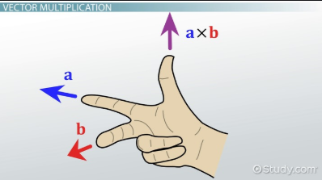
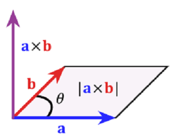

 

**向量积性质**

  + $\bf{a} \times \bf{a} = \bf{0}$;

  + $\bf{a} \times \bf{b} = -\bf{b} \times \bf{a}$;

  + $(\bf{a} + \bf{b}) \times \bf{c} = \bf{a} \times \bf{c} + \bf{b} \times \bf{c}$;

  + $ (\lambda \bf{a}) \times \bf{b} = \bf{a} \times (\lambda \bf{b})$.

**向量积在坐标下的计算方法**

设$\bf{a} = (a_x, a_y, a_z), \bf{b} = (b_x, b_y, b_z)$，则有：
$$\bf{a} \times \bf{b} = (a_x \bf{i} + a_y \bf{j} + a_z \bf{k}) \times (b_x \bf{i} + b_y \bf{j} + b_z \bf{k})$$

⬇️ Click to expand!

$\begin{split}
  = & a_xb_x\bf{i}\times\bf{i} + a_xb_y\bf{i}\times\bf{j} + a_xb_z\bf{i}\times\bf{k}\newline
    & +  a_yb_x\bf{j}\times\bf{i} + a_yb_y\bf{j}\times\bf{j} + a_yb_z\bf{j}\times\bf{k} \newline
    & + a_zb_x\bf{k}\times\bf{i} + a_zb_y\bf{k}\times\bf{j} + a_zb_z\bf{k}\times\bf{k}  \newline
    & \left(\bf{i}\times\bf{i} = \bf{j}\times\bf{j} = \bf{k}\times\bf{k} = \bf{0}\right)\newline
    & \left(\bf{i}\times\bf{j} = \bf{k}, \bf{j}\times\bf{k} = \bf{i}, \bf{k}\times\bf{i} = \bf{j}\right),\newline
    & \left(\bf{i}\times\bf{k} = -\bf{j},\bf{j}\times\bf{i} = -\bf{k},\bf{k}\times\bf{j} = -\bf{i}\right)
 \end{split}
$

$ = (a_yb_z - a_zb_y) \bf{i} + (a_zb_x - a_xb_z) \bf{j} + (a_xb_y-a_yb_x)\bf{k}$

写成代数中行列式的方式为：

$
\bf{a}\times\bf{b} = 
\left|\begin{array}{ccc}
i & j & k \newline
a_x & a_y & a_z \newline
b_x & b_y & b_z
\end{array}\right|
$

  <a href="https://www.geogebra.org/3d/kvtmmqex">
    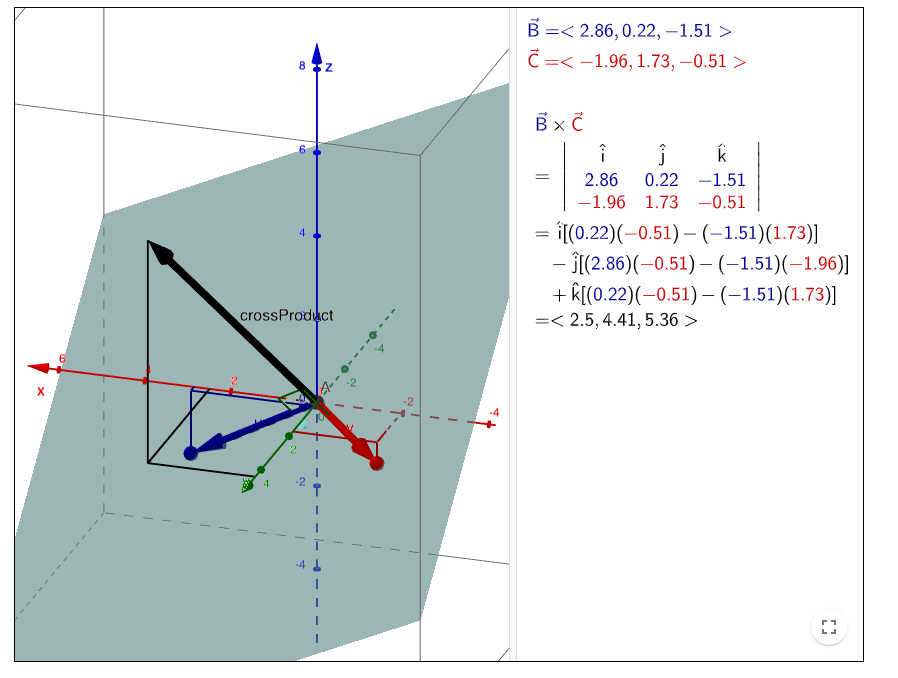
  </a>

 

---
**例子**
已知三角形的顶点分别是$A(1,2,3), B(3,4,5), C(2,4,7)$求三角形$ABC$的面积。

⬇️ Click to expand!

解：三角形的面积为$\dfrac{1}{2}\|\vec{AB} \times \vec{AC}\|$

---
**📌3.三个向量的混合积**
已知三个向量$\bf{a, b, c}$，先作两个向量$\bf{a}$和向量$\bf{b}$的向量积$\bf{a} \times \bf{b}$，再把得到的向量与第三个向量$\bf{c}$作数量积$(\bf{a} \times \bf{b}) \cdot \bf{c}$，这样得到的数称为向量$\bf{a, b, c}$的混合积。记作$[\bf{abc}]$。

**性质**

  +  $\bf{[abc]} = \bf{[bca]} = \bf{[cab]}$

**坐标下的计算方法**

$\bf{[abc]}  = \left|\begin{array}{ccc}
a_x & a_y & a_z \newline
b_x & b_y & b_z \newline
c_x & c_y & c_z
\end{array}\right|$

  <a href="https://www.geogebra.org/3d/kegrnjnc">
    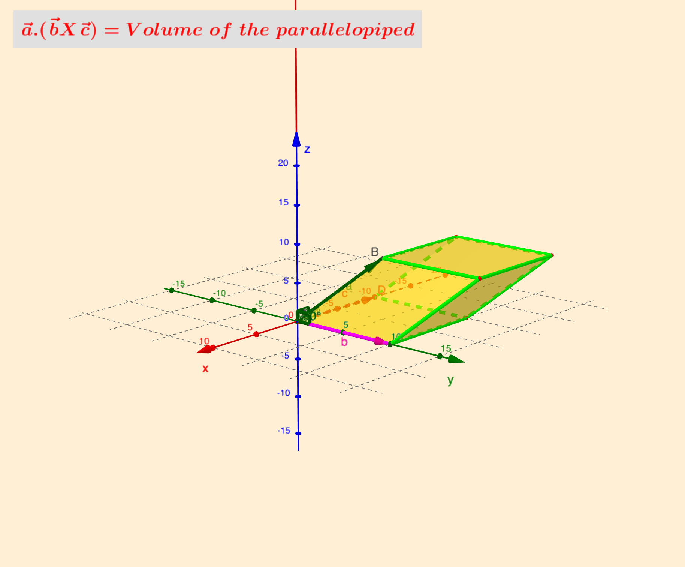
  </a>

 

---
**例子**
已知不在平面上的四点：$A_i(x_i, y_i, z_i), i=1,2,3,4$，求四面体$A_1A_2A_3A_4$的体积。

⬇️ Click to expand!

解：四面体的体积为$\bf{V} = \dfrac{1}{6}\left|\left[\vec{A_1A_2} \vec{A_1A_3} \vec{A_1A_4}\right]\right| = \pm \dfrac{1}{6} \left|\begin{array}{ccc} x_2 - x_1 & y_2 - y_1 & z_2 - z_1 \newline x_3 - x_1 & y_3 - y_1 & z_3 - z_1 \newline x_4 - x_1 & y_4 - y_1 & z_4 - z_1 \end{array} \right| $

 
---
 
📚**第二次作业:**

1. 设向量$\bf{a} = (3, -1, -2), \bf{b} = (1, 2, -1)$，求

  - $\bf{a} \cdot \bf{b}$;

  - $(-2\bf{a}) \cdot 3\bf{b}$;

  - $\bf{a} \times 2\bf{b}$;

  - $\bf{a, b}$夹角的余弦。

2. 已知$M_1(1, -1, 2), M_2(3, 3, 1), M_3(3, 1, 3)$，求与$\vec{M_1M_2}, \vec{M_2M_3}$同时垂直的单位向量。

3. 求向量$\bf{a} = (4, -3, 4)$在向量$\bf{b} = (2, 2, 1)$上的投影。

4. 已知向量$\bf{a} = (2, -3, 1), \bf{b} = (1, -1, 3), \bf{c}=(1, -2, 0)$，求

  - $\bf{(a \cdot b)c - (a \cdot c)b}$;

  - $\bf{(a + b)\times (b + c)}$;

  - $\bf{(a \times b) \cdot c}$.

---

### 第三节 空间平面

---
**1. 平面方程**

**📌点法式**

如果一个向量和平面垂直，我们称该向量为平面的一个法向量。如果已知平面上的一个点$M_0(x_0, y_0, z_0)$和任意一个法向量$\bf{n} = (A, B, C)$(法向量不唯一)我们可以建立该平面的方程。

假设$M(x, y, z)$为平面上的任意一点，则有$\bf{n} \cdot \bf{\vec{M_0 M}} = 0$，即

$$A(x - x_0) + B(y - y_0) + C(z - z_0) = 0$$

下图为点法式建立平面示意图

  <a href="https://www.geogebra.org/3d/wx2brsg7">
    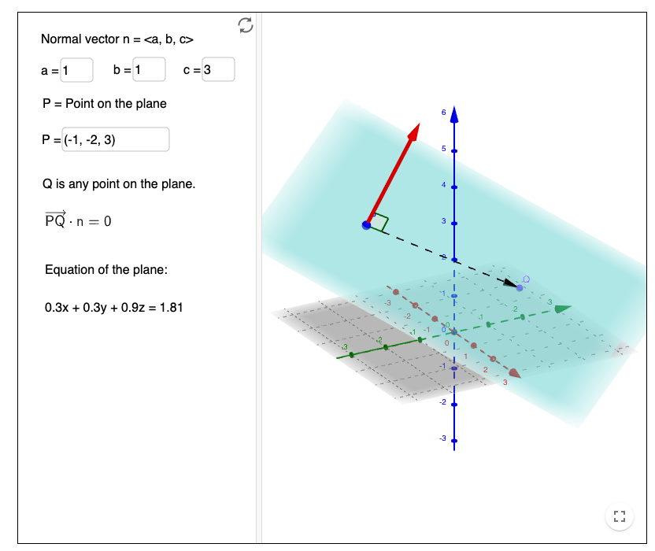
  </a>

 

---
**例子**
求过三点$M_i(x_i, y_i, z_i), i=1, 2, 3$的平面方程。

⬇️ Click to expand!

解：法向量为
$\bf{n} = \left|\begin{array}{ccc} 
          \bf{i} & \bf{j} & \bf{j} \newline
          x_2 - x_1 & y_2 - y_1 & z_2 - z_1 \newline
          x_3 - x_1 & y_3 - y_1 & z_3 - z_1
          \end{array}\right|
$

由点法式得到平面方程$\Pi$为：
$$
  \bf{n} \cdot \vec{M_0M} = 
  \left|\begin{array}{ccc}
          x - x_1 & y - y_1 & z - z_1 \newline
          x_2 - x_1 & y_2 - y_1 & z_2 - z_1 \newline
          x_3 - x_1 & y_3 - y_1 & z_3 - z_1
        \end{array}
  \right| = 0
$$

---

**📌一般式**

因为平面方程为一个**三元一次方程**，反过来，设有一个三元一次方程：

$$Ax + By + Cz + D = 0$$

我们任取满足方程的一个点$(x_0, y_0, z_0)$: 

$$Ax_0 + By_0 + Cz_0 + D = 0$$

两个式子相减得到：

$$A(x - x_0) + B(y - y_0) + C(z - z_0) = 0$$

这说明任意一个三元一次方程代表空间的一张平面。

🛠 **思考以下平面的特点**

  * $D = 0, Ax + By + Cz = 0$;
  
  * $A = 0, By + Cz + D = 0$;

  * $B = 0, Ax + Cz + D = 0$;

  * $A = D = 0, By + Cz = 0$;

  * $A = B = D = 0, Cz = 0$

🍺[Hands on](https://www.geogebra.org/m/bFuCp5Ys)

---
**例子**
设一平面与$x, y, z$轴的交点依次为$P(a, 0, 0), Q(0, b, 0), R(0, 0, c)$三点$(abc \ne 0)$。求此平面方程。

⬇️ Click to expand!

解： 设所求平面方程为:$Ax + By + Cz + D = 0$，则有：
$aA + D = 0,  bB + D = 0, cC + D = 0$
解之得，

$$\dfrac{x}{a} + \dfrac{y}{b} + \dfrac{z}{c} = 1$$.

---

**📌参数式**

设平面$\Pi$过$M_0(x_0, y_0, z_0)$点，平行于两个不共线的两个向量$\bf{u_1}(X_1, Y_1, Z_1), \bf{u_2}(X_2, Y_2, Z_2)$，于是$M(x, y, z)$在该平面上的的充分必要条件为向量$\vec{M_0M}, \bf{u_1, u_2}$共面。由于$\bf{u_1, u_2}$不共线，所以存在实数$s, t$使得：

$$\vec{M_0M} = s\bf{u_1} + t\bf{u_2}$$

上述方程写成分量的形式为：

$$
\left\{\begin{array}{c} 
x - x_0 = sX_1 + tX_2 \newline 
y - y_0 = sY_1 + tY_2 \newline
z - z_0 = sZ_1 + tZ_2 
\end{array}\right.
(s, t) \in \mathcal{R}
$$

即，

$$
\left\{\begin{array}{c} 
x = x_0 + sX_1 + tX_2 \newline 
y = y_0 + sY_1 + tY_2 \newline
z = z_0 + sZ_1 + tZ_2 
\end{array}\right.
(s, t) \in \mathcal{R}
$$

另外，常用的是一般式程，其表达式为：

$
\left|\begin{array}{ccc}
x - x_0 & y - y_0 & z - z_0 \newline
X_1 & Y_1 & Z_1 \newline
X_2 & Y_2 & Z_2 
\end{array}\right| = 0
$

---
**📌两平面的位置关系**

两张平面的位置关系有：相交、平行两种情况。判断方法为:

在直角坐标系中，两张平面：
$\Pi_i: A_ix + B_iy + C_iz + D_i = 0, i=1,2$

  + $\Pi_1$平行于$\Pi_2$的充分必要条件为：$\dfrac{A_1}{A_2} = \dfrac{B_1}{B_2} = \dfrac{C_1}{C_2}$;

  + $\Pi_1$等于$\Pi_2$的充分必要条件为：$\dfrac{A_1}{A_2} = \dfrac{B_1}{B_2} = \dfrac{C_1}{C_2} = \dfrac{D_1}{D_2}$.

在直角坐标系中，三张平面：
$\Pi_i: A_ix + B_iy + C_iz + D_i = 0, i=1,2,3$
相交于一点的充分必要条件为：

$
\left|\begin{array}{ccc}
A_1 & B_1 & C_1 \newline
A_2 & B_2 & C_2 \newline
A_3 & B_3 & C_3 
\end{array}\right|\ne 0
$

---
**📌两平面的夹角**

<a href="https://www.geogebra.org/3d/qpnanhce">
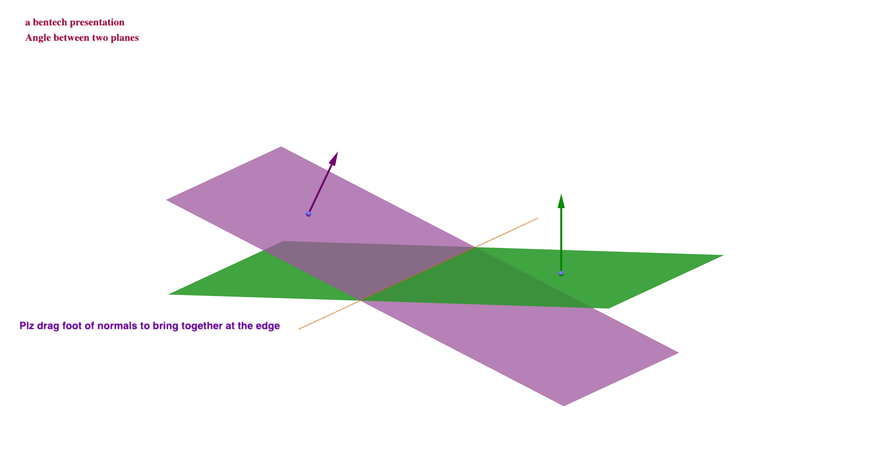
</a>

 

两平面法向量的夹角(通常指锐角或直角)称为两平面的夹角。
在直角坐标系中，两张平面：

$$\Pi_i: A_ix + B_iy + C_iz + D_i = 0, i=1,2$$

则夹角的余弦为，

$$\cos \theta = \dfrac{\left|A_1A_2 + B_1B_2 + C_1C_2\right|}{\sqrt{A_1^2 + B_1^2 + C_1^2}\sqrt{A_2^2 + B_2^2 + C_2^2}}$$

---
**例子**
求两张平面$x-y+2z-6=0$和$2x+y+z-5=0$的夹角。

⬇️ Click to expand!

解：

$\cos \theta = \dfrac{|1 \times 2 + (-1) \times 1 + 2 \times 1 }{\sqrt{1^2 + (-1)^2 + 2^2}\sqrt{2^2 + 1^2 + 1^2}} = \dfrac{1}{2}$

所以$\theta = \dfrac{\pi}{3}$

---
**📌点到平面的距离**

设空间一平面$\Pi: Ax + By + Cz + D = 0$其法向量为$\bf{n} = (A, B, C)$，另设$Q(x, y, z)$为平面外一点，点$Q$到平面$\Pi$的距离为：

在平面$\Pi$上任取一点$P(x_0, y_0, z_0)$，距离为：

$$
d = \dfrac{|\vec{PQ} \cdot \bf{n}|}{\|\bf{n}\|} = 
  = \dfrac{|Ax_0 + By_0 + Cz_0 + D|}{\sqrt{A^2 + B^2 + C^2}}
$$

见下图：

  <a href="https://www.geogebra.org/3d/vnazjmse">
    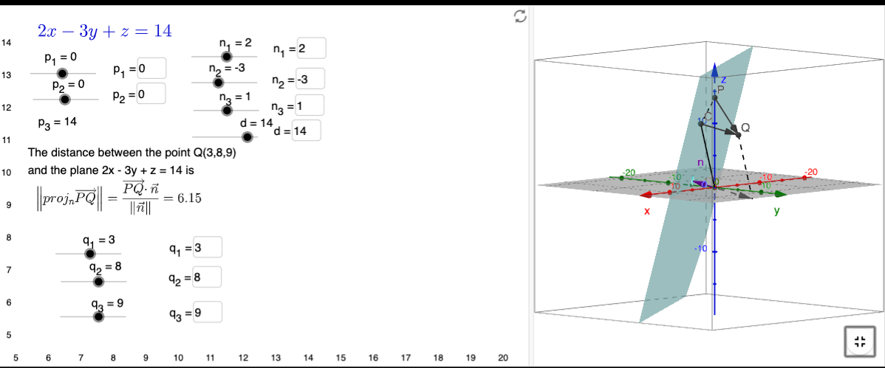
  </a>

 

---
**例子**
求点$(1, 2, 1)$到平面$x + 2y + 2z - 10 = 0$的距离。

⬇️ Click to expand!

解：在平面上任取一点$P(0, 0, 5)$,法向量$\bf{n} = (1, 2, 2)$,

$
d = \dfrac{|\vec{PQ} \cdot \bf{n}|}{\|\bf{n}\|} = 
  = \dfrac{|Ax_0 + By_0 + Cz_0 + D|}{\sqrt{A^2 + B^2 + C^2}}
$
$
  = \dfrac{|1 \times 1 + 2 \times 2 + 2 \times 1  - 10|}{\sqrt{1^2 + 2^2 + 2^2}}
  = \dfrac{3}{3} = 1.
$

---

📚 
**第三次作业:**

1. 求过点$(3, 0, -1)$且与平面$3x - 7y + 5z -12 = 0$平行的平面方程。

2. 求过三点$M_1(2, 9, -6), M_2(-2, -2, 2), M_3(1, -1, 2)$的平面方程。

3. 求平面$2x - 2y + z + 5 = 0$与各坐标平面的夹角。

4. 求三平面$x + 3y + z = 1, 2x - y - z = 0, -x + 2y + 2z = 3$的交点。

---

### 第四节 空间直线及其方程

---
**📌空间直线方程**

设直线$l$经过$M_0(x_0, y_0, z_0)$，平行于非零向量(方向向量)($\bf{u} = (X, Y, Z)$)，则$M(x,y,z)\in l$的充分必要条件为：

$\vec{M_0M} \parallel \bf{u}$

写成坐标的形式，得到了**直线的标准方程**:

$$\dfrac{x - x_0}{X} = \dfrac{y - y_0}{Y} = \dfrac{z - z_0}{Z}$$

又因为$\bf{u} \ne \bf{0}$，所以$\vec{M_0M} \parallel \bf{u}$的充分且必要条件是：存在实数$\lambda$使得

$\vec{M_0M} = \lambda \bf{u}$

用坐标写出，即得到了**直线的参数方程**:

$$
\left\{\begin{array}{c} x = x_0 + \lambda X \newline 
                        y = y_0 + \lambda Y \newline
                        z = z_0 + \lambda Z
       \end{array}\right.
$$

直线的这两种方程虽然在形式上不同，但它们的直接表现处出直线的几何意义，即它的方向和所经过的点。我们把这两种方法统称为**直线的点向式方程**。

  <a href="https://www.geogebra.org/3d/kfcyckrg">
    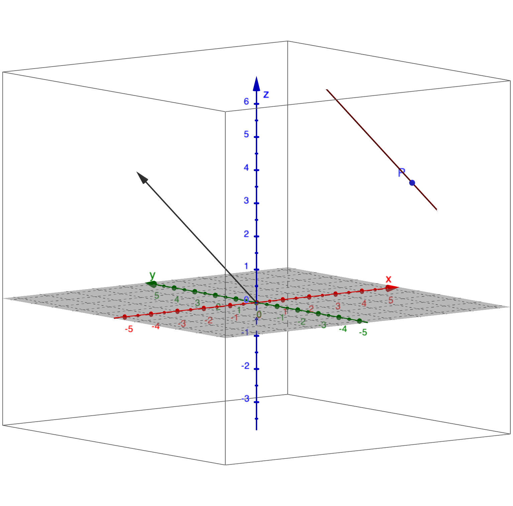
  </a>

 

确定直线的另外一种方法是把它作为两张平面的交线，即三元一次方程组：

$$
\left\{\begin{array}{c} A_1x + B_1y + C_1z + D_1 = 0 \newline
                        A_2x + B_2y + C_2z + D_2 = 0
       \end{array}\right.
$$

以上方程为直线的**一般方程**.

---
**例子**
给定平面$\Pi: 3x - y + 2z - 1 = 0$，直线$l: \dfrac{x-1}{4} = \dfrac{y-3}{-2} = \dfrac{z}{1}$和点$M_0(0, 0, -2)$。写出过$M_0$点平行于平面$\Pi$且和直线$l$相交的直线方程。

⬇️ Click to expand! 

解：设所求直线的方程为$l_1$，设$\Pi_1$过$M_0$且平行于平面$\Pi$，$\Pi_2$过$M_0$和直线$l$，则他们都通过$l_1$.

因为$\Pi_1$平行于平面$\Pi$，故可设其方程为：$3x - y + 2z + d = 0$，再将$M_0$的坐标带代入得到$d = 4$，得到平面$\Pi_1$的方程为：$3x - y + 2z + 4 = 0$
$\Pi_2$经过$M_0$和$M_1(1, 3, 0)$，平行于向量$\bf{u} = (4, -2, 1)$，也就是由点$M_0$和向量$\vec{M_0M}(1, 3, 2)$和$\bf{u}$所决定的平面，得到$\Pi_2$的一般方程为：$x + y - 2z - 4 = 0$
于是所求直线方程为

$
\left\{\begin{array}{c} x + y -2z - 4 = 0 \newline
                        3x - y + 2z + 4 = 0
       \end{array}\right.
$

---
**例子**
设直线的一般方程为:

$\left\{\begin{array}{c} 2x + y -2z + 1 = 0 \newline 4x - 2y + 2z - 1 = 0 \end{array}\right.$

求它的参数方程。

⬇️ Click to expand!

直线的方向向量为：

$
 \left|\begin{array}{cc} 1 & -2 \newline -2 & 2 \end{array}\right|, \left|\begin{array}{cc} -2 & 2 \newline 2 & 4 \end{array}\right|, \left|\begin{array}{cc} 2 & 1 \newline 4 & -2 \end{array}\right|
$

$
 = (-2, -12, 8)
$
在直线上找一点$(0, 0, 0.5)$，所以直线的参数方程为：

$
 \left\{\begin{array}{c} x = \lambda \newline y = 6\lambda \newline z = 0.5 + 4\lambda \end{array}\right.
$

---

**📌空间直线与平面**

直线与平面的位置关系有：
  + 相交(只有一个交点);

  + 直线在平面上;

  + 以及没有交点.

三种情况，后两种统称为平行。

设平面$\Pi$的方程为$Ax + By + Cz + D = 0$。直线$l$过点$M_0(x_0, y_0, z_0)$，平行于非零向量$\bf{u}(X, Y, Z)$。则$l$平行于$\Pi$;$l$在$\Pi$上的条件为：

$$
l \parallel \Pi \iff AX + BY + CZ = 0
$$

$$
l \in \Pi \iff \left\{\begin{array}{c}AX + BY + CZ = 0 \newline Ax_0 + By_0 + Cz_0 + D =0 \end{array}\right.
$$

设直线$l$的一般方程为:

$
\left\{\begin{array}{c} A_1x + B_1y + C_1z + D_1 = 0 \newline A_2x + B_2y + C_2z + D_2 =0 \end{array}\right.
$

设平面$\Pi$的方程为：

$ Ax + By + Cz + D = 0$

则有下述结果：

---
**命题**

  1. 直线$l$和平面$\Pi$相交的充分必要条件为：
 $\left|\begin{array}{ccc} A_1 & B_1 & C_1 \newline A_2 & B_2 & C_2 \newline A & B & C \end{array}\right| \ne 0$ 

  2. 直线$l$和平面$\Pi$无交点的充分必要条件为：线形方程组
$\left\{\begin{array}{l} A_1x + B_1y + C_1z + D_1 = 0 \newline A_2x + B_2y + C_2z + D_2 = 0 \newline Ax + By + Cz + D = 0 \end{array}\right.$ 
无解。

  3. 直线$l$在平面$\Pi$上的充分必要条件为：线形方程组
$\left\{\begin{array}{l} A_1x + B_1y + C_1z + D_1 = 0 \newline A_2x + B_2y + C_2z + D_2 = 0 \newline Ax + By + Cz + D = 0\end{array}\right.$
有无穷多解。

我们把经过同一条直线的所有平面构成的集合称为以$l$为轴的**共轴平面系**。如果$l$的一般方程为

$
\left\{\begin{array}{l} A_1x + B_1y + C_1z + D_1 = 0 \newline A_2x + B_2y + C_2z + D_2 =0 \end{array}\right.
$

则以$l$为轴的共轴平面系中平面方程的一般形式为：

$
\lambda(A_1x + B_1y + C_1z + D_1) + \mu(A_2x + B_2y + C_2z + D_2) = 0
$

其中$\lambda^2 + \mu^2 \ne 0$.

---
**例子**
已知$l$在$\Pi$上，其中$l$的一般方程为：

$
\left\{\begin{array}{l} 3x + 2y - z + 1 = 0 \newline x - 2z = 0 \end{array}\right.
$

平面$\Pi$的方程为$4x + ay + 2z + b = 0$，求$a, b$.

⬇️ Click to expand!

设$4x + ay + 2z + b = \lambda(3x + 2y - z + 1) + \mu(x - 2z)$，解之得，$\lambda = 2, \mu = -2$从而有$a = 4, b = 2$.

---

**📌空间直线与直线位置关系**

空间直线与直线的位置关系有异面、相交、重合、平行而不重合四种情况。设直线$l_i$的方向向量为$\bf{u_i}$且分别通过$M_i$点$i=1,2$，则有：

---

**命题**

  1. $l_1 \parallel l_2 \iff \bf{u_1} \parallel \bf{u_2}$;

  2. $l_1, l_2$共面$\iff$ $[\vec{M_1M_2 \bf{u_1} \bf{u_2}}] = 0$(混合积为零);

  3. $l_1, l_2$重合 $\iff$ $\vec{M_1M_2}, \bf{u_1}, \bf{u_2}$共线。

🛠**上述命题的分量表达式应该为什么？**

---

**📌空间直线与直线的夹角**

两直线方向向量的夹角(通常知锐角或直角)叫做两直线的夹角。设直线$l_i$的方向向量为$\bf{u_i} = (X_i, Y_i, Z_i), i=1,2$，则两直线夹角$\phi$的余弦为：

$$
\cos \phi = \dfrac{|X_1X_2 + Y_1Y_2 + Z_1Z_2|}{\sqrt{X_1^2 + Y_1^2 + Z_1^2}\sqrt{X_2^2 + Y_2^2 + Z_2^2}}
$$

  <a href="https://www.geogebra.org/3d/fjrx7vcj">
    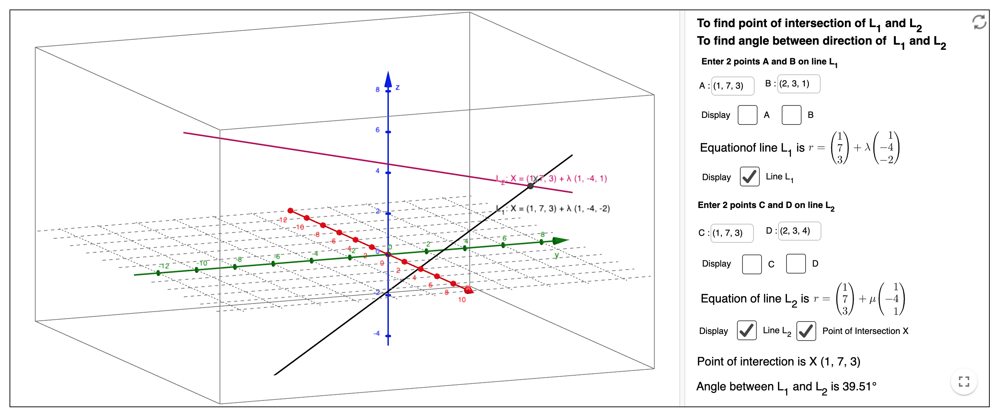
  </a>

 

---

**📌空间直线与平面的夹角**

直线与平面的夹角，即直线与它在平面上正射影的夹角。设直线$l$平行于非零向量$\bf{u}(X, Y, Z)$，平面$\Pi$的法向量为$\bf{n}(A, B, C)$，则它们的夹角为：

$$
\theta = arccos(|\sin <\widehat{\bf{u}, \bf{n}}>|)
$$

$$
\sin \theta = \dfrac{|AX + BY + CZ|}{\sqrt{A^2 + B^2 + C^2}\sqrt{X^2 + Y^2 + Z^2}}
$$

  <a href="https://www.geogebra.org/3d/bnxrq9ad">
    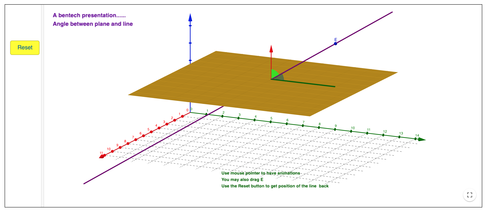
  </a>

 

---

**📌空间点到直线的距离**

设直线$l$经过点$M_0(x_0, y_0, z_0)$，平行于非零向量$\bf{u}(X, Y, Z)$
，则点$P(x, y, z)$到$l$的距离为：

$$
d = \dfrac{|\bf{u} \times \vec{M_0P}|}{|\bf{u}|}
$$

  

---
📚 
**第四次作业:**

+ 求过点$(4, -1, 3)$且平行于直线$\dfrac{x - 3}{2} = \dfrac{y}{1} = \dfrac{z - 1}{5}$ 的直线方程。

+ 用对称式及参数方程表示直线
  

  $\left\{\begin{array}{l} x - y + z = 1 \newline 2x + y + z = 4 \end{array}\right.$
  

+ 求直线
  

  $\left\{\begin{array}{l} 5x - 3y + 3z -9 = 0 \newline 3x - 2y + z -1 = 0 \end{array}\right.$ 
  

  与直线
  

  $\left\{\begin{array} 2x + 2y - z + 23= 0 \newline 3x + 8y + z -18 = 0 \end{array}\right.$ 
  

  的夹角。

+ 求直线
  

  $\left\{\begin{array}{l} 2x - 4y + z = 0 \newline 3x - y - 2z - 9 = 0 \end{array}\right.$
  

  在平面$4x - y + z = 1$投影直线的方程。

---

### 第五节 旋转曲面、柱面和锥面

---

**📌旋转曲面**

一条曲线$\Gamma$绕一条直线$l$旋转所得的曲面称为**旋转曲面**。$l$称为**轴**，$\Gamma$称为**母线**。

母线$\Gamma$上每个点$M_0$绕$l$旋转得到的圆，称为**纬圆**，纬圆与轴线垂直。过$l$的半平面与旋转曲面的交线称为**经线**。经线可以作为母线，但母线不一定是经线。

  

现在假设旋转轴为$z$轴，母线$\Gamma$在$yoz$平面上，其方程为：

$\left\{\begin{array}{l} f(y,z) = 0 \newline x = 0 \end{array}\right.$

则点$M(x, y, z)$在旋转曲面上的充分条件为:

$\left\{\begin{array}{l} f(y_0,z_0) = 0 \newline x_0 = 0 \newline x^2 + y^2 = x_0^2 + y_0^2 \newline 1 \cdot (z - z_0) = 0 \end{array}\right.$

这里$M_0(x_0, y_0, z_0)$为过$M$的纬圆在母线上的对应点。

消去$x_0, y_0, z_0$得到

$$f(\pm\sqrt{x^2 + y^2}, z) = 0$$

---
📝**小结**

为了得到$yOz$平面上的曲线$\Gamma$绕$z$轴旋转所得到的旋转曲线，只要将母线$\Gamma$在$yOz$平面上的方程中$y$改成$\pm\sqrt{x^2 + y^2}$，$z$不动。坐标平面上的曲线绕坐标轴旋转所得到的旋转曲面的方程都有类似的规律。

---
**例子**
母线$\Gamma$为

$\left\{\begin{array}{l} y^2 = 2pz \newline x = 0 \end{array}\right.$

绕$z$轴旋转所得到的旋转曲面方程为：

$x^2 + y^2 = 2pz$.

  <a href="https://www.geogebra.org/classic/tjcyukcx">
    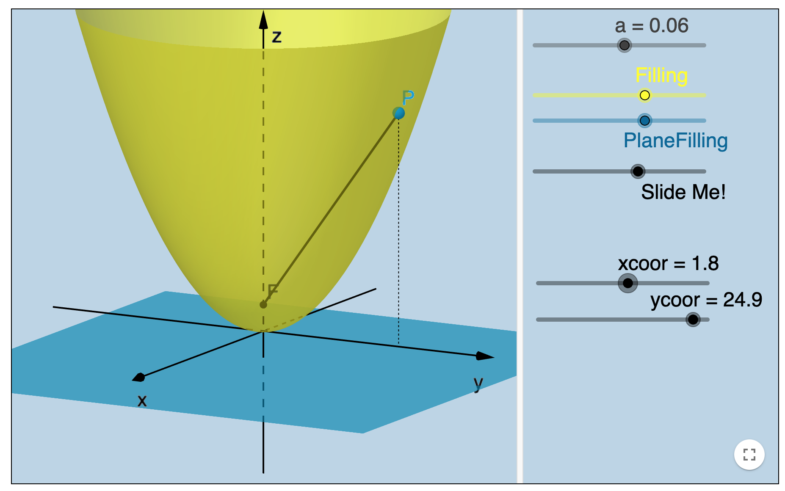
  </a>

---
**例子**
母线$\Gamma$为

$\left\{\begin{array}{l} \dfrac{x^2}{a^2} - \dfrac{y^2}{b^2} = 1 \newline z = 0 \end{array}\right.$

绕$x$轴旋转所得到的旋转曲面方程为(双叶双曲面)：

$\dfrac{x^2}{a^2} - \dfrac{y^2 + z^2}{b^2} = 1$.

  <a href="https://www.geogebra.org/classic/tdmrwwy5">
    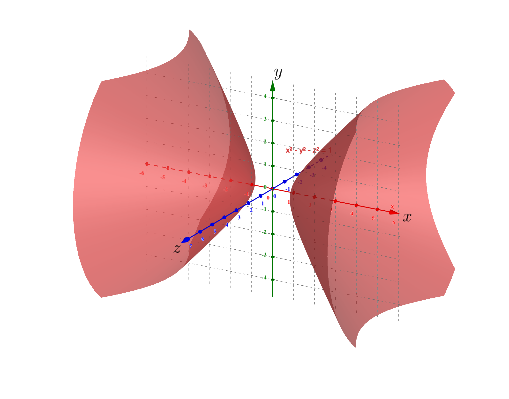
  </a>

绕$y$轴旋转所得到的旋转曲面方程为(单叶双曲面)：

$\dfrac{x^2 + z^2}{a^2} - \dfrac{y^2}{b^2} = 1$.

  <a href="https://www.geogebra.org/3d/ewgcjsee">
    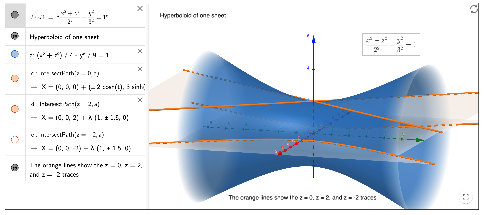
  </a>

---
**例子**
母线$\Gamma$为

$\left\{\begin{array}{l} 4x^2 + 9y^2 = 36 \newline z = 0 \end{array}\right.$

绕$x$轴旋转所得到的旋转曲面方程为：

$4x^2 + 9(y^2 + z^2) = 36$.

  <a href="https://www.geogebra.org/3d/y22upztm">
    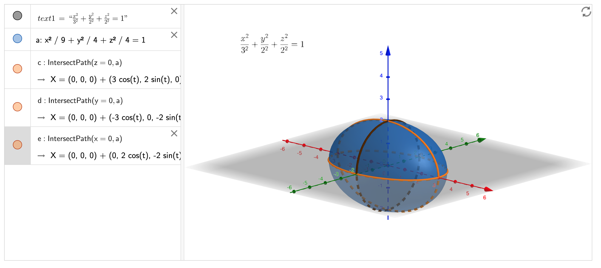
  </a>

---

**📌柱面**

若一条直线$l$沿着一条空间曲线$C$平行移动时所形成的曲面称为**柱面**。$l$称为**母线**，$C$称为**准线**。

<a href="https://www.geogebra.org/m/AWr5ag7a">
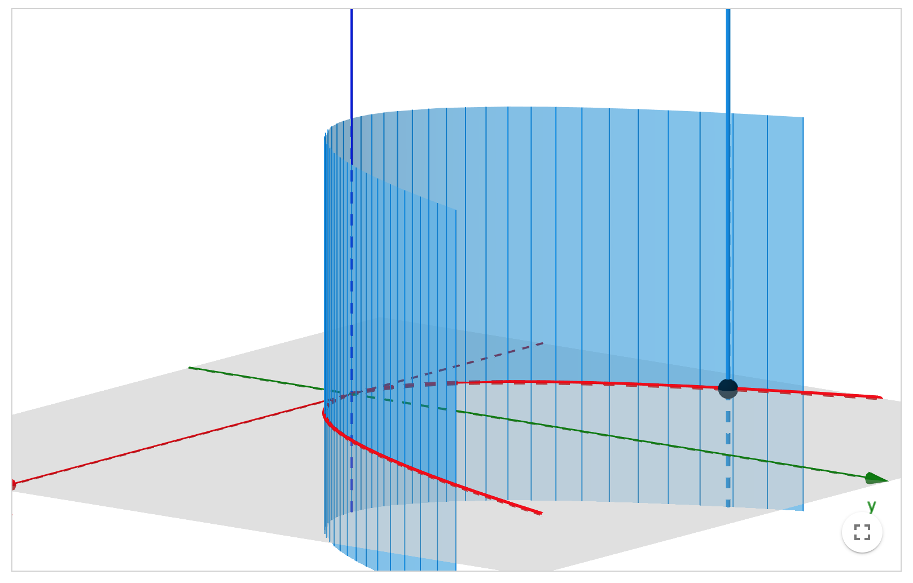
</a>

**柱面方程的建立**

设柱面的母线方向为$\bf{v}(l, m, n)$，准线$C$的方程为

$\left\{\begin{array}{l} F(x, y, z) = 0 \newline G(x, y, z) = 0 \end{array}\right.$

假设$M(x,y,z)$为柱面上的任意一点，则有$M$在过准线上的一点$M_0(x_0, y_0, z_0)$，且方向为$\bf{v}$的直线上。因此有：

$\left\{\begin{array}{l} F(x_0, y_0, z_0) = 0 \newline G(x_0, y_0, z_0) = 0 \newline x = x_0 + lu \newline y = y_0 + mu \newline z = z_0 + nu \end{array}\right.$

消去$x_0, y_0, z_0,u$，得到柱面方程。

**圆柱面、点的柱坐标**

圆柱面有一条对称轴$l$，圆柱面上每一点到轴的距离相等，这个距离称为圆柱面面的半径。如果知道圆柱面的半径为$r$，母线的方向为$\bf{v}(l, m, n)$以及圆柱面的对称轴$l_0$经过$M_0(x_0, y_0, z_0)$，则点$M(x,y,z)$在圆柱面上的充分且必要条件为$M$到轴$l_0$的距离等于$r$，即

$\dfrac{\|\vec{MM_0} \times \bf{v}\|}{\|\bf{v}\|} = r$

特别的，若圆柱面的半径为$r$，对称轴为$z$轴，则这个圆柱面的方程为：

$$x^2 + y^2  = r^2$$

<a href="https://www.geogebra.org/3d/perzz6xa">
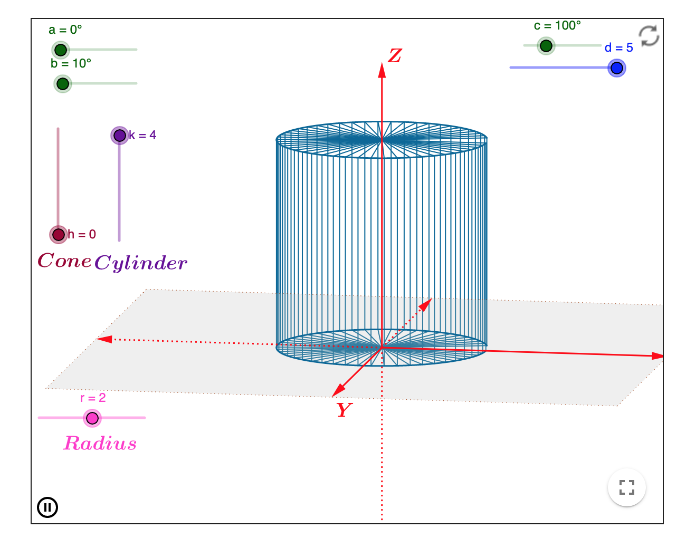
</a>

空间中的任意一点$M(x, y, z)$必在以$r = \sqrt{x^2 + y^2}$为半径，以$z$轴为对称轴的圆柱面上。这个圆柱面的参数方程为：

$\left\{\begin{array}{l} x = r\cos \theta \newline y = r \sin \theta \newline z = u \end{array}\right. 0 \le \theta < 2\pi, -\infty < u < +\infty$

因此，圆柱面上的点$M$被$(\theta, u)$所确定。从而空间中的任意一点被有序的三元实数组$(r, \theta, u)$所确定。$(r, \theta, u)$称为点$M$的**柱面坐标**。

下图点$B''$在柱坐标下的参数为$(r, \theta, u) = (4, 2, 5)$

  <a href="https://www.geogebra.org/3d/zhqbgbmj">
    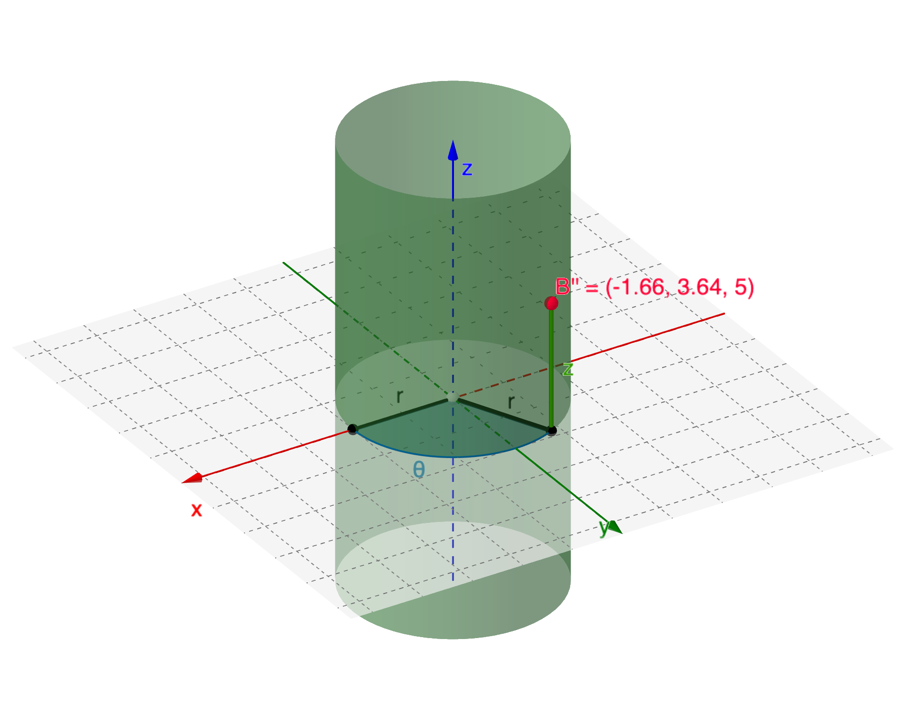
  </a>

直角坐标与柱坐标的相互关系为：

$\left\{\begin{array}{l} x = r\cos \theta \newline y = r \sin \theta \newline z = u \end{array}\right. r \ge 0, 0 \le \theta < 2\pi, -\infty < u < +\infty$

---
**柱面坐标的特点**

 
若一个柱面的母线平行于$z$轴(或$x$轴，或$y$轴)，则它的方程中不含有$z$(或$x$，或$y$)；反之，一个三元方程如果不含有$z$(或$x$，或$y$)，则它一定表示一个母线平行于$z$轴(或$x$轴，或$y$轴)的柱面。

---
**例子**

下图分别为:
+ 椭圆柱面($\dfrac{x^2}{2^2} + \dfrac{y^2}{3^2} = 1$);

+ 抛物柱面($z = x^2$);

+ 双曲柱面($\dfrac{x^2}{4} - \dfrac{y^2}{2} = 1$)。

  <a href="https://www.geogebra.org/m/sk9n55wr">
    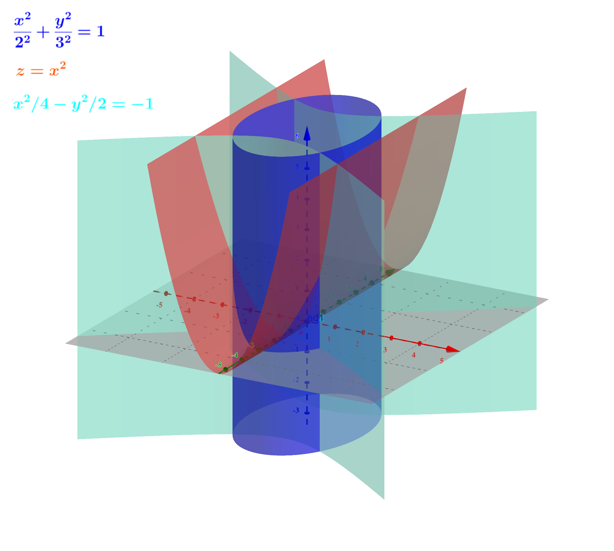
  </a>

---
**📌圆锥面**

对于圆锥面，它有一根对称轴$l$，它的每一条母线与轴$l$夹的角都相等，这个锐角称为圆锥面的**半顶角**。与轴$l$垂直的平面截圆锥面所得的交线为圆。如果知道圆锥面的顶点$M_0(x_0, y_0, z_0)$，圆锥面轴的方向向量$\bf{v}$以及半顶角$\alpha$，则$M(x, y, z)$在圆锥面上的充分必要条件为：

$<\vec{M_0M}, \bf{v}> = \alpha$或者$\pi - \alpha$,

因此有：

$|\cos <\vec{M_0M}, \bf{v}>| = \cos \alpha $

  <a href="https://www.geogebra.org/3d/hnxdn7az">
    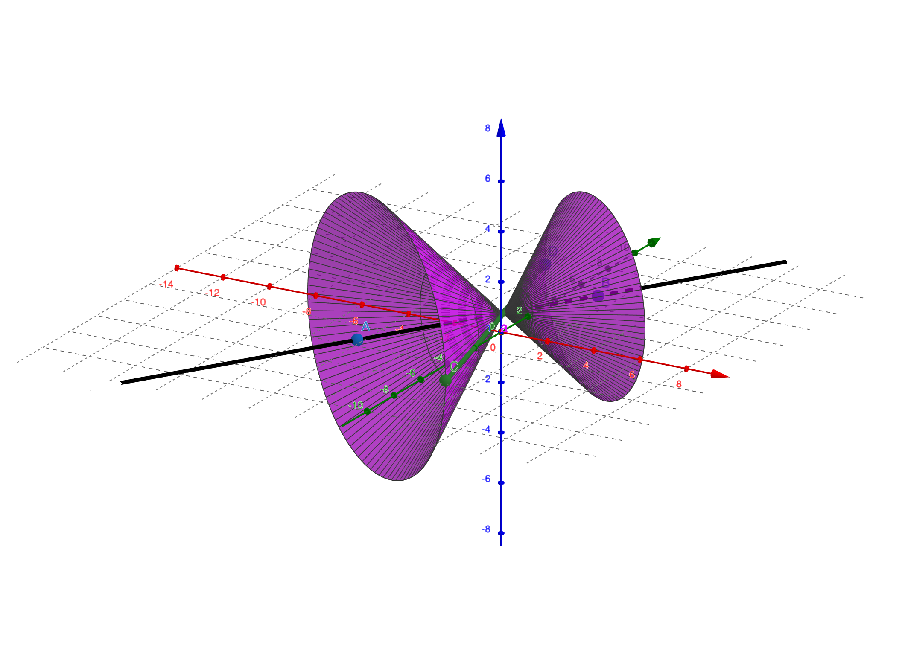
  </a>

---
**例子**

求以三根坐标轴为母线的圆锥面的方程。

⬇️iClick to expand!

显然这个圆锥面的顶点为原点，设轴$l$的方向为$\bf{v}$，因为三个坐标轴为母线，所以有：

$|\cos <\bf{e_1}, \bf{v}>| = |\cos <\bf{e_2}, \bf{v}>| = |\cos <\bf{e_3}, \bf{v}>| $

考察方向向量$\bf{v}$为$(1, 1, 1)$的情况，其它情况($(1, 1, -1), (1, -1, 1), (1, -1, -1)$)。$M(x, y, z)$在锥面上的充分必要条件为：

$|\cos<\vec{OM}, \bf{v}>| = |\cos<e_1, \bf{v}>|$

即

$\dfrac{|\vec{OM} \cdot \bf{v}|}{\|\vec{OM}\|\|\bf{v}\|} = \dfrac{|\bf{e_1} \cdot \bf{v}|}{\|\bf{v}\|}$

得到

$xy + yz + xz = 0$

### 第六节 三元二次曲面

---
**📌旋转二次曲面**

<a href="https://en.wikipedia.org/wiki/Quadric">
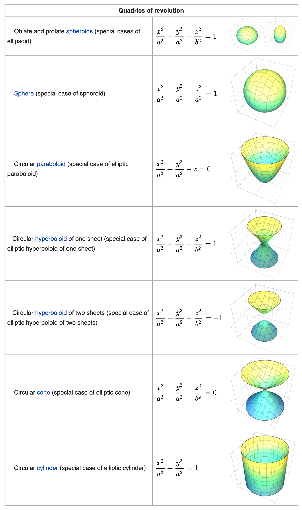
</a>

---
**📌非退化二次曲面**

<a href="https://en.wikipedia.org/wiki/Quadric">
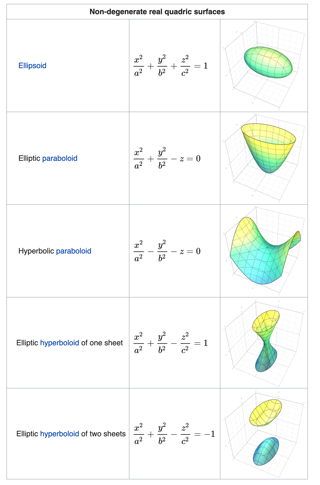
</a>

---
**📌退化二次曲面**

<a href="https://en.wikipedia.org/wiki/Quadric">
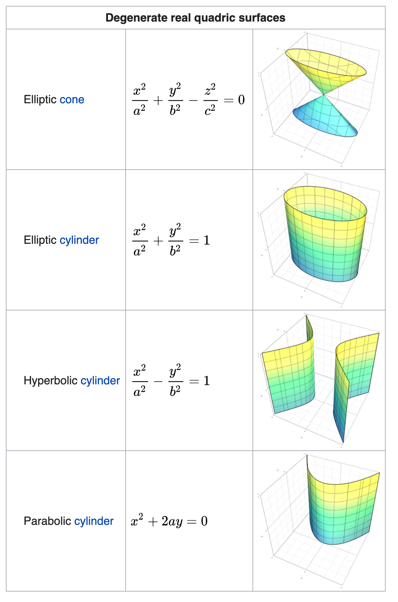
</a>

---
📚 
**第五次作业:**

1. 将$xOy$坐标面上的双曲线$4x^2 - 9y^2 = 36$分别绕$x$轴及$y$轴旋转一周，求得到的旋转曲面的方程，并作图。

2. 指出下列方程表示的曲面并作图：

  + $4x^2 + y^2 -z^2 = 4$;

  + $\dfrac{z}{3} = \dfrac{y^2}{9}$;

  + $\dfrac{x^2}{3^2} + \dfrac{y^2}{4^2} - \dfrac{z^2}{5^2} = \pm 1$;
  
  + $\dfrac{x^2}{3^2} + \dfrac{y^2}{4^2} - \dfrac{z^2}{5^2} = 0$;

  + $\dfrac{x^2}{3^2} + \dfrac{y^2}{4^2} + \dfrac{z^2}{5^2} = 1$.

---
### 强调几个曲面

**📌双曲抛物面**

**双曲抛物面又称马鞍面**，该曲面的的标准方程为$z = \dfrac{x^2}{p^2} - \dfrac{y^2}{q^2}$，特别的$z = xy$为一马鞍面。

  <a href="https://www.geogebra.org/classic/g4dqpkk4 ">
    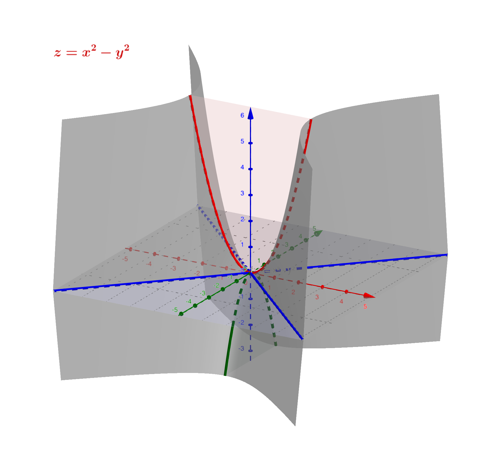
  </a>

  

---

**📌直纹面**

一曲面$S$称为**直纹面**，如果存在一簇直线是的这一簇中的每一条直线都在$S$上；并且$S$上的每一个点都在这一簇的某一条直线上。这样一簇直线称为$S$的**一簇直母线**。

二次曲面中：二次柱面和锥面都是直纹面，椭球面不是直纹面，因为它有界。双叶双曲面不是直纹面，椭圆抛物面也不是直纹面。剩下的：单叶双曲面和双叶双曲面都是直纹面。

  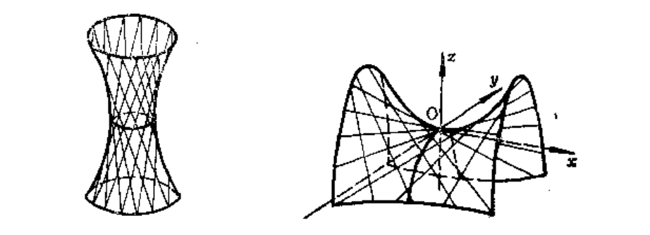

---

### 第七节 空间曲线

---
**📌空间曲线的方程**

**空间曲线一般式方程**

空间曲线可以看成两个曲面的交线。其方程为：

$$\left\{\begin{array}{l} F(x, y, z) = 0 \newline G(x, y, z) = 0 \end{array}\right. $$

---
**例子**

方程组

  $\left\{\begin{array}{l} x^2 + y^2 + z^2 = a^2 \newline (x - a/2)^2 + y^2 = (a/2)^2 \end{array}\right.$

为**Viviani曲线**。下图为$a=4$的情形。

  

---
**例子**

方程组

  $\left\{\begin{array}{l}x^2 + y^2 = 1 \newline 2x + 3y = 1 \end{array}\right. $

表示的曲线见下图。

  <a href="https://www.geogebra.org/classic/kwfhk7wg">
    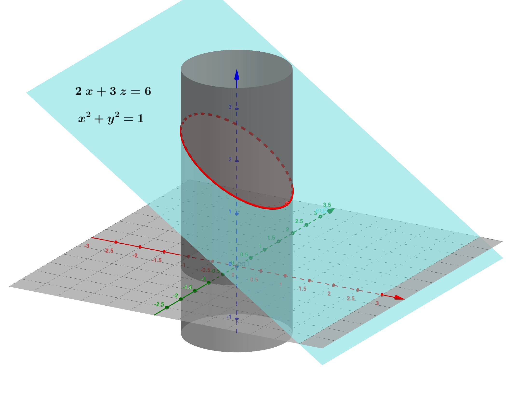
  </a>

---

**空间曲线的参数方程**

空间曲线可以看成是一个质点的移动轨迹，其**参数方程为**：

$\left\{\begin{array}{l} x = x(t) \newline y = y(t) \newline z = z(t) \end{array}\right.$

---
**例子**

**螺旋线**：在圆柱面$x^2 + y^2 = a^2$上以角速度$\omega$绕$z$轴旋转，同时又以线速度$v$沿平行于$z$轴的正方向上升，那么点形成的轨迹称为螺旋线，其参数方程为：

$\left\{\begin{array}{l} x = a\cos t \newline y = a\sin t \newline z = vt \end{array}\right.$

  <a href="https://www.geogebra.org/classic/bcqxkxsp">
    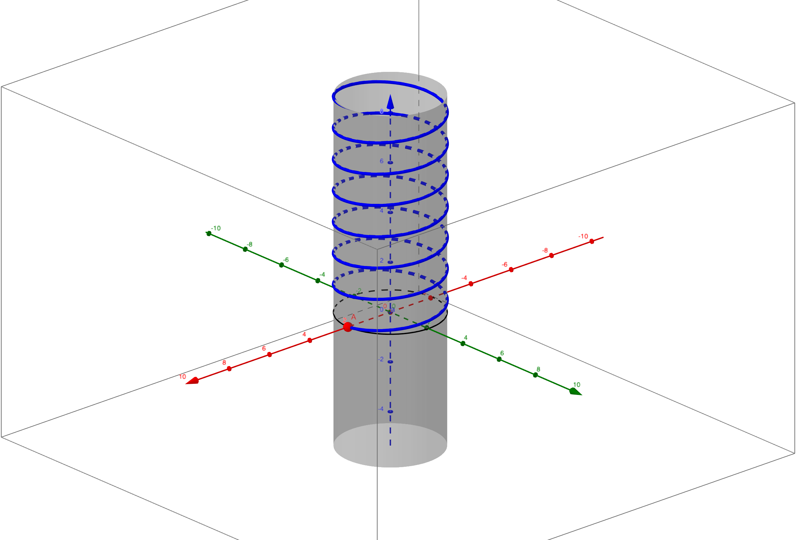
  </a>

**空间曲线在坐标平面上的投影，投影柱面**

设空间曲线$C$方程为

$\left\{\begin{array}{l} F(x, y, z) = 0 \newline G(x, y, z) = 0 \end{array}\right. $

消去变量$z$(如果可能的话)，所得到的方程为
$$H(x, y) = 0$$
得到过曲线$C$的**投影柱面**，而

$$
  \left\{\begin{array}{l} H(x, y) = 0 \newline z = 0 \end{array}\right.
$$

所表示的曲线为曲线$C$在$xOy$平面上的**投影曲线**，投影曲线围成的区域为空间曲线$C$在$xOy$平面上的**投影区域**。

---
**例子**

求下列曲面的交线在坐标平面上的投影。

$x^2 + y^2 = 2z, x^2 + y^2 = 4x$

解：$x^2 + y^2 = 2z$是椭圆抛物面，$x^2 + y^2 = 4x$是圆柱面。椭圆抛物面与柱面的交线$\Gamma$为：

  $\left\{\begin{array}{l} x^2 + y^2 = 2z \newline x^2 + y^2 = 4x \end{array}\right.$

$\Gamma$在$xOy$面上的投影为

  $\left\{\begin{array}{l} z = 0 \newline x^2 + y^2 = 4x \end{array}\right.$

$\Gamma$在$xOz$面上的投影为

  $\left\{\begin{array}{l} z = 2x \newline y = 0 \end{array}\right.$

<a href="https://www.geogebra.org/3d/hkctfegq">
   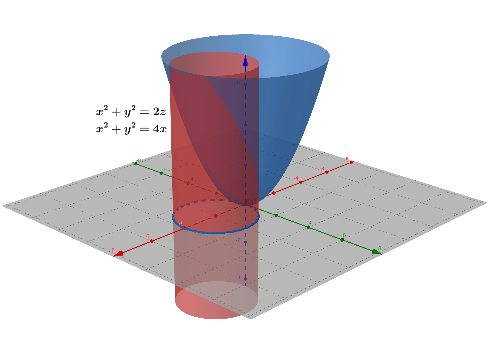
</a>

---
📚 
**第六次作业:**

+ 分别求母线平行于$x$轴，$y$轴而且通过曲线

    $
      \left\{\begin{array}{l} 2x^2 + y^2 + z^2 = 16 \newline x^2 + z^2 - y^2 = 0 \end{array}\right.
    $

   的柱面方程。

+ 将曲线

    $
      \left\{\begin{array}{l} x^2 + y^2 + z^2 = 9 \newline y = x \end{array}\right.
    $

   化为参数方程。

+ 求螺旋线

   $
      \left\{\begin{array}{l} x = a\cos \theta \newline y = a \sin \theta \newline z = b\theta \end{array}\right.
   $

   在三个坐标平面上的投影曲线的直角坐标方程。

---
## 📚参考书目
📖1. 《高等数学》上下册（第七版），同济大学，高等教育出版社，2014.7.

📖2. 《解析几何》，邱维声，北京大学出版社，1988.

📖3. 《解析几何》，尤承业，北京大学出版社，2004.

---
# Calculus and its Visualization: an Introduction

---
# 👏 THANKS

