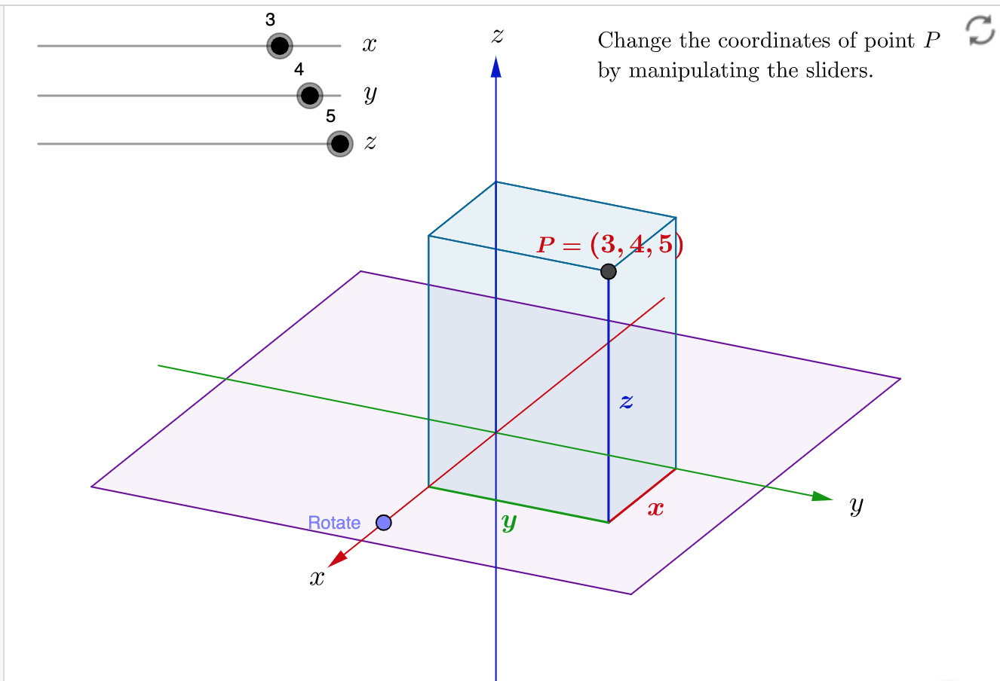
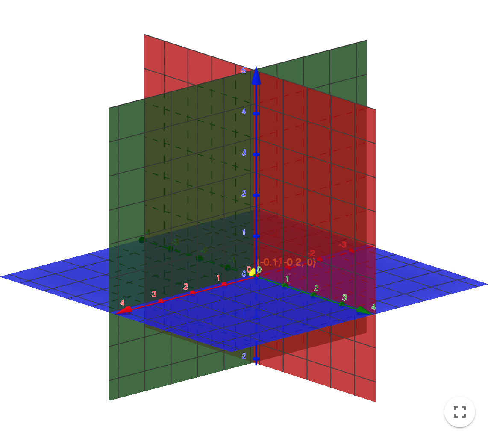
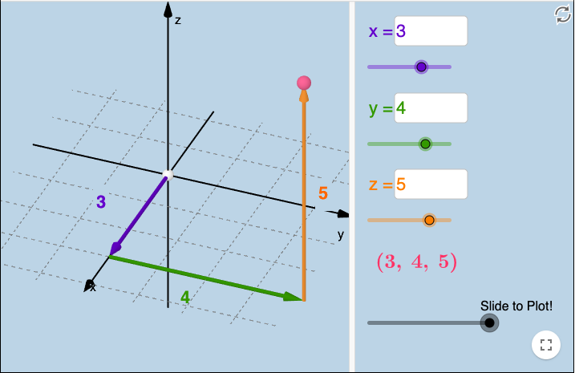

这部分内容为空间几何初步.

## 第八章 向量代数与空间解析几何

### 第一节 向量及其运算
---

📌**1. 向量和标量**

“速度”和“位移”是向量，“速率”和“长度”是标量。几何上向量是有大小和方向的有向线段。向量描述事物间的位移和相对位置，向量不包括“位置”的概念。“点”有位置，但没有大小和厚度。

向量的表示：
$$\bf{a, b, c,} \cdots $$
或者
$$\vec{a}, \vec{b}, \vec{c}, \cdots$$

两个向量的夹角:
$$(\widehat{a,b}) = \phi$$

---

📌**2. 向量的线性运算**

**向量的加法和减法**：

向量的加法符合以下规律：

  + 交换律： $\bf{a + b = b + a} $;

  + 结合律：$\bf{(a + b) + c = a + (b + c)}$   

**数乘**

向量与数的乘积满足以下运算规律：

  + 结合律：$\lambda (\mu \bf{a}) = (\lambda \mu)\bf{a}$;

  + 分配律：$(\lambda + \mu)\bf{a} = \lambda \bf{a} + \mu \bf{a}$, $\lambda (\bf{a + b}) = \lambda \bf{a} + \lambda \bf{b}$.

---

 **定理1**
设向量$\bf{a} \ne \bf{0}$，则向量$\bf{b}$平行于$\bf{a}$的充分必要条件为：$\bf{b} = \lambda \bf{a}$.

---

**📌3. 空间直角坐标系**

在空间取定一定点$O$和三个两两相互垂直的单位向量$\bf{i, j, k}$就确定了三条都以$O$为原点的两两相互垂直的数轴，依次记为$x$轴(横轴)，$y$轴(纵轴)，$z$轴(竖轴)，统称为坐标轴。它们构成空间的一个直角坐标系，如下图所示：

👉[Click: 更详细的动画](https://www.geogebra.org/material/edit/id/yxadpqun#bookcontent)

三条坐标轴的任意两条可以确定一个平面，这样确定的三个坐标平面统称为坐标平面。$x$轴及$y$轴所确定的坐标平面叫做$xOy$面等等。如下图所示：

👉[Click: 更详细的动画](https://www.geogebra.org/material/edit/id/yxadpqun#bookcontent)

---

**📌4. 向量坐标表示**

$$M \leftrightarrow \bf{r} \leftrightarrow \vec{OM} = x\bf{i} + y\bf{j} + z\bf{k} \leftrightarrow (x, y, z) $$

例如向量：$\bf{r} = \vec{OM} = 3\bf{i} + 4\bf{j} + 5\bf{k}$

👉[Click: 更详细的动画](https://www.geogebra.org/material/edit/id/yxadpqun#bookcontent)

$n$维空间向量的Enstein表示为：
$$M \leftrightarrow \bf{r} \leftrightarrow \vec{OM} = x^1\bf{e_1} + x^2\bf{e_2} + \cdots +  x^n\bf{e_n} \leftrightarrow (x^1, x^2, \cdots, x^n) = x^i \bf{e_i}$$

---

**📌5. 利用坐标作向量的线形运算、向量的模、方向角、投影**

设向量$\bf{a} = a_x\bf{i} + a_y\bf{j} + a_z\bf{k}$, $\bf{b} = b_x\bf{i} + b_y\bf{j} + b_z\bf{k}$，则有：
  
  + $\bf{a} + \bf{b}= (a_x + b_x)\bf{i} + (a_y + b_y)\bf{j} + (a_z + b_z)\bf{k}$;
  
  + $\bf{a} - \bf{b}= (a_x - b_x)\bf{i} + (a_y - b_y)\bf{j} + (a_z - b_z)\bf{k}$;
  
  + $\lambda\bf{a} = (\lambda a_x )\bf{i} + (\lambda a_y +b_y)\bf{j} + (\lambda a_z )\bf{k}$;
  
  + $(a_x, a_y, a_z) + (b_x, b_y, b_z) = (a_x+b_x, a_y+b_y, a_z+b_z)$;

  + $(a_x, a_y, a_z) + (b_x, b_y, b_z) = (a_x+b_x, a_y+b_y, a_z+b_z)$;

  + $\lambda (a_x, a_y, a_z)  = (\lambda a_x, \lambda a_y, \lambda a_z)$
 

 

👉[Click: 更详细的动画](https://www.geogebra.org/material/edit/id/yxadpqun#bookcontent)

---
**例子**
已知两点$A(x_1, y_1, z_1), B(x_2, y_2, z_2)$以及$\lambda \ne -1$，在直线$AB$上求点$M$，使
$$\vec{AM} = \lambda \vec{MB}$$

Click to expand!

解： $\vec{AM} = \vec{OM} - \vec{OA}$, $\vec{MB} = \vec{OB} - \vec{OM}$，所以有：

$$\vec{OM} - \vec{OA} = \lambda (\vec{OB} - \vec{OM})$$，

故

$$\vec{OM} = \dfrac{1}{1+\lambda}\left(\vec{OA} + \lambda \vec{OB}\right)$$

将坐标带入得到：

$$\vec{OM} = \left(\dfrac{x_1 + \lambda x_2}{1 + \lambda}, \dfrac{y_1 + \lambda y_2}{1 + \lambda}, \dfrac{z_1 + \lambda z_2}{1 + \lambda}\right)$$

**向量长度**

设向量$\bf{a} = (a_x, a_y, a_z)$，则向量的长度为：

$$\|\bf{a}\| = \sqrt{a_x^2 + a_y^2 + a_z^2}$$

**方向余弦**

$$\left(\cos \alpha, \cos \beta, \cos \gamma\right) = \left(\dfrac{a_x}{\|a\|}, \dfrac{a_y}{\|a\|}, \dfrac{a_z}{\|a\|}\right) = \dfrac{1}{\|a\|}\left(a_x, a_y, a_z\right)$$

$$\cos^2 \alpha + \cos^2 \beta + \cos^2 \gamma = \dfrac{\|a\|^2}{\|a\|^2} = 1 $$

**方向角**

上式中的$\alpha, \beta, \gamma$称为向量$\bf{a}$的方向角。

---
**例子**
已知两点$M_1(2, 2, \sqrt{2}), M_2(1, 3, 0)$，计算向量$\vec{M_1 M_2}$的模、方向余弦和方向角。

Click to expand!

解： 
$$\|\vec{M_1 M_2}\| = \|(-1, 1, -\sqrt{2})\| = 2$$

$$\left(\cos \alpha, \cos \beta, \cos \gamma\right) = \left(-\dfrac{1}{2}, \dfrac{1}{2}, -\dfrac{\sqrt{2}}{2}\right)$$

$$\alpha = \dfrac{2\pi}{3}, \beta = \dfrac{\pi}{3}, \gamma = \dfrac{3\pi}{4}$$

---
**投影**

  

👉[Click: 更详细的动画](https://www.geogebra.org/material/edit/id/yxadpqun#bookcontent)

 > 注意：
 
   + 同济大学高等数学书中的投影是一个标量，也就这上图中的分数$\dfrac{35}{49}$。其实，向量$Proj_{\vec{v}}\vec{u}$若看成一个向量更符合实际的几何意义。
 
   + 若按照同济大学教科书，投影的计算方法为：$$Proj_{\vec{v}}\vec{u} = \dfrac{\vec{u}\cdot \vec{v}}{\|\vec{v}\|}$$

---

 

📚**第一次作业:**

Clip to expand!

  1. 已知两点$M_1(0, 1, 2)$和$M_2(1, -1, 0)$，试用坐标表示向量$\vec{M_1M_2}, -2\vec{M_1M_2}$.

  2. 求点$P(a, b, c)$关于(1)各坐标平面;(2)各坐标轴;(3)坐标原点的对称点的坐标。

  3. 证明以三点$A(4, 1, 9), B(10, -1, 6), C(2, 4, 3)$为顶点的三角形是等腰直角三角形。

  4. 设已知两点$M_1(4, \sqrt{2}, 1)$和$M_2(3, 0, 2)$，计算向量$\vec{M_1M_2}$的模、方向余弦和方向角。

---

### 第二节 数量积、向量积、混合积
---
**📌. 数量积**
由物理学知识知道：物体在常力$\bf{F}$的作用下产生了直线位移$\bf{S}$，则力所做的功为：

$$W = \|\bf{F}\|\|\bf{S}\|\cos (\widehat{\bf{F},\bf{S}})$$

受此启发，我们定义向量 $\bf{a}$ 和 $\bf{b}$ 的数量积(内积, scalar product)为: 

$$\|\bf{a}\|\|\bf{b}\|\cos (\widehat{\bf{a},\bf{b}})$$, 

记为：

$$\bf{a} \cdot \bf{b} = \|\bf{a}\|\|\bf{b}\|\cos (\widehat{\bf{a},\bf{b}})$$

**由定义可以推出数量积具有以下性质**：

  + $\bf{a} \cdot \bf{a} = \|a\|^2$;

  + $\bf{a} \cdot \bf{b} = \bf{b} \cdot \bf{a} $;

  + $(\bf{a} + \bf{b} ) \cdot \bf{c} = \bf{a} \cdot \bf{c} + \bf{b} \cdot \bf{c} $;

  + $(\lambda\bf{a}) \cdot \bf{b} = \lambda (\bf{a} \cdot \bf{b} )$.

**数量积在坐标下的计算方法**

设$\bf{a} = (a_x, a_y, a_z), \bf{b} = (b_x, b_y, b_z)$，则有：
$$\bf{a} \cdot \bf{b} = (a_x \bf{i} + a_y \bf{j} + a_z \bf{k}) \cdot (b_x \bf{i} + b_y \bf{j} + b_z \bf{k})$$

Click to expand!

$$ = a_xb_x\bf{i}\cdot\bf{i} + a_xb_y\bf{i}\cdot\bf{j} + a_xb_z\bf{i}\cdot\bf{k}
  +  a_yb_x\bf{j}\cdot\bf{i} + a_yb_y\bf{j}\cdot\bf{j} + a_yb_z\bf{j}\cdot\bf{k}
  + a_zb_x\bf{k}\cdot\bf{i} + a_zb_y\bf{k}\cdot\bf{j} + a_zb_z\bf{k}\cdot\bf{k}
$$

$$=(a_xb_x + a_yb_y + a_zb_z)$$

👉[Click: 更详细的动画](https://www.geogebra.org/material/edit/id/yxadpqun#bookcontent)

---
**例子**
已知三点$M(1,1,1), A(2,2,1), B(2,1,2)$，求$\angle{AMB}$

Click to expand!

$\cos \angle{AMB} = \dfrac{\vec{MA} \cdot \vec{MB}}{\|\vec{MA}\|\|\vec{MB}\|} = \dfrac{1}{\sqrt{2}\sqrt{2}} = \dfrac{1}{2}$

所以有，
$$\angle{AMB} = \dfrac{\pi}{3}$$

---

**📌2. 两个向量的向量积**

 > “Give me a fulcrum, and I shall move the world!”

 > "给我一个支点我将反转地球！"-阿基米德。

设$\bf{O}$为一根杠杆的支点。有一个力$\bf{F}$作用在这根杠杆的$P$点处夹角为$\theta$，由力学规定，力$\bf{F}$对支点$\bf{O}$的力矩是一个向量$\bf{M}$，该向量的长度为：

$$\|\bf{M}\| = \|\vec{OP}\|\|\bf{F}\|\sin \angle{(\widehat{\vec{OP}, \bf{F}})}$$

$\bf{M}$所在的方向垂直于$\vec{OP}$和$\bf{F}$所决定的平面，它的方向为按照右手规则从$\vec{OP}$以不超过$\pi$的角度转向$\bf{F}$来确定。受此启发我们定义两个向量的向量积如下：

设$\bf{a}, \bf{b}$为两个向量，向量$\bf{a, b}$的向量积(**一个新的向量**)$\bf{a}\times\bf{b}$(cross product)定义为：

  + 大小: $\|\bf{a} \times \bf{b}\| = \|a\|\|b\|\sin \angle{\widehat{(\bf{a}, \bf{b})}}$;

  + 方向：垂直于向量$\bf{a, b}$所在的平面，方向为按右手法则从向量$\bf{a}$以不超过$\pi$的角转向向量$\bf{b}$.

下图直观展示了向量$\bf{a}\times\bf{b}$：

**向量积性质**

  + $\bf{a} \times \bf{a} = \bf{0}$;

  + $\bf{a} \times \bf{b} = -\bf{b} \times \bf{a}$;

  + $(\bf{a} + \bf{b}) \times \bf{c} = \bf{a} \times \bf{c} + \bf{b} \times \bf{c}$;

  + $ (\lambda \bf{a}) \times \bf{b} = \bf{a} \times (\lambda \bf{b})$.

**向量积在坐标下的计算方法**

设$\bf{a} = (a_x, a_y, a_z), \bf{b} = (b_x, b_y, b_z)$，则有：
$$\bf{a} \times \bf{b} = (a_x \bf{i} + a_y \bf{j} + a_z \bf{k}) \times (b_x \bf{i} + b_y \bf{j} + b_z \bf{k})$$

Click to expand!

$ = a_xb_x\bf{i}\times\bf{i} + a_xb_y\bf{i}\times\bf{j} + a_xb_z\bf{i}\times\bf{k}
  +  a_yb_x\bf{j}\times\bf{i} + a_yb_y\bf{j}\times\bf{j} + a_yb_z\bf{j}\times\bf{k}
  + a_zb_x\bf{k}\times\bf{i} + a_zb_y\bf{k}\times\bf{j} + a_zb_z\bf{k}\times\bf{k}
$

$ 
\bf{i}\times\bf{i} = \bf{j}\times\bf{j} = \bf{k}\times\bf{k} = \bf{0}
$

$ 
\bf{i}\times\bf{j} = \bf{k},
\bf{j}\times\bf{k} = \bf{i},
\bf{k}\times\bf{i} = \bf{j},
\bf{i}\times\bf{k} = -\bf{j},
\bf{j}\times\bf{i} = -\bf{k},
\bf{k}\times\bf{j} = -\bf{i}
$

$ = (a_yb_z - a_zb_y) \bf{i} + (a_zb_x - a_xb_z) \bf{j} + (a_xb_y-a_yb_x)\bf{k}$

写成代数中行列式的方式为：

$
\bf{a}\times\bf{b} = 
\left|\begin{array}{ccc}
i & j & k \newline
a_x & a_y & a_z \newline
b_x & b_y & b_z
\end{array}\right|
$

👉[Click: 更详细的动画](https://www.geogebra.org/material/edit/id/yxadpqun#bookcontent)

---
**例子**
已知三角形的顶点分别是$A(1,2,3), B(3,4,5), C(2,4,7)$求三角形$ABC$的面积。

Click to expand!

解：三角形的面积为$\|\vec{AB} \times \vec{AC}\|$

---

---
**📌3.三个向量的混合积**
已知三个向量$\bf{a, b, c}$，先作两个向量$\bf{a}$和向量$\bf{b}$的向量积$\bf{a} \times \bf{b}$，再把得到的向量与第三个向量$\bf{c}$作数量积$(\bf{a} \times \bf{b}) \cdot \bf{c}$，这样得到的数称为向量$\bf{a, b, c}$的混合积。记作$[\bf{abc}]$。

**性质**

  +  $\bf{[abc]} = \bf{[bca]} = \bf{[cab]}$

**坐标下的计算方法**

$\bf{[abc]}  = \left|\begin{array}{ccc}
a_x & a_y & a_z \newline
b_x & b_y & b_z \newline
c_x & c_y & c_z
\end{array}\right|$

---
**例子**
已知不在平面上的四点：$A_i(x_i, y_i, z_i), i=1,2,3,4$，求四面体$A_1A_2A_3A_4$的体积。

Click to expand!

解：四面体的体积为$\bf{V} = \dfrac{1}{6}\left|\left[\vec{A_1A_2} \vec{A_1A_3} \vec{A_1A_4}\right]\right| = \pm \dfrac{1}{6} \left|\begin{array}{ccc} x_2 - x_1 & y_2 - y_1 & z_2 - z_1 \newline x_3 - x_1 & y_3 - y_1 & z_3 - z_1 \newline x_4 - x_1 & y_4 - y_1 & z_4 - z_1 \end{array} \right| $

 

---

# Calculus and its Visualization: an Introduction

Thanks to [**GeoGebra**](https://www.geogebra.org/)

👉[ **For details, click here:**](https://www.geogebra.org/m/yxadpqun)

📖教材
======
1. 《高等數學》上下冊（第七版），同濟大學數學系編，高等教育出版社，2014.7

