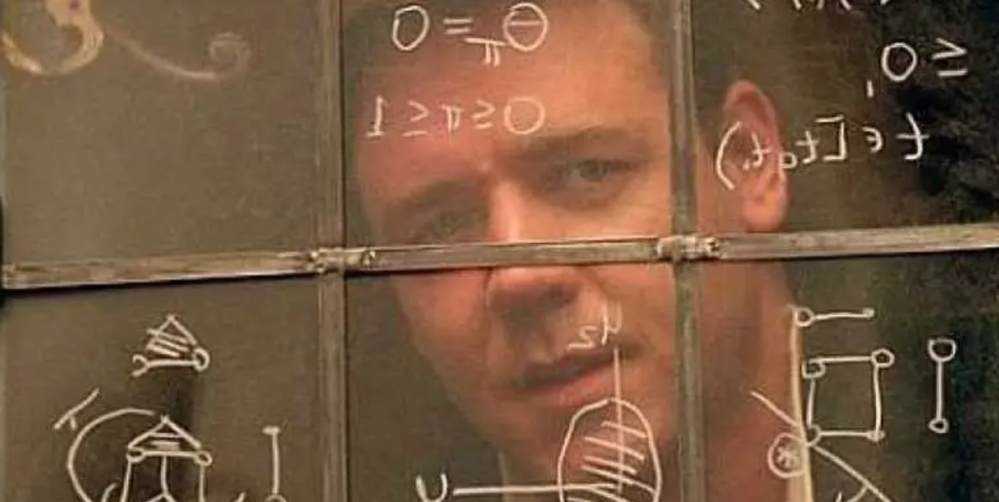
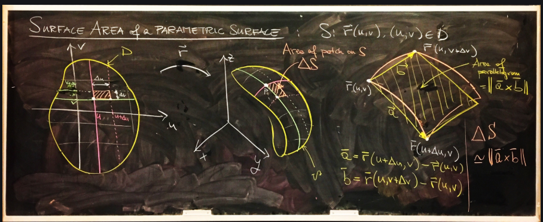
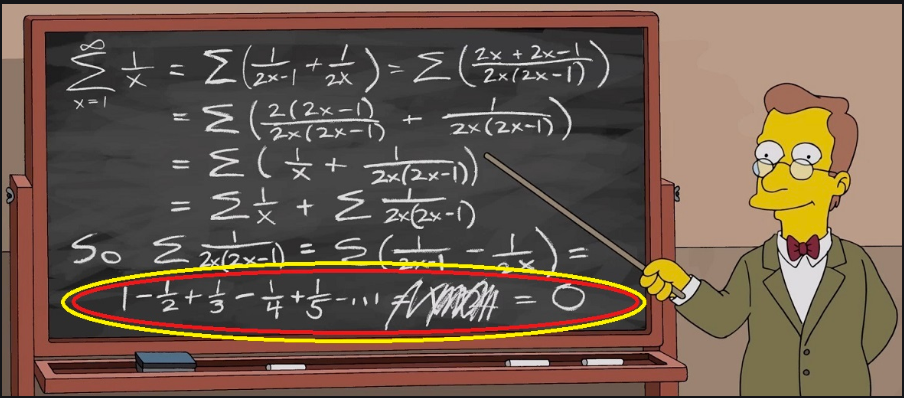

These are notes and test papers about real analysis.

---
## Table of Contents
1. [Real Analysis I](#analysis1)
2. [Real Analysis II](#analysis2)
3. [Real Analysis III](#analysis3)
4. [References](#references)

---

In mathematics, **real analysis** is the branch of mathematical analysis that studies 
the behavior of real numbers, sequence and series of real numbers, and real functions.
Some particular properties of real valued sequences and functions that real analysis 
studies include convergence, limits, continuity, smoothness, differentiability and 
integrability.

---

## Real Analysis I

  

---
### Lecture Notes
+ [**📖Introduction**](http://wuguoning.github.io/files/analysis/introduction.pdf)
+ [**📖Limit of Sequence**](http://wuguoning.github.io/files/analysis/limits.pdf)
+ [**📖Continuity**](http://wuguoning.github.io/files/analysis/continuity.pdf)
+ [**📖Mean Value Theorem**](http://wuguoning.github.io/files/analysis/meanvalue.pdf)
+ [**📖Derivative**](http://wuguoning.github.io/files/analysis/derivative.pdf)
+ [**📖Primitive**](http://wuguoning.github.io/files/analysis/primitive.pdf)
+ [**📖Definite Integral**](http://wuguoning.github.io/files/analysis/integral.pdf)
    - [Slide of Definite Integral](http://wuguoning.github.io/files/analysis/slides/integral.pdf)
+ [**📖Improper Integral**](http://wuguoning.github.io/files/analysis/improperIntegral.pdf)
    - [Slide of Definite Integral](http://wuguoning.github.io/files/analysis/slides/improperIntegral.pdf)

---

### Homework
+ [**📝Homework of Introduction**](http://wuguoning.github.io/files/analysis/homeworks/homework_introduction.pdf)
+ [**📝Homework of Limits**](http://wuguoning.github.io/files/analysis/homeworks/homework_limits.pdf)
+ [**📝Homework of Continuity.**](http://wuguoning.github.io/files/analysis/homeworks/homework_continuity.pdf)
+ [**📝Homework of Mean Value Theorem.**](http://wuguoning.github.io/files/analysis/homework4.pdf)
+ [**📝Homework of Derivative.**](http://wuguoning.github.io/files/analysis/homework5.pdf)
+ [**📝homework of Primitive.**](http://wuguoning.github.io/files/analysis/primitive_homework.pdf) 
+ [**📝Homework.**](http://wuguoning.github.io/files/analysis/integral_homework.pdf)

---
### Test

+ [**✏️Test of Limits.**](http://wuguoning.github.io/files/analysis/test1.pdf)
+ [**✏️Test of Continuity.**](http://wuguoning.github.io/files/analysis/test2.pdf)
+ [**✏️Test of Mean Value Theorem.**](http://wuguoning.github.io/files/analysis/test3.pdf)
+ [**✏️Test of Derivative.**](http://wuguoning.github.io/files/analysis/test4.pdf)
+ [**✏️Test of Primitive.**](http://wuguoning.github.io/files/analysis/test4.pdf)

---

+ [**✏️Midterm Test 18-19-1.**](http://wuguoning.github.io/files/analysis/midtermtest18-19-1.pdf)
+ [**✏️Midterm Test 17-18-1.**](http://wuguoning.github.io/files/analysis/17-18-1-real-analysis-mid-term-test.pdf)
+ [**✏️Final Test 17-18-1.**](http://wuguoning.github.io/files/analysis/17-18-1_real_analysis_final_test.pdf)

---
### List
+ [**✏️Students:20-21-1-Analysis-I**](http://wuguoning.github.io/files/analysis/list/20-21-1-Analysis-I.xls)

---

## Real Analysis II

  

---
### Lecture Notes

+ [**📖Multi-variable Function.**](http://wuguoning.github.io/files/analysis/mul_var_fun.pdf)
+ [**📖Differential of Multi-variable Function.**](http://wuguoning.github.io/files/analysis/diff_multi_var.pdf)
+ [**📖Multiple Integral.**](http://wuguoning.github.io/files/analysis/mul_int.pdf)
+ [**📖Line and Surface Integral.**](http://wuguoning.github.io/files/analysis/line_and_surface.pdf)

---
### Homework

+ [**📝Homework of Multi-variable Function**](http://wuguoning.github.io/files/analysis/homework_mult_continuity.pdf)

+ [**📝Homework of Differential of Multi-variable Function**](http://wuguoning.github.io/files/analysis/homework_mult_diff.pdf)

---
### Test
+ [**✏️Test for differential of multi-variable function**](http://wuguoning.github.io/files/analysis/test6.pdf)
  - [**✏️Answer of differential of multi-variable function**](http://wuguoning.github.io/files/analysis/mulvar_diff_test_ans.pdf)
+ [**✏️Test of multiple integral**](http://wuguoning.github.io/files/analysis/mul_int_test.pdf)
  - [**✏️Answer of multiple integral**](http://wuguoning.github.io/files/analysis/mulvar_int_test_ans.pdf)
+ [**✏️Test of line ans surface integral**](http://wuguoning.github.io/files/analysis/line_surface_int_test.pdf)
  - [**✏️Answer of line ans surface integral**](http://wuguoning.github.io/files/analysis/lineSurface_test_ans.pdf)
+ [**✏️Final Test: 18-19-2-final-test**](http://wuguoning.github.io/files/analysis/2018-2019-2-final-test-and-ans.pdf)

---

## Real Analysis III

  

---
### Lecture Notes

+ [**📖Parameter Integral.**](http://wuguoning.github.io/files/analysis/para-int.pdf)
+ [**📖Series.**](http://wuguoning.github.io/files/analysis/series.pdf)
+ [**📖Function Series.**](http://wuguoning.github.io/files/analysis/function_series.pdf)
+ [**📖Power Series.**](http://wuguoning.github.io/files/analysis/powerSeries.pdf)
+ [**📖Fourier Series.**](http://wuguoning.github.io/files/analysis/fourierSeries.pdf)

---
### Homework
+ [**📝Homework of Parameter Integral**](http://wuguoning.github.io/files/analysis/homework_para_int.pdf)
+ [**📝Homework of Series**](http://wuguoning.github.io/files/analysis/homeworks/homework_series.pdf)
+ [**📝Homework of Functional Series**](http://wuguoning.github.io/files/analysis/homeworks/homework_funcseries.pdf)
+ [**📝Homework of Power Series**](http://wuguoning.github.io/files/analysis/homeworks/homework_power_series.pdf)
+ [**📝Homework of Fourier Series**](http://wuguoning.github.io/files/analysis/homeworks/homework_fourier_series.pdf)

---
### List
+ [**✏️Students-20-21-1-Analysis-III.**](http://wuguoning.github.io/files/analysis/list/20-21-1-Analysis-III.xls)

---
### Test
+ [**✏️Parameter Integral**](http://wuguoning.github.io/files/analysis/test_para_inte.pdf)

---
## References:
  [1]. V. A. Zorich. Mathematical Analysis I, 2nd ed. 2015, Springer.

  [2]. V. A. Zorich. Mathematical Analysis II, 2nd ed. 2015, Springer.

  [3]. 陈纪修,於崇华. 数学分析上下册, 2006, 高等教育出版社.

  [4]. 华东师范大学. 数学分析上下册, 2010, 高等教育出版社.

  [5]. 裴礼文. 数学分析中的典型问题与方法, 2015, 高等教育出版社.

---

# Calculus and its Visualization: an Introduction

---

# 👏 THANKS

---
