这部分介绍多元函数微分及其应用。

## 目录
+ [第一节 平面点集与多元函数](#cotes1)
+ [第二节 二元函数的极限](#cotes2)
+ [第三节 二元函数的连续](#cotes3)
+ [第四节 二元函数可微性](#cotes4)
+ [第五节 方向导数与梯度](#cotes5)
+ [第六节 复合函数求导法则](#cotes6)
+ [第七节 隐函数求导法则](#cotes7)
+ [第八节 多元函数微分几何应用](#cotes8)
+ [第九节 极值与拉格朗日乘数法](#cotes9)

---

<a name="cotes1"></a>
## 📌**1. 平面点集与多元函数**

<span style="color:red">**多元函数**</span>是指自变量为两个或两个以上的函数。作为一元函数的推广，自身保留了一元函数的许多性质，但是也产生了许多新的不同于一元函数的性质。本章主要针对于二元函数展开讨论，在掌握了二元函数的理论后可以推广到$n$元函数中去。

**平面点集**

当平面上确定一个坐标系后，所有的有序二元数组$(x,y)$与平面上的点之间建立了一一对应关系(数形对应)，这种确定了坐标系的平面称为<span style="color:red">**坐标平面**</span>。

坐标平面上满足某些条件$P$的点的集合称为平面点集，记作

<center>
  $E = \left\{(x,y) \vert (x,y)满足条件P\right\}$
</center>

下图为平面上三个不同<span style="color:red">**距离**</span>定义下的单位圆：

  + 欧几里德距离: $Dist(P_1(x_1, y_1), P_2(x_2, y_2)) = \sqrt{(x_1 - x^2)^2 + (y_1 - y_2)^2}$;

  + 切比雪夫距离: $Dist(P_1(x_1, y_1), P_2(x_2, y_2)) = \max \left(\vert x_1 - x_2 \vert, \vert y_1 - y_2\vert \right)$;

  + 曼哈顿距离: $Dist(P_1(x_1, y_1), P_2(x_2, y_2)) = \vert x_1 - x_2\vert + \vert y_1 - y_2\vert$;

<center>
  <a href="https://www.geogebra.org/geometry/dedtwqnf">
  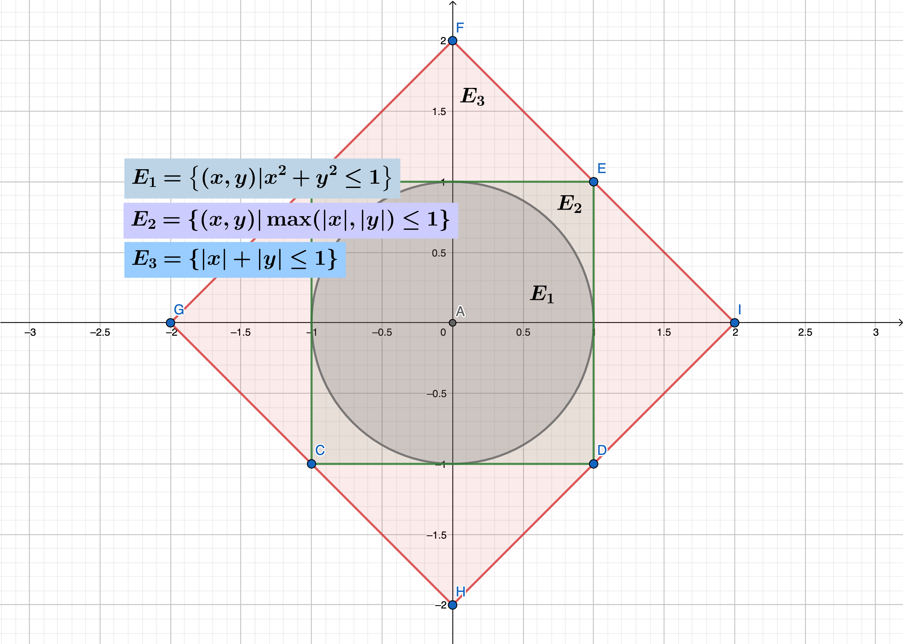
  </a>
</center>

如果不作声明，我们一般🈯️欧几里德距离。

若$P(x_0, y_0) \in \mathbf{R}^2$，我们称到点$P_0$的距离小于$\delta$的所有点的集合称为$P_0$的$\delta$邻域，记作$U(P_0, \delta)$.

---

**点集与集合之间的关系**

假设$E \subset \mathcal{R}^2$, 有：

+ <span style="color:red">**内点**</span>: 若存在点$P$的邻域$U(P)$，使得$U(P) \subset E$;

+ <span style="color:red">**边界点**</span>: 若$P$的任何一个邻域既含有$E$中的点，又含有不属于$E$中的点；

+ <span style="color:red">**外点**</span>: 若存在$P$的一个邻域$U(P)$，使得$U(P) \cap E = \emptyset$


<center>
  <a href="https://www.geogebra.org/geometry/nkjmkqvy">
  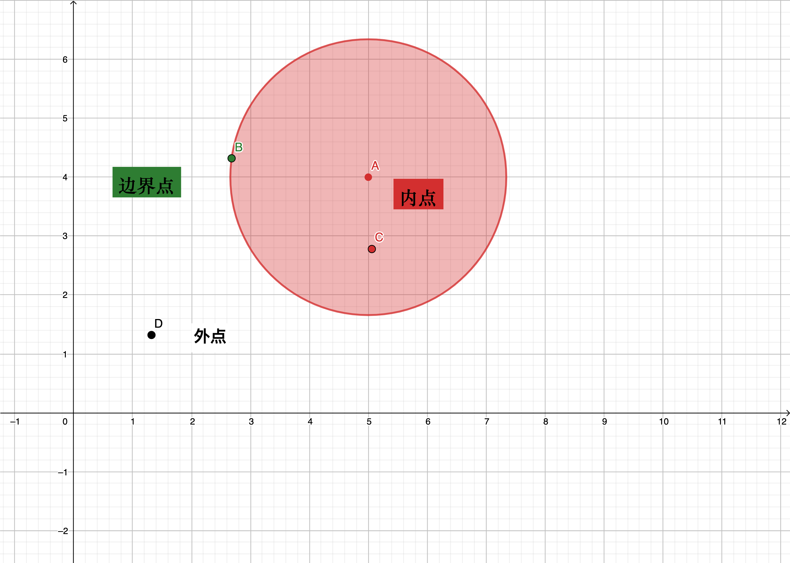
  </a>
</center>

另外点$P$与集合$E$的另一种关系为：

+ <span style="color:red">**聚点**</span>: 若点$P$的任何一个空心邻域$\mathring{U}(P, \delta)$都含有$E$中的点，则$P$称为$E$的聚点；

+ <span style="color:red">**孤立点**</span>: 若$P \in E$但不是$E$的聚点。

**一些重要的平面点集的定义**

+ <span style="color:red">**开集**</span>: 若平面点集$E$中的每一个点都为$E$的内点；

+ <span style="color:red">**闭集**</span>: 若点集$E$中的所有聚点都属于$E$，或者$E^C$($E$的补集)为开集；

+ <span style="color:red">**有界集**</span>: 若集合$E$中的点到$O(0,0)$的最大距离为一个有限数；

+ <span style="color:red">**开域**</span>: 若非空开集合$E$具有<span style="color:red">**连通性**</span>，即$E$中的任意两点都可以用属于$E$中的折线相连接；

+ <span style="color:red">**闭域**</span>: 开域连同其边界形成的点集；

+ <span style="color:red">**区域**</span>: 开域、闭域、或者开域连同一部分边界点形成的点集。

---

**二元函数**

设$D \subset \mathcal{R}^2$，若按照某个对应法则$f$，$D$中的每一个点$P(x,y)$都有一个确定的实数$z$与之对应，则称$f$
为定义在$D$上的一个<span style="color:red">**二元函数**</span>，记作

<center>
  $f: D \to \mathcal{R}$
</center>

称$D$为$f$的<span style="color:red">**定义域**</span>。若$P \in D$称与$P$所对应的$z$为点$P$的<span style="color:red">**函数值**</span>，记为$z = f(P)$。全体函数值的集合为$f$的<span style="color:red">**值域**</span>。$(x,y)$称为$f$的<span style="color:red">**自变量**</span>，而把$z$称为<span style="color:red">**因变量**</span>。


<center>
  <a href="https://www.geogebra.org/3d/svpcxqhq">
  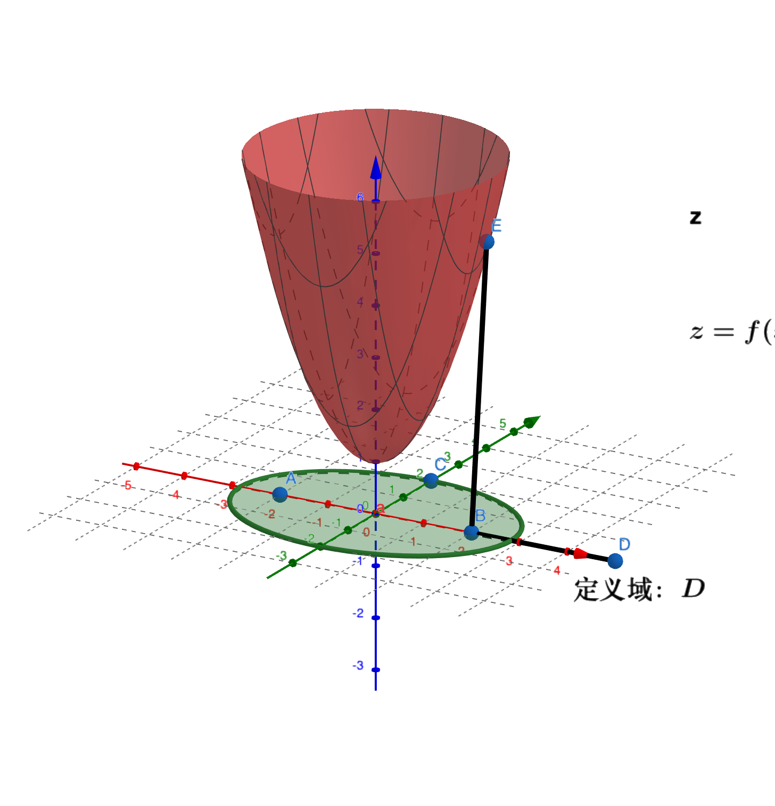
  </a>
</center>


**$n$元函数**

设$D \subset \mathcal{R}^n$，若按照某个对应法则$f$，$D$中的每一个点$P(x_1, x_2, \cdots, x_n)$都有一个确定的实数$z$与之对应，则称$f$
为定义在$D$上的一个<span style="color:red">**$n$元函数**</span>，记作

<center>
  $f: D \to \mathcal{R}$
</center>

---
<span style="color:red"> 
📚**第一次作业:**
</span>

+ 求下列函数的定义域：
  - $f(x,y) = \sqrt{x^2 + y^2}$

  - $f(x, y) = \ln (y - x)$

  - $f(x, y, z) = \sqrt{R^2 - x^2 - y^2} + \dfrac{1}{\sqrt{x^2 + y^2 + z^2}}(R > r)$

---

<a name="cotes2"></a>
## 📌**2. 二元函数的极限**

设二元函数$f(x,y)$的定义域为$D \subset \mathcal{R}^2$, $P_0$为$D$的一个聚点，$A$是一个确定的实数。如果对于任意的$\epsilon > 0$，总存在某一个正数$\delta > 0$，使得当$P \in \mathring{U}(P_0, \delta)$时($0 < \|P - P_0\| < \delta$)时，有$\vert f(P) - A \vert < \epsilon$。则称$f(x, y)$当$P \to P_0$时极限为$A$，记为：
<center>
  $\lim\limits_{P \to P_0}f(P) = A.$
</center>

---

<span style="color:red">
**数学逻辑语言为:**
</span>

<center>
  $\lim\limits_{P \to P_0}f(P) = A \iff \forall \epsilon > 0, \exists \delta > 0, \forall P \in \mathring{U}(P_0, \delta) \Rightarrow \vert f(P) - A \vert < \epsilon.$
</center>
---
**✏️例子**

  设$f(x,y) = (x^2 + y^2)\sin \dfrac{1}{\sqrt{x^2 + y^2}}$，证明$\lim\limits_{(x,y) \to (0,0)} f(x,y) = 0$

<details>
<summary>⬇️ Click to expand!</summary>
$
\begin{split}
& \because \left| (x^2 + y^2)\sin \dfrac{1}{\sqrt{x^2 + y^2}} - 0 \right| \le x^2 + y^2 \newline
& \therefore \delta = \sqrt{\epsilon}, \forall \vert (x,y) - (0, 0) \vert \le \delta \Rightarrow 
  \vert f(x,y) - f(0, 0) \vert \le \epsilon
\end{split}
$
</details>

---
**✏️例子**

  讨论极限$\lim\limits_{(x, y) \to (0, 0)} \dfrac{xy}{x^2 + y^2}$

<details>
<summary>⬇️ Click to expand!</summary>
$
\begin{split}
&\because \lim\limits_{\substack{(x, y) \to (0, 0)\newline y =kx}} = \dfrac{1 + k}{1 + k^2} \newline
& \therefore
\end{split} 极限不存在，极限依赖与路径。
$
</details>

<center>
  <a href="https://www.geogebra.org/3d/pwqr5yuz">
  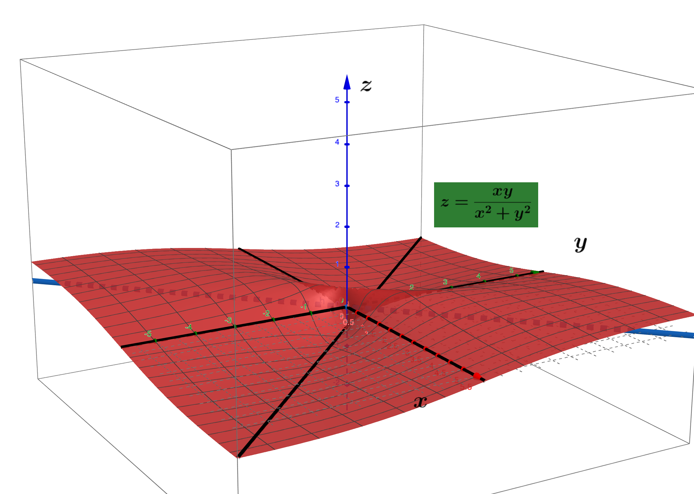
  </a>
</center>

---
**✏️例子**

讨论极限$\lim\limits_{(x, y) \to (0, 0)} \dfrac{x^2 + y^2}{\sqrt{x^2 + y^2 + 1} - 1}$

<details>
<summary>⬇️ Click to expand!</summary>
解： 
$
\begin{split}
\lim\limits_{(x, y) \to (0, 0)} \dfrac{x^2 + y^2}{\sqrt{1 + x^2 + y^2} - 1} & = \lim\limits_{t \to 0}\dfrac{t}{\sqrt{(1 + t) - 1}}\newline 
& \lim\limits_{t \to 0}\dfrac{t}{1/2 t} = 2.
\end{split}
$
</details>
---
**累次极限**

几种极限：

+ 重极限：$\lim\limits_{(x,y) \to (x_0, y_0)} f(x,y)$;

+ 累次极限：$\lim\limits_{x \to x_0}\lim\limits_{y \to y_0} f(x, y)$ 或者 $\lim\limits_{y \to y_0}\lim\limits_{x \to x_0}f(x, y)$

---
🛠<span style="color:red">**思考题**</span>

思考重极限和累次极限的关系是什么？

---
<span style="color:red"> 
📚**第二次作业:**
</span>

+ 求下列极限
  - $\lim\limits_{(x,y) \to (0, 0)}\dfrac{1 - xy}{x^2 + y^2}$;

  - $\lim\limits_{(x,y) \to (0, 0)}\dfrac{2 - \sqrt{4 + xy}}{xy}$;

  - $\lim\limits_{(x,y) \to (0, 0)}\dfrac{x + y}{x - y}$

+ 函数$z = \dfrac{y^2 + 2x}{y^2 - 2x}$在何处间断？

---

<a name="cotes3"></a>
## 📌**3. 二元函数的连续**

**二元函数连续性定义**

---
设函数$f$为定义在点集$D \subset \mathcal{R}^2$上的二元函数，$P_0 \in D$(它或者是$D$的聚点，或者是$D$的孤立点)，对于任意的$\epsilon > 0$，总存在相应的$\delta > 0$，只要$P \in U(P_0, \delta) \cap D$，有：
<center>
  $\vert f(P) - f(P_0)\vert \le \epsilon$
</center>
则称<span style="color:red">$f$在$P_0$点连续</span>。

---
<span style="color:red">
**数学逻辑语言为:**
</span>

<center>
  $\lim\limits_{P \to P_0}f(P) = f(P_0)  \iff \forall \epsilon > 0, \exists \delta > 0, \forall P \in U(P_0, \delta) \Rightarrow \vert f(P) - f(P_0) \vert < \epsilon.$
</center>

---
**连续函数的性质**

有界闭区域上的连续函数有以下性质：

+ 有界性、能够取得最大最小值；

+ 介值定理；

+ 一致连续。

---
<span style="color:red"> 
📚**第三次作业:**
</span>

+ 讨论下列函数的连续性：
  
  - $f(x, y) = \lfloor x + y \rfloor$(取整函数)；

  - <center>
    $f(x, y) = \left\{\begin{array}{cl}  \dfrac{\sin xy}{\sqrt{x^2 + y^2}}, & x^2 + y^2 \ne 0 \newline  0, & x^2 + y^2 = 0 \end{array} \right. $
    </center>

---

<a name="cotes4"></a>
## 📌**4. 二元函数可微性**

**可微与全微分**

在一元函数中，函数可微的几何意义为函数在给定点的切线存在，函数在给定点处的微分其实为函数对应点的线形映射。
<center>
$df|_{x_0}(\Delta x) = f'(x_0)\Delta x$
</center>

---
设函数$z = f(x, y)$在$P(x_0, y_0)$点的某邻域$U(P_0)$上有定义，对于$P(x_0 + \Delta x, y_0 + \Delta y) \in U(P_0)$，如果有：

<center>
$$P(x_0 + \Delta x, y_0 + \Delta y) - f(x_0, y_0) = A\Delta x + B\Delta y + o(\rho)$$
或者
$$P(x_0 + \Delta x, y_0 + \Delta y) - f(x_0, y_0) = A\Delta x + B\Delta y + \epsilon_1 \Delta x + \epsilon_2 \Delta y$$
</center>

其中$A, B$仅与$P_0$有关，$\rho = \sqrt{\Delta x^2 + \Delta y^2}$，$o(\rho)$为$\rho$的高阶无穷小量(第二种情形，$\epsilon_1, \epsilon_2$为随着$\Delta x, \Delta y \to 0$的无穷小量)，则称函数$f$在$P_0$点<span style="color:red">**可微**</span>，并称线形函数$A\Delta x + B\Delta y$为函数$f$的<span style="color:red">**全微分**</span>，记作：


<center>
$$df|_{P_0}(\Delta x, \Delta y) = A\Delta x + B\Delta y $$
</center>

---
**偏导数**

对于二元函数，固定其中的一个变量，考察二元函数对其中一个变量的变化率，这就是偏导数。

---
设函数$z = f(x,y), (x,y) \in D$，若$(x_0, y_0) \in D$，且$f(x, y_0)$在$x_0$的某邻域内有定义，则当极限

<center>
  $\lim\limits_{\Delta x \to 0} \dfrac{\Delta_x f(x_0, y_0)}{\Delta x} = \lim\limits_{\Delta x \to 0} \dfrac{f(x_0+\Delta x, y_0) - f(x_0, y_0)}{\Delta x}$
</center>

存在时，称这个极限为函数$f$在$(x_0,y_0)$关于$x$的<span style="color:red">**偏导数**</span>，
记作

<center>
  $f_x(x_0, y_0), z_x(x_0, y_0), \left.\dfrac{\partial f}{\partial x}\right\vert_{(x_0, y_0)}, \left.\dfrac{\partial z}{\partial x}\right\vert_{(x_0, y_0)}$
</center>


同样可以定义$f$关于点$(x_0, y_0)$关于$y$的偏导数$f_y(x_0, y_0), \left.\dfrac{\partial f}{\partial x}\right\vert_{(x_0,y_0)}$

二元函数偏导数$f_x(x_0, y_0)$是曲面$z = f(x, y)$与平面$y = y_0$的交线在$x = x_0$点的导数。

关于偏导数的几何意义，见下图：

<center>
  <a href="https://www.geogebra.org/3d/bk2tdtxf">
    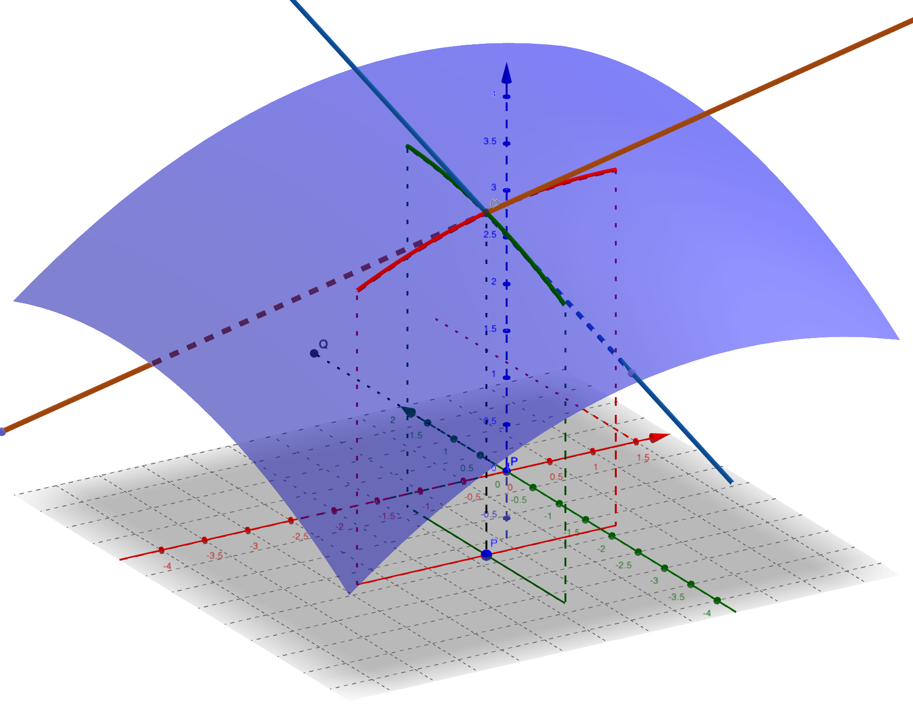
  </a>
</center>

<center>
  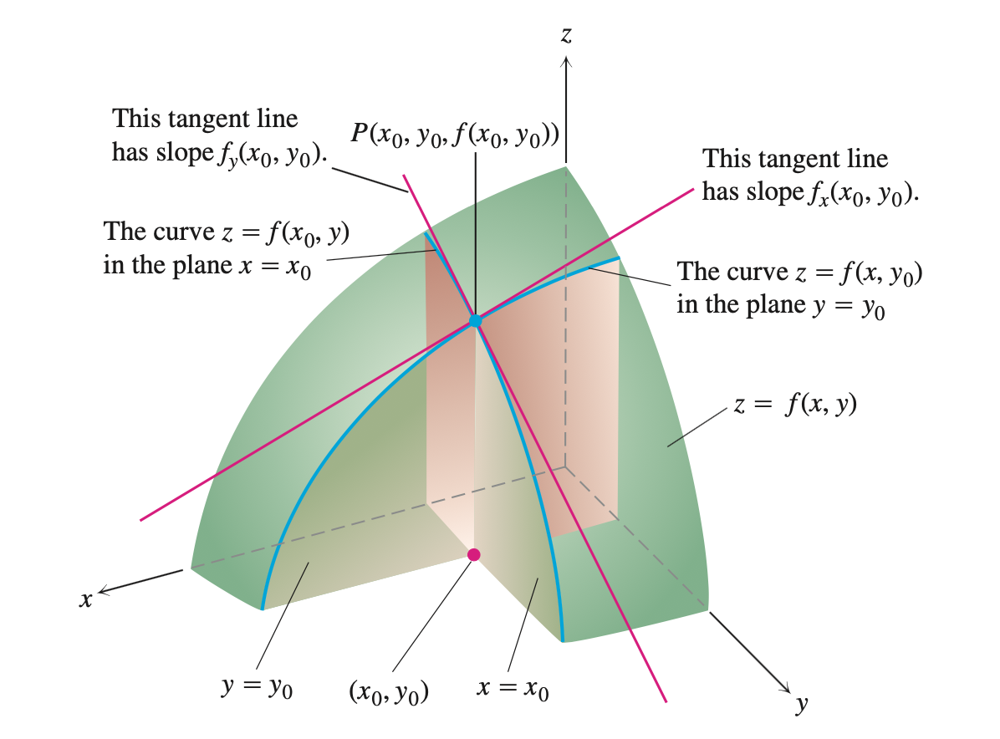
</center>

若函数$z = f(x,y)$在区域$D$上的每一点$(x,y)$都存在对$x$(或对$y$)的偏导数，则得到函数$z = f(x, y)$在区域$D$上对$x$(或对$y$)的<span style="color:red">**偏导函数**</span>，记作

<center>
  $f_x(x, y), \dfrac{\partial f}{\partial x}$
</center>

<center>
  $f_y(x, y), \dfrac{\partial f}{\partial y}$
</center>
---
**✏️例子**

求函数$f(x, y) = x^3 + 2x^2y - y^3$在点$(1,3)$关于$x$和关于$y$的偏导数。

<details>
<summary>⬇️ Click to expand!</summary>
$f_x(1, 3) = \dfrac{\textrm{d} f(x, 3)}{\textrm{d} x} = 3x^2 + 12x\vert_{x=1} = 15$
另外一个偏导数为
$f_y(1, 3) = \dfrac{\textrm{d} f(1, y)}{\textrm{d} x} = 2 - 3y^2\vert_{y=3} = -25$

偏导函数
$f_x(x, y) = \dfrac{\textrm{d} f(x, y)}{\textrm{d} x} = 3x^2 + 4xy$

</details>

---
# python code

```python
s = "Python syntax highlighting"

# import modules
import sympy as sym

# Define the symbol function
x, y = sym.symbols('x y')
f = x**3 + 2*x**2*y - y**3
f_x = sym.diff(f, x)
f_x = sym.diff(f, y)

# Compute the values
f_x.subs([(x,1),(y,3)])
f_y.subs([(x,1),(y,3)])

```
---

**高阶偏导数**

对一阶偏导函数求偏导数，或者是对函数求两次偏导数得到函数的二阶偏导数。二阶偏导数记作，
<center>
  $\dfrac{\partial^2 f}{\partial x^2}$ 或者$f_{xx}$
</center>
<center>
  $\dfrac{\partial^2 f}{\partial y^2}$ 或者$f_{yy}$
</center>
<center>
  $\dfrac{\partial^2 f}{\partial x \partial y}$ 或者$f_{xy}$
</center>
<center>
  $\dfrac{\partial^2 f}{\partial y\partial x}$ 或者$f_{yx}$
</center>

这里二阶偏导数的计算过程为：
<center>
  $\dfrac{\partial^2 f}{\partial x^2} = \dfrac{\partial}{\partial x}\left(\dfrac{\partial f}{\partial x}\right)$ 或者$f_{xx} = (f_x)_x$
</center>

<center>
  $\dfrac{\partial^2 f}{\partial y^2} = \dfrac{\partial}{\partial y}\left(\dfrac{\partial f}{\partial y}\right)$ 或者$f_{yy} = (f_y)_y$
</center>

<center>
  $\dfrac{\partial^2 f}{\partial x\partial y} = \dfrac{\partial}{\partial x}\left(\dfrac{\partial f}{\partial y}\right)$ 或者$f_{xy} = (f_x)_y$
</center>

<center>
  $\dfrac{\partial^2 f}{\partial y\partial x} = \dfrac{\partial}{\partial y}\left(\dfrac{\partial f}{\partial x}\right)$ 或者$f_{yx} = (f_y)_x$
</center>

---
**✏️例子**
设$z = x^3y^2 - 3xy^3 - xy + 1$求 $\dfrac{\partial^2 z}{\partial x^2}, \dfrac{\partial^2 z}{\partial x \partial y}$
<details>
<summary>⬇️ Click to expand!</summary>
解： $\dfrac{\partial z}{\partial x} = 3x^2y^2 - 3y^3 - y, \dfrac{\partial z}{\partial y} = 2x^3y - 9xy^2 - x$


所以，
$
\begin{split}
& \dfrac{\partial^2 z}{\partial x^2} = 6xy^2, \newline
&\dfrac{\partial^2 z}{\partial x \partial y} = 6x^2y - 9y^2 - 1\newline
&\dfrac{\partial^2 z}{\partial y \partial x} = 6x^2y - 9y^2 - 1\newline
&\dfrac{\partial^2 z}{\partial y^2} = 2x^3 - 18xy
\end{split}
$

</details>

---
如果函数$z = f(x,y)$的两个混合偏导数$\dfrac{\partial f}{\partial x \partial y}, \dfrac{\partial^2f}{\partial y \partial x}$连续，则两个混合偏导数相等。

---
**可微、连续和偏导的关系探讨**

+ 可微:  $P(x_0 + \Delta x, y_0 + \Delta y) - f(x_0, y_0) = A\Delta x + B\Delta y + \epsilon_1 \Delta x + \epsilon_2 \Delta y$;

+ 连续:  $\lim\limits_{(\Delta x, \Delta y) \to (0, 0)}P(x_0 + \Delta x, y_0 + \Delta y) = f(x_0, y_0)$;

+ 偏导数存在：$\lim\limits_{\Delta x \to 0 }\dfrac{P(x_0 + \Delta x, y_0) - f(x_0, y_0)}{\Delta x} = 存在$ 和 $\lim\limits_{\Delta y \to 0 }\dfrac{P(x_0, y_0 + \Delta y) - f(x_0, y_0)}{\Delta y} = 存在$

---
<span style="background-color:lightblue">
   💡可微===>连续，但是连续不一定可微。
</span> 

---

如果函数$f$在$P_0(x_0, y_0)$点可微，则有：
<center>
$P(x_0 + \Delta x, y_0 + \Delta y) - f(x_0, y_0) = A\Delta x + B\Delta y + \epsilon_1 \Delta x + \epsilon_2 \Delta y$;
</center>
在上面等式中令$\Delta y = 0$，则有：
<center>
$\lim\limits_{\Delta x \to 0 }\dfrac{P(x_0 + \Delta x, y_0) - f(x_0, y_0)}{\Delta x} = A$
</center>
同理，在上面可微分等式中令$\Delta x = 0$，则有：
<center>
$\lim\limits_{\Delta y \to 0 }\dfrac{P(x_0, y_0 + \Delta y) - f(x_0, y_0)}{\Delta y} = B$
</center>

---
如果函数$f(x, y)$在点$P_0(x_0, y_0)$点可微分，那么该函数在点$P_0(x_0, y_0)$的偏导数存在，且有：
<center>
$\left.\mathrm{d}z\right\vert_{P_0}(\Delta x, \Delta y) = \left.\dfrac{\partial z}{\partial x}\right\vert_{(x_0, y_0)}\Delta x + \left.\dfrac{\partial z}{\partial y}\right\vert_{(x_0, y_0)}\Delta y $
</center>

习惯上，我们把自变量的增量$\Delta x$和$\Delta y$分别记为$\textrm{d}x$和$\textrm{d}y$，这样函数的全微分为：

<center>
$\textrm{d} z = \dfrac{\partial z}{\partial x} \textrm{d}x + \dfrac{\partial z}{\partial y}\textrm{d}y$ 
</center>

---
 <span style="background-color:lightblue"> 
   💡可微===>偏导数存在，但是偏导数存在不一定可微。
 </span> 

---
如果函数$z = f(x,y)$的偏导数$\dfrac{\partial z}{\partial x}, \dfrac{\partial z}{\partial y}$在点$(x,y)$连续，则函数在$(x,y)$点处可微分。

---
**✏️例子**

讨论函数
<center>
$f(x,y) = \left\{\begin{array}{ll} \dfrac{xy}{\sqrt{x^2 + y^2}}, & x^2 + y^2 \ne 0 \newline 0, & x^2 + y^2 = 0 \end{array}\right.$
</center>
在$(0, 0)$点的可微性。

<details>
<summary>⬇️ Click to expand!</summary>
按照定义可以证明:
$f_x(0, 0) = f_y(0, 0) = 0$
所以有，
<center>
$\Delta z - \mathrm{d}z\vert_{(0, 0)}(\Delta x, \Delta y)= f(\Delta x, \Delta y) - f(0, 0)- 0\times\Delta x - 0\times\Delta y
 = \dfrac{\Delta x \cdot \Delta y}{\sqrt{(\Delta x)^2 + (\Delta y)^2}}$
</center>

从而有：


<center>
$\dfrac{f(\Delta x, \Delta y) - f(0, 0)- 0\Delta x - 0\Delta y}{\sqrt{(\Delta x)^2 + (\Delta y)^2}} \nrightarrow 0, (\Delta x, \Delta y) \to (0, 0)$ 
</center>
所以函数在$(0, 0)$点不可微。

</details>

---
**✏️例子**
求函数$u = x - \cos \dfrac{y}{2} + \arctan \dfrac{z}{y}$的全微分。

<details>
<summary>⬇️ Click to expand!</summary>
解：由于
$\dfrac{\partial u}{\partial x} = 1, \dfrac{\partial u}{\partial y} = \dfrac{1}{2}\sin \dfrac{y}{2} - \dfrac{z}{y^2 + z^2}, \dfrac{\partial u}{\partial z} = \dfrac{y}{y^2 + z^2}$

所以有：

$\mathrm{d}u = \mathrm{d}x + \left(\dfrac{1}{2}\sin \dfrac{y}{2} - \dfrac{z}{y^2 + z^2}\right)\mathrm{d}y + \dfrac{y}{y^2 + z^2}\mathrm{d}z$

</details>

---

<span style="color:red"> 
📚**第四次作业:**

+ 求下列函数的偏导数
  
  - $z = \sin(xy) + \cos^2(xy)$

  - $z = x^{\dfrac{y}{z}}$

  - $u = \arctan(x - y)^z$

+ 求下列函数的$\dfrac{\partial^2 z}{\partial x^2}, \dfrac{\partial^2 z}{\partial y^2}, \dfrac{\partial^2 z}{\partial x \partial y} $

  - $z = x^4 + y^4 - 4x^2y^2$

  - $z = \arctan\dfrac{y}{x}$

  - $z = y^x$

+ 曲线
<center>
$\left\{\begin{array}{l} z = \dfrac{x^2 + y^2}{4}\newline y = 4 \end{array}\right.$ 
</center>
在点$(2, 4, 5)$处的切线对于$x$轴的倾角是多少？

+ 求下列函数的全微分：

  - $z = xy + \dfrac{x}{y}$

  - $z = \dfrac{y}{\sqrt{x^2 + y^2}}$
---

<a name="cotes5"></a>
## 📌**5. 方向导数与梯度**

偏导数研究的是二元函数沿着$x$轴方向或者$y$轴方向的变化率。我们可以更一般的讨论函数沿着任一射线方向的变化率。

以$P_0(x_0, y_0)$为起点，方向为$\mathbf{v}$的射线的参数方程为:
<center>
$\vec{OP_0} + \rho \mathbf{v} = (x_0 + \rho \cos \alpha, y_0 + \rho \sin \alpha), \rho \ge 0$.
</center>

---
设$D \subset \mathcal{R}^2$为开集，$f(x,y)$为定义在$D$上的二元函数，$(x_0, y_0) \in D$，$\mathbf{v} = (\cos \alpha, \sin \alpha)$为一个方向向量，如果极限
<center>
$\lim\limits_{\rho \to 0+}\dfrac{f(x_0 + \rho \cos \alpha, y_0 + \rho \sin \alpha) - f(x_0, y_0)}{\rho}$
</center>

存在，则称此极限为函数$f$在点$P_0(x_0, y_0)$点沿方向$\mathbf{v}$的<span style="color:red">**方向导数**</span>，记为

<center>
$\dfrac{\partial f}{\partial \mathbf{v}}\left|_{(x_0, y_0)}\right.$
</center>

曲面$z = f(x, y)$在$(x_0, y_0)$
<center>
  <a href="https://www.geogebra.org/3d/qxuq4ats">
    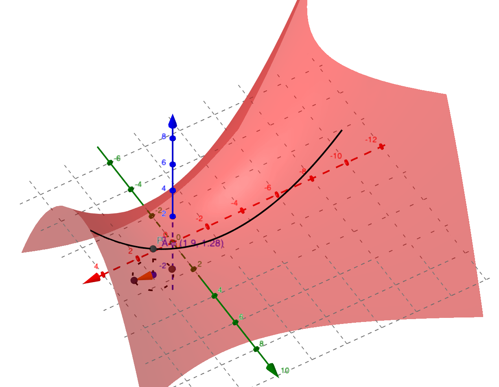
  </a>
</center>

---
**✏️例子**

讨论函数$z = \sqrt{x^2 + y^2}$在$(0, 0)$点，沿着任一方向$\mathbf{v} = (\cos \alpha, \sin \alpha)$的方向导数。

解：$\left.\dfrac{\partial f}{\partial \mathbf{v}}\right\vert_{(0, 0)} = \lim\limits_{\rho \to 0+}\dfrac{f(0 + \rho \cos \alpha, 0 + \rho \sin \alpha) - f(0, 0)}{\rho} = 1$

所以函数在$(0, 0)$点沿着任一方向的方向导数为常数1，见下图：

<center>
  <a href="https://www.geogebra.org/3d/c6umjdmd">
    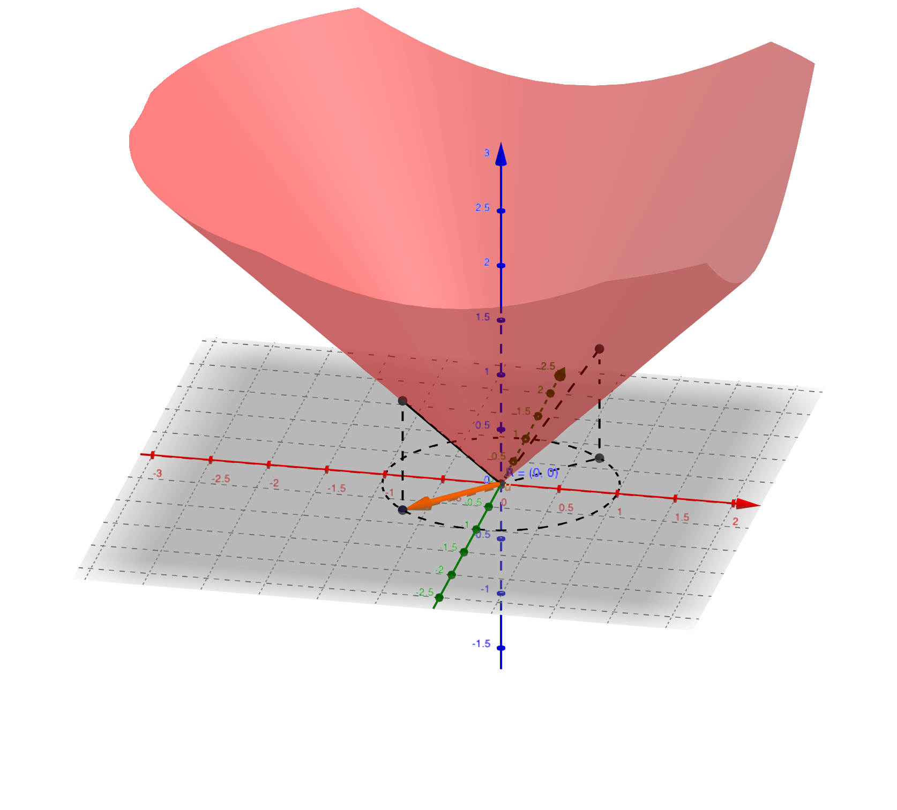
  </a>
</center>

---
**✏️例子**

讨论函数$f(x, y) = \vert x^2 - y^2 \vert^{1/2}$在原点的方向导数。

解：$\dfrac{\partial f}{\partial \mathbf{v}}\vert_{(0, 0)} = \lim\limits_{\rho \to 0+}\dfrac{f(0 + \rho \cos \alpha, 0 + \rho \sin \alpha) - f(0, 0)}{\rho} = \vert \cos^2 \alpha - \sin \alpha^2 \vert^{1/2}$

+ 当$\cos^2 \alpha = \sin^2 \alpha$时，沿着这样的方向，方向导数为零；

+ 当$\cos^2 \alpha \ne \sin^2 \alpha$时，沿着这样的方向，方向导数为$\vert \cos^2 \alpha  - \sin^2 \alpha \vert^{1/2}$；

见下图：

<center>
  <a href="https://www.geogebra.org/3d/xfezhpvs">
    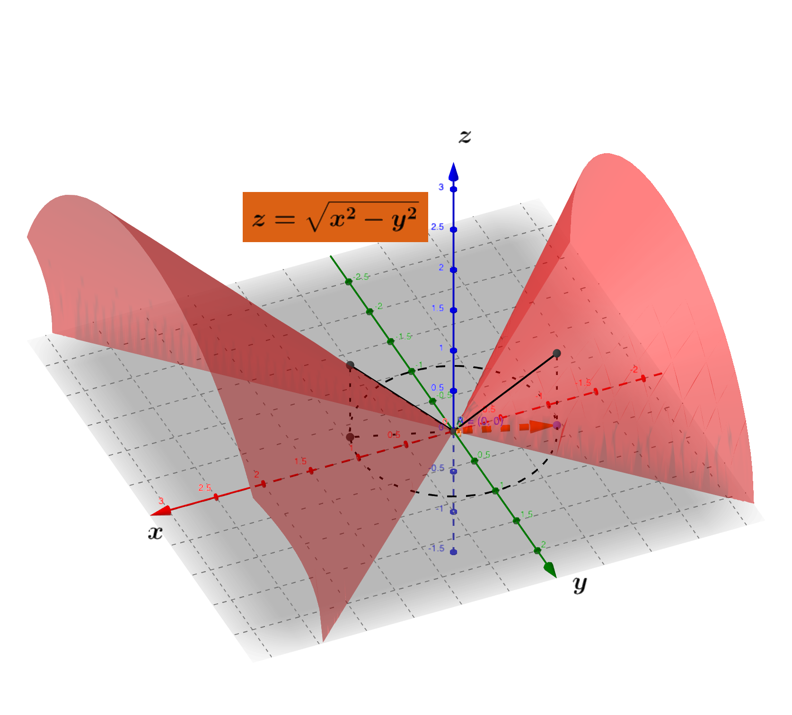
  </a>
</center>

---
**可微与方向导数的关系**

设函数$f(x,y)$在$P_0(x_0, y_0)$点可微分，那么对于任一方向$\mathbf{v} = (\cos \alpha, \sin \alpha)$，$f$在$P_0(x_0, y_0)$点沿方向$\mathbf{v}$的方向导数存在，且有

<center>
$\begin{split}
\left.\dfrac{\partial f}{\partial \mathbf{v}}\right|_{(x_0, y_0)} &  = \left.\dfrac{\partial f}{\partial x}\right|_{(x_0, y_0)} \cos \alpha + \left.\dfrac{\partial f}{\partial y}\right|_{(x_0, y_0)} \sin \alpha \newline
& = \left(\left.\dfrac{\partial f}{\partial x}\right|_{(x_0, y_0)}, \left.\dfrac{\partial f}{\partial y}\right|_{(x_0, y_0)}\right) \cdot (\cos \alpha, \sin \alpha)
\end{split}
$
</center>

---
**梯度**

若函数$f(x,y)$在点$P_(x_0, y_0)$对所有自变量的偏导数存在，则称向量$(f_x(x_0, y_0), f_y(x_0, y_0))$为函数在点$P_0$点处的<span style="color:red">**梯度**</span>。记作：

<center>
$\textbf{grad} f  = (f_x(P_0), f_y(P_0))$
</center>
或者

<center>
$\nabla f(P_0)  = (f_x(P_0), f_y(P_0))$
</center>

---
<span style="background-color:lightblue">
   💡 "$\nabla$"读作纳布拉，称为梯度运算符。
</span> 

---
下图为曲面:
<center>
$f(x,y) = \dfrac{-x^2(x+1)\dfrac{x-2}{4} - \dfrac{y^4 - 2y^2 + y + 2}{3}+2xy}{2} + 1$
</center>

<center>
  <a href="https://www.geogebra.org/3d/wafxpnzu">
    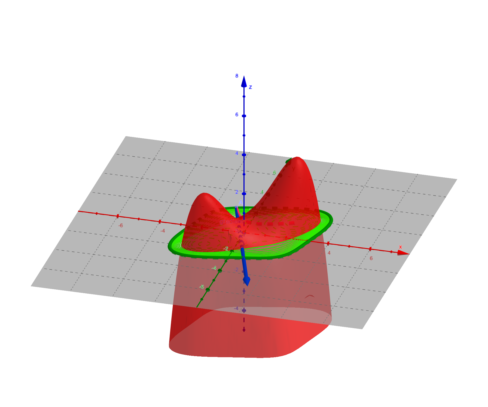
  </a>
</center>

该函数在$(x, y)$处的梯度为：$(f_x(x,y), f_y(x,y)) = (\dfrac{-4x^3 + 3x^2 + 4x + 8y}{8}, \dfrac{-4y^3 + 6x + 4y - 1}{6})$.

等值线为函数的取值为常数的自变量的范围：对于二元函数来讲，:
<span style="color:red">**等值线的表达式为:**</span>

<center>
$f(x,y) = c$
</center>

下图展示了上面曲面的等值线。

<center>
  <a href="https://www.geogebra.org/3d/wafxpnzu">
    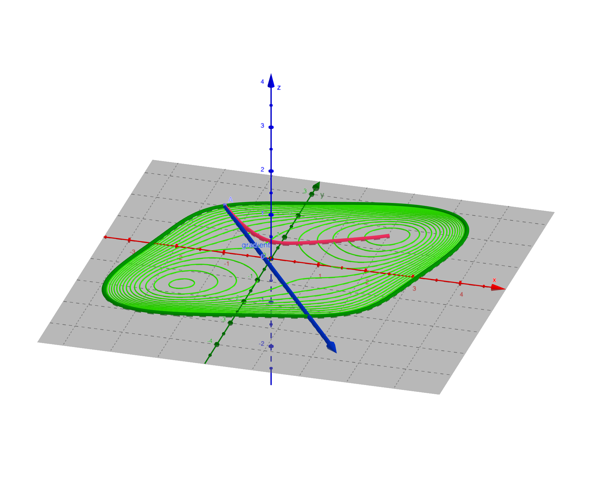
  </a>
</center>

---
 💡 从上面分析可以看出：

   + <span style="color:red">**方向导数为梯度在所求方向上的投影**</span>;

 <center>
 $\left.\dfrac{\partial f}{\partial \mathbf{v}}\right|_{P_0}  = \nabla f(P_0) \cdot \dfrac{\mathbf{v}}{\Vert \mathbf{v}\Vert}$
 </center>

  + 梯度为一个向量，不是一个标量;

  + 如果在一点处方向导数的方向选择为梯度方向，则方向导数最大，且值为梯度的模;

  + 如果在一点处方向导数的方向选择为负梯度方向，则方向导数最小，且值为梯度的模的相反数;

  + 如果在一点处方向导数的方向选择为和梯度垂直的方向，则方向导数的值为零;

  + 梯度方向和等值线相互垂直，且从等值线小值指向大值.

---
**✏️例子**

设$z = x^2 - xy + y^2$，求它在$(1,1)$点的沿方向$\mathbf{v} = (\cos \alpha, \sin \alpha)$的方向导数，并指出：

  + 沿着哪个方向的方向导数最大？

  + 沿着哪个方向的方向导数最下？

  + 沿着那个方向的方向导数为零。

<details>
<summary>⬇️ Click to expand!</summary>
解：函数在$P_0(1,1)$处的梯度为：
<center>
$\nabla f(1,1) = \left(2x - y, 2y - x\right)_{(1,1)} = (1, 1)$
</center>

所以，函数在$(1, 1)$处沿着方向$\mathbf{v} = (\cos \alpha, \sin \alpha)$的方向导数为：

<center>
$\dfrac{\partial f}{\partial \mathbf{v}}(1, 1) \cdot (\cos \alpha, \sin \alpha) = \cos \alpha + \sin \alpha = \sqrt{2}\sin (\alpha + \dfrac{\pi}{4})$
</center>

所以，函数沿着:
<center>
  (1) $\alpha = \dfrac{\pi}{4}$方向导数最大，且最大值为$\Vert \nabla f(1,1) \Vert = \sqrt{2}$
</center>

<center>
  (2) $\alpha = \dfrac{5\pi}{4}$方向导数最小，且最大值为$-\Vert \nabla f(1,1) \Vert = -\sqrt{2}$
</center>

<center>
  (3) $\alpha = \dfrac{5\pi}{4}, \dfrac{7\pi}{4}$方向导数为零。
</center>

<center>
  <a href="https://www.geogebra.org/3d/btfavuk5">
    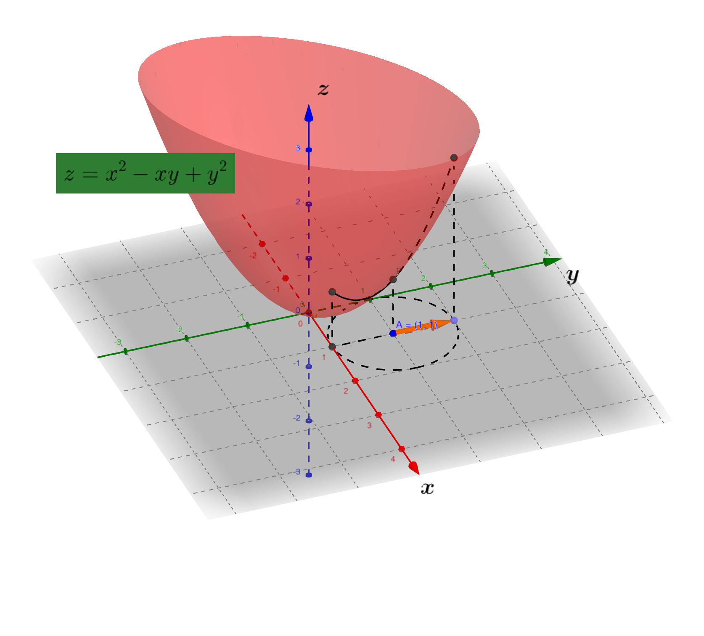
  </a>
</center>


<center>
  <a href="https://www.geogebra.org/3d/sskkyrp3">
    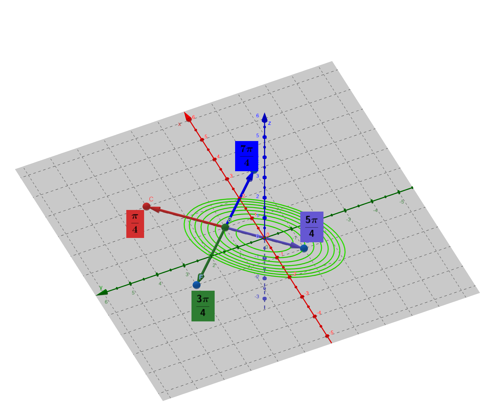
  </a>
</center>

</details>

---
**💡几个重要的定义：**

<span style="color:red">
偏导数、微分、方向导数、梯度。
</span> 

+ 🤔你可以写出这些概念的定义么？

+ 🤔它们的几何意义是什么？

+ 🤔相互逻辑关系是什么？


---
**💡几点说明：**

<span style="color:red">
多元函数的导数，更一般的应该为一个矩阵(Jacobi Matrix)。例如：
</span>

+  如果$f: D \subset \mathcal{R} \to \mathcal{R}$，则$f'(x)$为一个函数(导函数);


+  如果$f: D \subset \mathcal{R}^2 \to \mathcal{R}$，则$f'(x,y) = (f_x(x,y), f_y(x,y))$;


+  如果$f: D \subset \mathcal{R}^n \to \mathcal{R}$，则$f'(x_1,x_2, \cdots, x_n) = (f_{x_1}, f_{x_2}, \cdots, f_{x_n})\vert_{(x_1, x_2, \cdots, x_n)} $;


+  如果$f: D \subset \mathcal{R}^n \to \mathcal{R}^m$，那么$f = (f_1, f_2, \cdots, f_m)^\intercal$，其中$f_i: D \to \mathcal{R}$，这时$f'(x_1, x_2, \cdots, x_n) = \left[\begin{array}{cccc} \dfrac{\partial f_1}{\partial x_1} & \dfrac{\partial f_1}{\partial x_2} & \cdots & \dfrac{\partial f_1}{\partial x_n} \newline \dfrac{\partial f_2}{\partial x_1} & \dfrac{\partial f_2}{\partial x_2} & \cdots & \dfrac{\partial f_2}{\partial x_n} \newline 
\vdots & \vdots & \cdots & \vdots \newline \dfrac{\partial f_m}{\partial x_1} & \dfrac{\partial f_m}{\partial x_2} & \cdots & \dfrac{\partial f_m}{\partial x_n}\end{array} \right]$.

---
<span style="color:red"> 
📚**第五次作业:**
<a name="cotes2"></a>

+ 求函数$z = x^2 + y^2$在点$(1,2)$处沿着从点$(1,2)$到点$(2, 2+\sqrt{3})$的方向的方向导数。

+ 求函数$z = 1 - \dfrac{x^2}{a^2} - \dfrac{y^2}{b^2}$在点$(\dfrac{a}{\sqrt{2}}, \dfrac{b}{\sqrt{2}})$c处沿曲线$\dfrac{x^2}{a^2} + \dfrac{y^2}{b^2} = 1$在这点的内法线方向的方向导数。

+ 设$f(x,y,z) = x^2 + 2y^2 + 3z^2 + xy + 3x - 2y - 6z$，求$\nabla f(0, 0, 0), \nabla f(1, 1, 1)$

---
## 📌**6. 复合函数求导法则**

**⛓链式规则(chain rule)**

设$z = f(x,y): D_f \subset \mathcal{R}^2 \to \mathcal{R}$，而$g: D_g \subset \mathcal{R}^2 \to \mathcal{R}^2$，如果$g(D_g) \subset D_f$，那么可以构成符合函数：

<center>
$z = f \circ g = f[x(u,v), y(u,v)]$
</center>

这里$g$表示为：$(u, v) \to (x(u, v), y(u, v))$.

---
设$g$在$(u_0, v_0) \in D_g$点可导，即$x = x(u, v), y = y(u, v)$在$(u_0, v_0)$点可偏导。记$x_0 = x(u_0, v_0), y_0 = y(u_0, v_0)$，如果$f$在$(x_0, y_0)$点可微，则有：
<center>
$\dfrac{\partial z}{\partial u}(u_0, v_0) = \dfrac{\partial z}{\partial x}(x_0, y_0)\dfrac{\partial x}{\partial u}(u_0, v_0) + \dfrac{\partial z}{\partial y}(x_0, y_0)\dfrac{\partial y}{\partial u}(u_0, v_0)$
</center>

<center>
$\dfrac{\partial z}{\partial v}(u_0, v_0) = \dfrac{\partial z}{\partial x}(x_0, y_0)\dfrac{\partial x}{\partial v}(u_0, v_0) + \dfrac{\partial z}{\partial y}(x_0, y_0)\dfrac{\partial y}{\partial v}(u_0, v_0)$
</center>

采用矩阵的写法为：

<center>
$\left[\dfrac{\partial z}{\partial u}, \dfrac{\partial z}{\partial v} \right]_{(u_0, v_0)}  = \left[ \dfrac{\partial z}{\partial x},  \dfrac{\partial z}{\partial y} \right]_{(x_0, y_0)} \left[\begin{array}{cc} \dfrac{\partial x}{\partial u} & \dfrac{\partial x}{\partial v} \newline  \dfrac{\partial y}{\partial u} & \dfrac{\partial y}{\partial v}\end{array}\right]_{(u_0, v_0)}$
</center>

<center>
  <a href="https://www.geogebra.org/geometry/ngzxkxgw">
    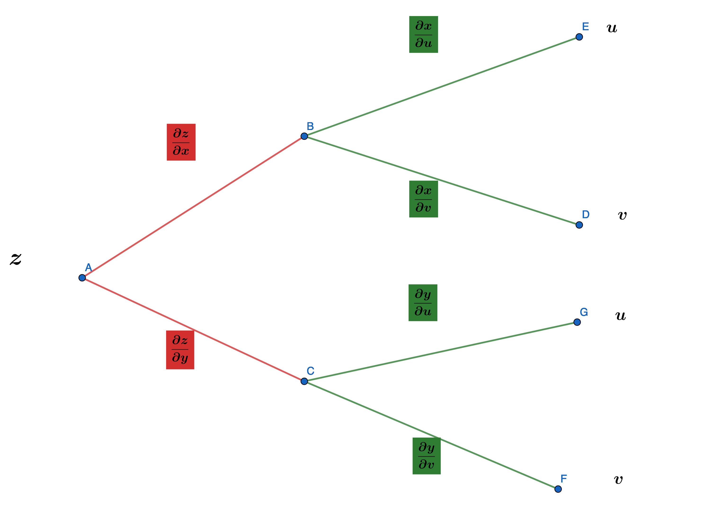
  </a>
</center>
---
**✏️例子**

设$z = ax + by, x = cu + dv, y = eu + fv (a, b, c, d \in \mathcal{R})$，求$\dfrac{\partial z}{\partial u}, \dfrac{\partial z}{\partial v}$

<details>
<summary>⬇️ Click to expand!</summary>
<center>
$\dfrac{\partial z}{\partial u} = \dfrac{\partial z}{\partial x}\dfrac{\partial x}{\partial u} + \dfrac{\partial z}{\partial y}\dfrac{\partial y}{\partial u} = ac + be$
</center>

<center>
$\dfrac{\partial z}{\partial v} = \dfrac{\partial z}{\partial x}\dfrac{\partial x}{\partial v} + \dfrac{\partial z}{\partial y}\dfrac{\partial y}{\partial v} = ad + bf$
</center>

或者

<center>
$\left[\dfrac{\partial z}{\partial u}, \dfrac{\partial z}{\partial v}\right]  = \left[ \dfrac{\partial z}{\partial x},  \dfrac{\partial z}{\partial y} \right] \left[\begin{array}{cc} \dfrac{\partial x}{\partial u} & \dfrac{\partial x}{\partial v} \newline  \dfrac{\partial y}{\partial u} & \dfrac{\partial y}{\partial v}\end{array}\right] = \left[a, b\right]\left[\begin{array}{cc} c & d \newline e & f\end{array}\right] = \left[ac+be, ad+bf\right]$
</center>

</details>

---
**🤔思考**
+ <span style="color:red">两个线形变换复合的导数对应于导数的乘积</span>

+ <span style="color:red">两个非线形变换复合的导数对应于❓❓的❓❓</span>

---
**✏️例子**

设$z = \dfrac{x^2}{y}, x = u - 2v, y = 2u + v $，求$\dfrac{\partial z}{\partial u}, \dfrac{\partial z}{\partial v}$
<details>
<summary>⬇️ Click to expand!</summary>
<center>
$\dfrac{\partial z}{\partial u} = \dfrac{\partial z}{\partial x}\dfrac{\partial x}{\partial u} + \dfrac{\partial z}{\partial y}\dfrac{\partial y}{\partial u} = \dfrac{2x}{y}1 + \left(-\dfrac{x^2}{y^2}\right)2$
</center>

<center>
$\dfrac{\partial z}{\partial v} = \dfrac{\partial z}{\partial x}\dfrac{\partial x}{\partial v} + \dfrac{\partial z}{\partial y}\dfrac{\partial y}{\partial v} = \dfrac{2x}{y}(-2) + \left(-\dfrac{x^2}{y^2}\right)1$
</center>

或者

<center>
$\left[\dfrac{\partial z}{\partial u}, \dfrac{\partial z}{\partial v}\right]  = \left[ \dfrac{\partial z}{\partial x},  \dfrac{\partial z}{\partial y} \right] \left[\begin{array}{cc} \dfrac{\partial x}{\partial u} & \dfrac{\partial x}{\partial v} \newline  \dfrac{\partial y}{\partial u} & \dfrac{\partial y}{\partial v}\end{array}\right] = \left[\dfrac{2x}{y}, -\dfrac{x^2}{y^2}\right]\left[\begin{array}{cc} 1 & -2 \newline 2 & 1\end{array}\right] = \left[\dfrac{2x}{y}-\dfrac{x^2}{y^2}, \dfrac{2x}{y}(-2) - \dfrac{x^2}{y^2}\right]$
</center>
</details>

---
**✏️例子**

设$w = f(x^2 + y^2 + z^2, xyz) $，$f$具有连续的二阶偏导数，求$\dfrac{\partial f}{\partial x}, \dfrac{\partial^2 f}{\partial x \partial z}$

<details>
<summary>⬇️ Click to expand!</summary>
解：
另$u = x^2 + y^2 + z^2, v = xyz$,且记$f_1 = \dfrac{\partial f}{\partial u}, f_2 = \dfrac{\partial f}{\partial v}, f_{12} = \dfrac{\partial^2 f}{\partial u \partial v}$ 等等，有：

<center>
$\dfrac{\partial w}{\partial x} = f_1 2x + f_2yz$
</center>

<center>
$\dfrac{\partial^2 w}{\partial x \partial z} = \dfrac{\partial}{\partial z}\left(f_1 2x + f_2yz\right) = f_{11}(4xz) + f_{12}(2x^2y + 2yz^2) + f_{22}(y^2xz) + yf_2$
</center>

</details>

---
**✏️例子**

设$z = f(u, v, t) = uv + \sin t$，而$u = e^t, u = \cos t$，求导数$\dfrac{\mathrm{d}z}{\mathrm{d}t}$

<details>
<summary>⬇️ Click to expand!</summary>
解：

$\dfrac{\mathrm{d}z}{\mathrm{d}t} = \dfrac{\partial f}{\partial u}\dfrac{\mathrm{d}u}{\mathrm{d}t} + \dfrac{\partial f}{\partial v}\dfrac{\mathrm{d}v}{\mathrm{d}t} = ve^t - u\sin t + \cos t$

</details>


---

<a name="cotes7"></a>
## 📌**7. 隐函数求导法则**

**隐式函数**

之前我们接触的函数，其表达式大多是自变量的某个算式，如：
<center>
$y = x^2 + 1, w = xyz + \sin yz + e^{xy}, \cdots$
</center>
这种形式的函数称为<span style="color:red">**显函数**</span>。但是在不少情况下常常会遇到另一种形式的函数，其自变量与因变量之间的对应法则有一个方程所确定，通常称为<span style="color:red">**隐函数**</span>。例如：$z = x^2 + y^2$这个二元函数，当确定$z = 1$时，确定了一个隐函数：$x^2 + y^2 = 1$。例如曲面
<center>
$z = 3(1-x^2)e^{-(x - 0.5)^2 - (y + 1)^2} - 2(\dfrac{x}{5} - x^3 - y^5)e^{-x^2-y^2 - \dfrac{1}{3}e^{-(x+1)^2-(y-1)^2}}$
</center>
当$z = 0.44$时得到方程，见下图：
<center>
$0.44 = 3(1-x^2)e^{-(x - 0.5)^2 - (y + 1)^2} - 2(\dfrac{x}{5} - x^3 - y^5)e^{-x^2-y^2 - \dfrac{1}{3}e^{-(x+1)^2-(y-1)^2}}$
</center>

<center>
  <a href="https://www.geogebra.org/3d/wart6zgs">
    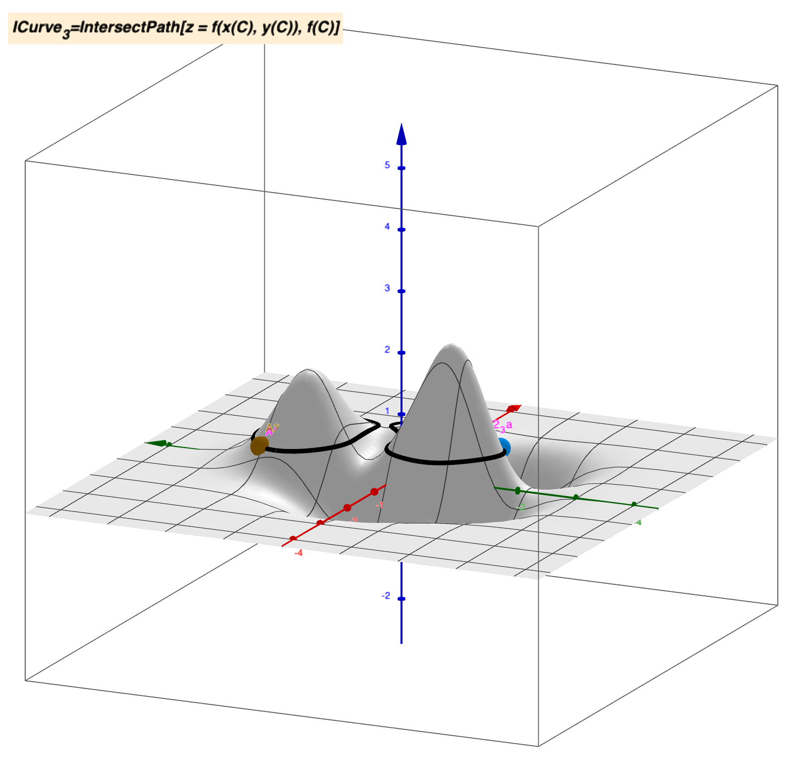
    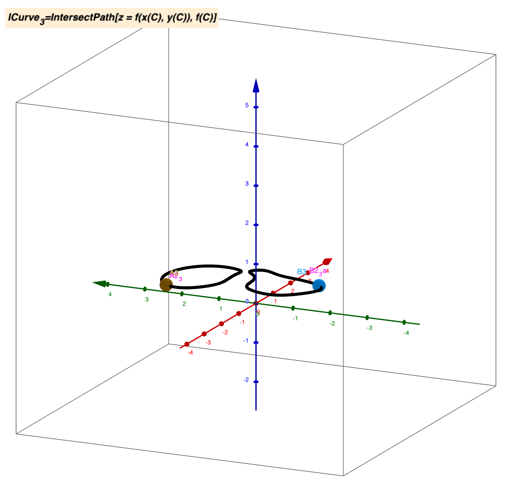
  </a>
</center>

---
**隐式方程定理**

设函数$F(x,y)$在点$P_0(x_0, y_0)$的某一邻域内具有连续的偏导数，且满足：
  
  + $F(x_0, y_0) = 0$(初始条件)；

  + $F_y(x_0, y_0) \ne $(偏导数不为零)；

则方程$F(x, y) = 0$在点$P_0(x_0, y_0)$的某一邻域内能唯一确定✅一个连续且具有连续导数的函数$y = f(x)$，它满足：

  + $y_0 = f(x_0)$;

  + $\dfrac{\mathrm{d}f}{\mathrm{d}x} = \dfrac{-F_x}{F_y}$(<span style="color:red">**求导公式**</span>)

---
**✏️例子**

**笛卡尔叶形线(folium of Descartes)**首先由笛卡尔在1638年提出。笛卡尔叶形线的隐式方程为：
<center>
$x^3 + y^3 - 3axy = 0$
</center>
该曲线在第一象限形成一个闭合曲线，且渐近线为$y = x$，关于$y = x$对称。

---
  > 该曲线由笛卡尔在1638年提出，针对费马声称有一种方法能够找到曲线的切线和法线方程。笛卡尔提出该曲线让费马去寻找在任意一点的切线和发现方程（笛卡尔办不到啊）。其结果是：费马利用隐函数求导法则很容易找到了该曲线的切线和法线方程。

---

下面我们来求解该曲线$x^3 + y^3 - 6xy = 0$的在$(3, 3)$点的切线和法线方程。

解：

首先可以验证该曲线在$(3,3)$点附近确定了一个函数$y = f(x)$，因为若令$F(x,y) = x^3 + y^3 - 6xy$.可以验证$F(3,3) = 0, F_y(3,3) = (3y^2 - 6x)_{(3,3)} = 9 \ne 0$.

斜率：$k = -\dfrac{F_x}{F_y}(3,3) = -\dfrac{3x^2 - 6y}{3y^2 - 6x} = -1$

或者对于方程的两边关于$x$求导数得到：

<center>
$3x^2 + 3y^2\dfrac{\mathrm{d}y}{\mathrm{d}x} - 6y - 6x\dfrac{\mathrm{d}y}{\mathrm{d}x} = 0$
</center>

得到$k = -1$

所以：

+ 切线方程为： $y - 3 = -(x - 3)$;

+ 法线方程为： $y - 3 = (x - 3)$.

上式关于$x$继续求导数，得到；

<center>
$6x + 6y\left(\dfrac{\mathrm{d}y}{\mathrm{d}x}\right)^2 + 3y^2\dfrac{\mathrm{d}^2y}{\mathrm{d}x^2}- 6\dfrac{\mathrm{d}y}{\mathrm{d}x} - 6\dfrac{\mathrm{d}y}{\mathrm{d}x}  - 6x\left(\dfrac{\mathrm{d}^2y}{\mathrm{d}x^2}\right) = 0$
</center>

从上式中可得到$\dfrac{\mathrm{d}^2y}{\mathrm{d}x^2}$


<center>
  <a href="https://www.geogebra.org/geometry/jwqpwrsk">
    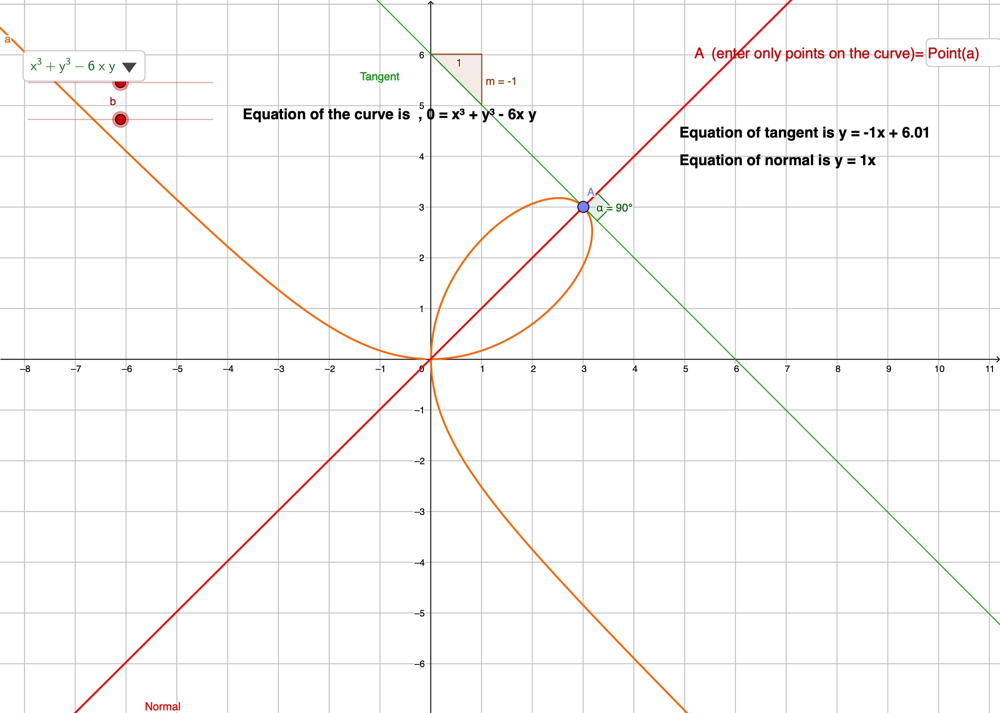
  </a>
</center>

---
**✏️例子(反函数求导公式)**

设$y = f(x)$在$x_0$的某邻域上具有连续的导数$f'(x)$，且$f(x_0) = y_0$，考虑方程

<center>
$F(x,y) = y - f(x) = 0$
</center>

由于

<center>
$F(x_0,y_0) = y_0 - f(x_0) = 0, F'_y(x, y) = 1, F_x'(x_0, y_0) = -f'(x_0)$
</center>


所以只要$f'(x_0) \ne 0$得到隐函数$x = g(y)$为$y = f(x)$的反函数。且有：

<center>
$g'(y) = - \dfrac{F_y}{F_x} = -\dfrac{1}{-f'(x)} = \dfrac{1}{f'(x)}$
</center>

<center>
  <a href="https://www.geogebra.org/geometry/ywspypad">
    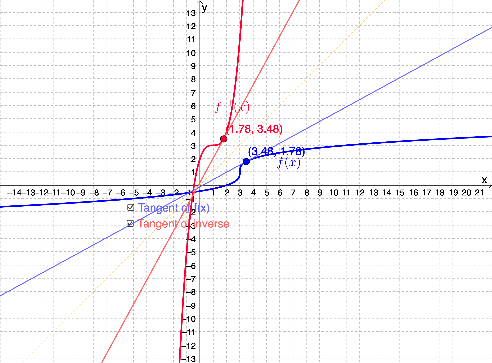
  </a>
</center>

---
**隐式方程组**

设有方程组
<center>
$
  \left\{\begin{array}{l} F(x, y, u, v) = 0 \newline G(x, y, u, v) = 0 \end{array}\right.
$
</center>
其中$F(x, y, u, v), G(x, y, u, v)$为定义在$D \subset \mathcal{R}^4$上的4元函数。若存在平面区域$E, F \subset \mathcal{R}^2$，对于$E$中的每一个点$(x, y)$，有唯一的$(u, v) \in F$，使得$(x, y, u, v) \in D$，且满足上方程组，则称有方程组确定了✅<span style="color:red">**隐式方程组**</span>

<center>
$
  \left\{\begin{array}{l} u = f(x, y) \newline v = g(x, y) \end{array}\right.
$
</center>
并在$D$上成立恒等式


<center>
$
  \left\{\begin{array}{l} F(x, y, f(x, y), g(x, y)) = 0 \newline G(x, y, f(x, y), g(x, y)) = 0 \end{array}\right.
  (x, y) \in E
$
</center>

---
**隐式方程组定理**

若
+ $F(x, y, u, v)$与$G(x, y, u, v)$在以$P_0(x_0, y_0, u_0, v_0)$为内点的区域$D \subset \mathcal{R}^4$上连续；

+ $F(x_0, y_0, u_0, v_0) = 0, G(x_0, y_0, u_0, v_0) = 0$(初始条件)；

+ 在$D$上$F, G$具有连续的一阶偏导数；

+ $J = \dfrac{\partial (F, G)}{\partial (u, v)} = \left\vert\begin{array}{cc} F_u & F_v \newline G_u & G_v \end{array}\right\vert_{P_0} \ne 0$

则：

+ 在点$P_0$的某一邻域内方程组确定了定义在$Q_0(x_0, y_0)$的某一(二维空间)邻域$U(Q_0)$的两个二元隐函数$u = f(x, y), v = g(x, y)$，使得
  - $(x, y, f(x,y), g(x,y)) \in U(P_0)$;
  
  - $F(x, y, f(x,y), g(x,y)) \equiv 0$
  
  - $G(x, y, f(x,y), g(x,y)) \equiv 0$

+ $f(x,y), g(x,y)$在$U(Q_0)$上连续；

+ $f(x,y), g(x,y)$在$U(Q_0)$上具有连续偏导数，且有

<center>
$\dfrac{\partial u}{\partial x} = -\dfrac{1}{J}\dfrac{\partial (F,G)}{\partial (x,v)}, \dfrac{\partial v}{\partial x} = -\dfrac{1}{J}\dfrac{\partial (F,G)}{\partial (u,x)}$
</center>

<center>
$\dfrac{\partial u}{\partial y} = -\dfrac{1}{J}\dfrac{\partial (F,G)}{\partial (y,v)}, \dfrac{\partial v}{\partial y} = -\dfrac{1}{J}\dfrac{\partial (F,G)}{\partial (u,y)}$
</center>
---
**✏️例子**

讨论方程组

<center>
$ \left\{\begin{array}{l} F(x,y,u,v) = u^2 + v^2 - x^2 - y = 0 \newline G(x,y,u,v) =  -u + v - xy + 1 = 0 \end{array}\right.$
</center>

在$P_0(2,1,1,2)$近旁确定怎样的隐函数组，并求其偏导数。

<details>
<summary>⬇️ Click to expand!</summary>
解： 首先$F(P_0) = G(P_0) = 0$，满足初始条件。其次
<center>
$F_x = -2x, F_y = -1, F_u = 2u, F_v = 2v$

$G_x = -y, G_y = -x, G_u = -1, G_v = 1$
</center>

容易计算，在$P_0$点的六个雅可比行列式中只有：
<center>
$\dfrac{\partial (F, G)}{\partial (x,v)}(P_0) = 0$
</center>

因此，只有$x,v$难以肯定是否确定以$y, u$为自变量的隐函数。除此之外，在$P_0$的近旁任何两个变量都可以作为其余两个变量为自变量的隐函数。

如果我们想求得$x = x(u, v), y = y(u,v)$的偏导数，我们只需对方程组的两边关于$u,v$求偏导数，得到

<center>
$ \left\{\begin{array}{l} 2v - 2xx_v - y_v = 0 \newline 1 - yx_v - xy_v = 0 \end{array}\right.$
</center>
<center>
$ \left\{\begin{array}{l} 2u - 2xx_u - y_u = 0 \newline -1 - yx_u - xy_u = 0 \end{array}\right.$
</center>

得到，

<center>
$x_u = \dfrac{2xu + 1}{2x^2 - y}, y_u = -\dfrac{2x + 2yu}{2x^2 - y}$ 
</center>
<center>
$x_v = \dfrac{2xv + 1}{2x^2 - y}, y_v = \dfrac{2x - 2yv}{2x^2 - y}$
</center>
</details>

😓😓😓 A lot of math!

---
**反函数组与坐标变换**

设函数组

<center>
$ \left\{\begin{array}{l} u = u(x,y) \newline v = v(x,y) \end{array}\right.$
</center>
确定了一个从二维空间到二维空间的变换，把该方程组改写为：

<center>
$ \left\{\begin{array}{l} F(x,y,u,v) = u - u(x,y) = 0 \newline G(x,y,u,v) = v - v(x,y) = 0 \end{array}\right.$
</center>

如果在$P_0(x_0, y_0)$点满足：

<center>
$ u_0 = u(x_0, y_0), v_0 = v(x_0, y_0), \left.\dfrac{\partial (u,v)}{\partial (x, y)}\right\vert_{P_0} \ne 0$
</center>

则在$P'_0(u_0, v_0)$的某一邻域内$U(P'_0)$上存在唯一的反函数组

<center>
$ \left\{\begin{array}{l} x = x(u,v) \newline y = y(u,v) \end{array}\right.$
</center>

使得$x_0 = x(u_0, v_0), y_0 = y(u_0, v_0)$

此外，反函数方程组存在连续的一阶偏导数，且有：

<center>
$ \dfrac{\partial x}{\partial u} =   \left.\dfrac{\partial v}{\partial y}\right/\dfrac{\partial (u, v)}{\partial (x, y)},
  \dfrac{\partial x}{\partial v} = - \left.\dfrac{\partial u}{\partial y}\right/\dfrac{\partial (u, v)}{\partial (x, y)}$
</center>

<center>
$ \dfrac{\partial y}{\partial u} = - \left.\dfrac{\partial v}{\partial x}\right/\dfrac{\partial (u, v)}{\partial (x, y)},
  \dfrac{\partial y}{\partial v} =   \left.\dfrac{\partial u}{\partial x}\right/\dfrac{\partial (u, v)}{\partial (x, y)}$
</center>

另有：

<center>
$ \dfrac{\partial (u, v)}{\partial (x, y)}\cdot \dfrac{\partial (x,y)}{\partial (u,v)} = 1$
</center>

---
😓😓😓 A lot of math!

---
**✏️例子**

平面上的点$P$的直角坐标$(x, y)$与极坐标$(\rho, \theta)$之间的坐标变换公式为：
<center>
$ \left\{\begin{array}{l} x = \rho \cos \theta \newline y = \rho \sin \theta \end{array}\right.$
</center>

由于
<center>
$ \dfrac{\partial (x,y)}{\partial (\rho, \theta)} = \left\vert\begin{array}{cc} \cos \theta & -\rho \sin \theta \newline \sin \theta & \rho \cos \theta \end{array}\right\vert = r$
</center>

所以除原点外，方程组存在反变换方程组：

<center>
$\rho = \sqrt{x^2 + y^2}$
</center>

<center>
$ \theta = \left\{\begin{array}{ll} \arctan \dfrac{y}{x}, & x > 0 \newline \pi + \arctan \dfrac{y}{x}, & x < 0  \end{array}\right.$
</center>

---
<center>
😓😓😓 A lot of math!
</center>

---
<a name="cotes1"></a>
## 📌**8. 多元函数微分几何应用**

---
**空间曲线的切线与法平面**

☘︎ 首先设平面曲线由方程$F(x,y) = 0$给出，它在$P_0(x_0, y_0)$点的某个邻域内满足隐函数存在条件，于是在$P_0$点附近确定一个连续可微函数$y = f(x)$(或者$x = g(y)$),其切线和法线方程为：

<center>
$y - y_0 = f'(x_0)(x - x_0)$
</center>

<center>
$y - y_0 = -\dfrac{1}{f'(x_0)}(x - x_0)$
</center>
由于$f'(x) = -\dfrac{F_x}{F_y}$
所以曲线$F(x,y) = 0$ 在$P_0(x_0, y_0)$点的<span style="color:red">**切线和法线方程**</span>为：

<center>
$F_x(x_0, y_0)(x - x_0) + F_y(x_0, y_0)(y - y_0) = 0$
</center>

<center>
$F_x(x_0, y_0)(x - x_0) - F_y(x_0, y_0)(y - y_0) = 0$
</center>

---

☘︎ 下面讨论曲线由参数方程$x = x(t), y = y(t), z = z(t), \alpha \le t \le \beta$表示的空间曲线在$P_0(x_0, y_0, z_0)$点的切线和法平面方程，这里$x_0 = x(t_0), y_0 = y(t_0), z_0 = z(t_0)$.

我们知道空间曲线在一点的切线可以看作割线的极限，对于上述参数方程假设：
<center>
$[x'(t_0)]^2 + [y'(t_0)]^2 + [z'(t_0)]^2 \ne 0$
</center>

在曲线上$P_0(x_0, y_0, z_0)$点的附近选取一点$P(x, y, z)$，于是连接$P_0P$的割线方程为：

<center>
$\dfrac{x - x_0}{\Delta x} = \dfrac{y - y_0}{\Delta y} = \dfrac{z - z_0}{\Delta z}$
</center>

上式同除以$\Delta t$得到：

<center>
$\dfrac{x - x_0}{\dfrac{\Delta x}{\Delta t}} = \dfrac{y - y_0}{\dfrac{\Delta y}{\Delta t}} = \dfrac{z - z_0}{\dfrac{\Delta z}{\Delta t}}$
</center>

当$\Delta t \to 0$,得到在$P_0$点的<span style="color:red">**切线方程**</span>为：

<center>
$\dfrac{x - x_0}{x'(t_0)} = \dfrac{y - y_0}{y'(t_0)} = \dfrac{z - z_0}{z'(t_0)}$
</center>

在$P_0$点的<span style="color:red">**法平面方程**</span>为：

<center>
$x'(t_0)(x - x_0) + y'(t_0)(y - y_0) + z'(t_0)(z - z_0) = 0$
</center>

---

☘︎ 当空间曲线由方程
<center>
$L: \left\{\begin{array}{l}F(x,y,z) = 0 \newline G(x,y,z) = 0\end{array}\right. $
</center>
给出。若它在$P_0(x_0, y_0, z_0)$点的某邻域上满足隐函数存在的条件。这里不妨假设$\left.\dfrac{\partial (F, G)}{\partial (x, y)}\right\vert_{P_0} \ne 0$。则方程在$P_0$点附近能唯一确定连续可微隐函数组
<center>
$x = \varphi(z), y = \psi(z)$
</center>

且
<center>
$\dfrac{\mathrm{d}x}{\mathrm{d}z} = -\dfrac{\dfrac{\partial (F, G)}{\partial (z, y)}}{\dfrac{\partial (F, G)}{\partial (x, y)}}, \dfrac{\mathrm{d}y}{\mathrm{d}z} = -\dfrac{\dfrac{\partial (F, G)}{\partial (x, z)}}{\dfrac{\partial (F, G)}{\partial (x, y)}}$
</center>

在$P_0$点附近，得到空间曲线的参数方程为：
<center>
$x = \varphi(z), y = \psi(z), z = z$.
</center>

所以切线方程为：

<center>
$\dfrac{x - x_0}{\left.\dfrac{\mathrm{d}x}{\mathrm{d}z}\right\vert_{P_0}} = \dfrac{y - y_0}{\left.\dfrac{\mathrm{d}y}{\mathrm{d}z}\right\vert_{P_0}}  = \dfrac{z - z_0}{1}$
</center>

即，整理后的<span style="color:red">**切线方程**</span>

<center>
$\dfrac{x - x_0}{\left.\dfrac{\partial (F, G)}{\partial (y, z)}\right\vert_{P_0}} = \dfrac{y - y_0}{\left.\dfrac{\partial (F, G)}{\partial (z, x)}\right\vert_{P_0}}  = \dfrac{z - z_0}{\left.\dfrac{\partial (F, G)}{\partial (x, y)}\right\vert_{P_0}}$
</center>

整理后的<span style="color:red">**法平面方程**</span>

<center>
$\left.\dfrac{\partial (F, G)}{\partial (y, z)}\right\vert_{P_0}(x - x_0) + \left.\dfrac{\partial (F, G)}{\partial (z, x)}\right\vert_{P_0}(y - y_0) + \left.\dfrac{\partial (F, G)}{\partial (x, y)}\right\vert_{P_0}(z - z_0) = 0$
</center>

<span style="color:red">**空间曲线的切向量**</span>为：

<center>
$\left\vert\begin{array}{ccc} i & j & k \newline F_x & F_y & F_z \newline G_x & G_y & G_z \end{array}\right\vert_{P_0}$
</center>

---
**✏️例子**

求球面$x^2 + y^2 + z^2 = 50$与锥面$x^2 + y^2 = z^2$所截出的曲线在$(3,4,5)$的切线和法平面方程。

解：
令$F(x, y, z) = x^2 + y^2 + z^2 -50, G(x, y, z) = x^2 + y^2 - z^2$，则有曲线在该点的切向量为：

<center>
$\left\vert\begin{array}{ccc} i & j & k \newline F_x & F_y & F_z \newline G_x & G_y & G_z \end{array}\right\vert_{P_0} = \left\vert\begin{array}{ccc} i & j & k \newline 6 & 8 & 10 \newline 6 & 8 & -10 \end{array}\right\vert$
</center>

所以法平面方程为：

<center>
$\left\vert\begin{array}{ccc} x-3 & y-4 & z-5 \newline 6 & 8 & 10 \newline 6 & 8 & -10 \end{array}\right\vert$
</center>

切线方程为：

<center>
$\dfrac{x - 3}{-4} = \dfrac{y - 4}{3} = \dfrac{y - 5}{0} $
</center>

<center>
<a href="https://www.geogebra.org/3d/rmvfa2uk">
   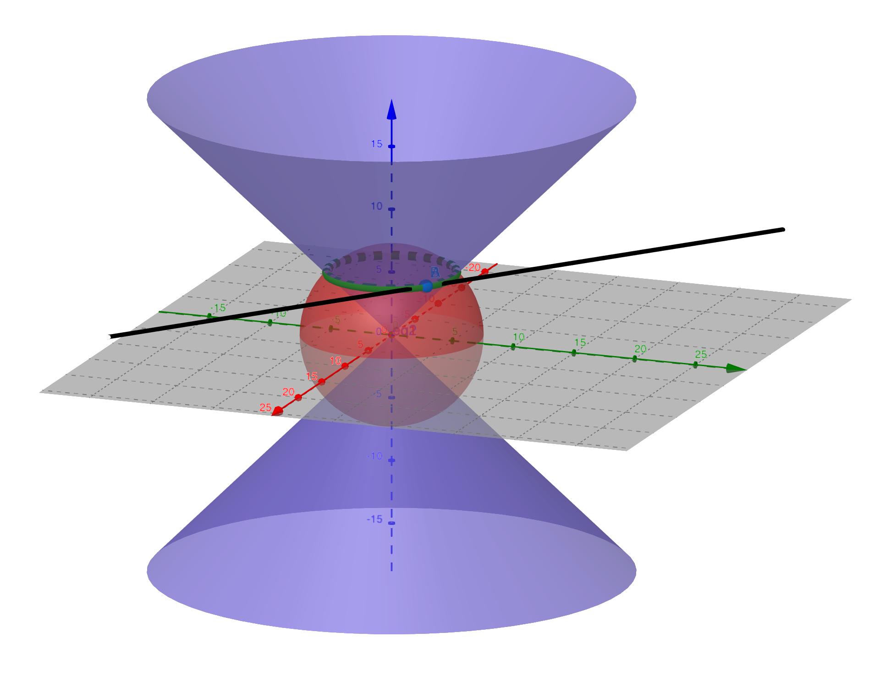
</a>
</center>

---
**空间曲面的切平面与法向量**

☘︎ 设曲面$S$方程的一般表示为：
<center>
$F(x, y, z) = 0$
</center>
这里考虑$F$具有连续的偏导数，且$F_x^2 + F_y^2 + F_z^2 \ne 0$，$P_0(x_0, y_0, z_0)$为曲面$S$上的一点。考察曲面$S$上过点$P_0$
的任意一条光滑曲线$\Gamma$:

<center>
$\left\vert\begin{array}{l} x = x(t) \newline y = y(t) \newline z = z(t)\end{array}\right.$
</center>

并设$x_0 = x(t_0), y_0 = y(t_0), z_0 = z(t_0)$，由于$\Gamma$在曲面$S$上，所以有：

<center>
$F(x(t), y(t), z(t)) \equiv 0$
</center>

对$t$在$t_0$处求导得到：

<center>
$F_x(P_0)x'(t_0) + F_y(P_0)y'(t_0) + F_z(P_0)z'(t_0) = 0$
</center>

这说明，曲面$S$上过$P_0$的任意一条光滑曲线$\Gamma$在$P_0$点的切线都与向量：

<center>
$\mathbf{n} = (F_x(P_0), F_y(P_0), F_z(P_0))$
</center>

垂直，因此这些切线都在一张平面$\Pi$上。平面$\Pi$称为曲面$S$在$P_0$点的<span style="color:red">**切平面**</span>,它的法向量$\mathbf{n}$为曲面$S$在$P_0$点的<span style="color:red">**法向量**</span>。

<span style="color:red">**空间曲面$S$在$P_0$点处的切平面方程为**</span>：

<center>
$F_x(P_0)(x - x_0) + F_y(P_0)(y - y_0) + F_z(P_0)(z - z_0) = 0 $
</center>

<span style="color:red">**空间曲面$S$在$P_0$点处的法向量为**</span>：

<center>
$\dfrac{x - x_0}{F_x(P_0)} = \dfrac{y - y_0}{F_y(P_0)} = \dfrac{z - z_0}{F_z(P_0)} $
</center>

---
☘︎ 若空间曲面由方程$z = f(x,y)$给出，也就是$F(x, y, z) = z - f(x, y) = 0$，则曲面在$P_0(x_0, y_0, z_0)$点处的法向量为：

<center>
$\mathbf{n} = (\dfrac{\partial f}{\partial x}(x_0, y_0), \dfrac{\partial f}{\partial y}(x_0, y_0), -1)$
</center>

所以曲面$z = f(x, y)$在$P_0(x_0, y_0, z_0)$点处的<span style="color:red">**切平面和法向量为**</span>：


<center>
$\dfrac{\partial f}{\partial x}(x_0, y_0)(x - x_0) + \dfrac{\partial f}{\partial y}(x_0, y_0)(y - y_0) - (z - z_0) = 0$
</center>

<center>
$\dfrac{x - x_0}{\dfrac{\partial f}{\partial x}(x_0, y_0)} = \dfrac{y - y_0}{\dfrac{\partial f}{\partial y}(x_0, y_0)} = \dfrac{z - z_0}{-1} $
</center>

---
☘︎ **强调一点**

空间曲面$z = f(x,y)$在$P_0(x_0, y_0, z_0$点的切平面方程为：

<center>
$z = f(x_0, y_0) + f_x(x_0, y_0)(x - x_0) + f_y(x_0, y_0)(y - y_0)$
</center>

所以在该<span style="color:red">**切平面上(注意是切平面，不是曲面)**</span>：

<center>
$z - f(x_0, y_0) = f_x(x_0, y_0)(x - x_0) + f_y(x_0, y_0)(y - y_0) = \mathrm{d}f\vert_{P_0}(\Delta x, \Delta y)$
</center>

  + 曲面$z = f(x,y)$在$P_0$点的全微分$\mathrm{d}f\vert_{P_0}(\Delta x, \Delta y)$表示切平面从$(x_0, y_0)$到$(x_0 + \Delta x, y_0 + \Delta y)$的增量；

  + $f(x_0 + \Delta x, y_0 + \Delta y) - f(x_0, y_0)$表示曲面的增量。

见下图：

<center>
<a href="https://www.geogebra.org/3d/vcqyewuj">
   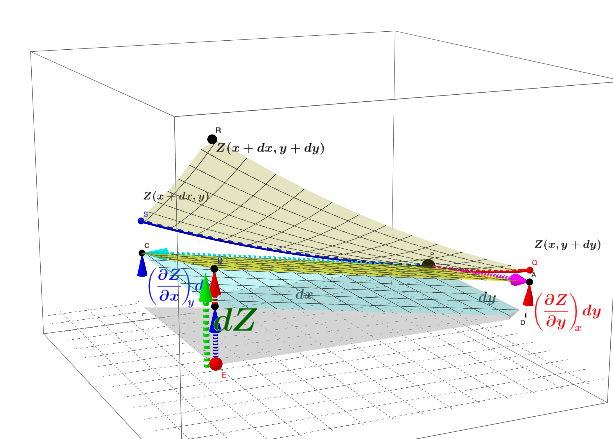
</a>
</center>

---
**✏️例子**

求椭球面$x^2 + 2y^2 + 3z^2 = 6$在(1,1,1)处的切平面方程和法线方程。

解：
令$F(x,y,z) = x^2 + 2y^2 + 3z^2 - 6$，则曲面在$(1,1,1)$点处的法向量为$\pm(1, 2, 3)$.所以该曲面在$(1,1,1)$点处的切平面和法线方程分别为：

<center>
$(x - 1) + 2(y - 1) + 3(z - 1) = 0$
</center>

<center>
$\dfrac{x - 1}{1} = \dfrac{y - 1}{2} = \dfrac{z - 1}{3}$
</center>

<center>
<a href="https://www.geogebra.org/3d/nw76ectw">
   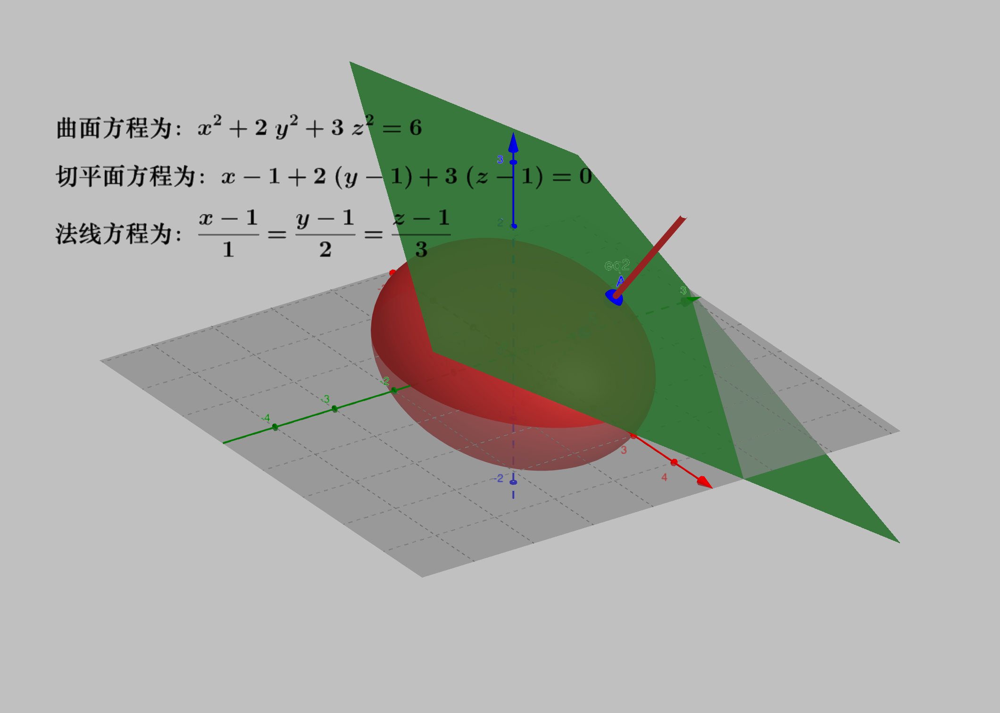
</a>
</center>

---
<a name="cotes9"></a>
## 📌**9. 极值与拉格朗日乘数法**

**无条件极值**

---
对于二元函数$z = f(x,y)$，若存在$P_0(x_0, y_0)$的某个邻域$U(P_0)$，使得$\forall (x, y) \in \mathring{U}(P_0)$，有$f(x, y) < f(x_0, y_0)$($f(x, y)>f(x_0, y_0)$)，则称$P_0(x_0, y_0)$为函数的<span style="color:red">**极大值点(极小值点)**</span>，$f(x_0, y_0)$为<span style="color:red">**极大值(极小值)**</span>。

<center>
<a href="https://www.geogebra.org/3d/nppwncny">
   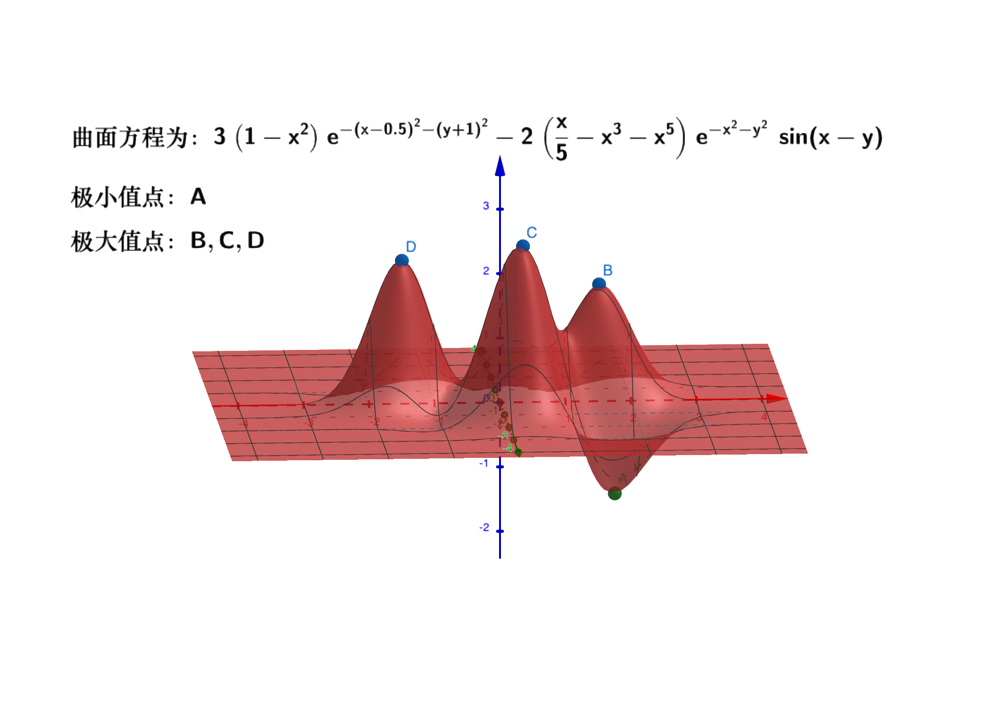
</a>
</center>

---
设$z = f(x,y)$在点$P_0(x_0, y_0)$具有偏导数，且在$P_(x_0, y_0)$处有极值，则有：

<center>
$f_x(x_0, y_0) = 0, f_y(x_0, y_0) = 0$
</center>

---
设$z = f(x,y)$在点$(x_0, y_0)$点的某邻域内连续且具有一阶及二阶连续偏导数，又$f_x(x_0, y_0) = f_y(x_0, y_0) = 0$，令$A = f_{xx}(x_0, y_0), B = f_{xy}(x_0, y_0), C = f_{yy}(x_0, y_0)$，则$f(x,y)$在$(x_0, y_0)$是否取得极值的条件如下：

  + $AC - B^2 > 0$时具有极值，且当$A > 0$时为极小值；当$A < 0$时为极大值。

  + $AC - B^2 < 0$时没有极值。

  + $AC - B^2 = 0$时可能有极值，也可能没有极值。

---
**条件极值与拉格朗日乘数法**

欲求函数

<center>
$z = f(x, y)$
</center>

在约束条件
<center>
$C: \varphi(x, y) = 0$
</center>

的极值。

若把条件$\varphi(x,y) = 0$看作$(x,y)$满足的曲线方程，并假设$C$上的点$P_0(x_0, y_0)$为$f$在条件$\varphi(x_0, y_0) = 0$下的极值点，且该条件能够确定一个可微的隐函数$y = g(x)$，则$x_0$必定也是$z = f(x, g(x)) = h(x)$的极值。故由$f$在$P_0$点可微，得到：

<center>
$h'(x_0) = f_x(x_0, y_0) + f_y(x_0, y_0)g'(x_0) = 0$
</center>

而当$\varphi$满足隐函数定理条件时🈶️，
<center>
$g'(x_0) = - \dfrac{\varphi_x(x_0, y_0)}{\varphi_y(x_0, y_0)}$
</center>

代入得到

<center>
$f_x(P_0)\varphi_y(P_0) - f_y(P_0)\varphi_x(P_0) = 0$
</center>

上式的几何意义为曲面$z = f(x,y)$的等高线$f(x,y) = f(P_0)$与曲线$C$在$P_0$处具有公共的切线，从而存在某一个常数$\lambda_0$在$P_0$处满足

<center>
$\left\{\begin{array}{l} f_x(P_0) + \lambda_0 \varphi_x(P_0) = 0 \newline f_y(P_0) + \lambda_0 \varphi_y(P_0) = 0 \newline \varphi(P_0) = 0 \end{array}\right.$
</center>


<center>
<a href="https://www.geogebra.org/3d/pfaxgcfc">
   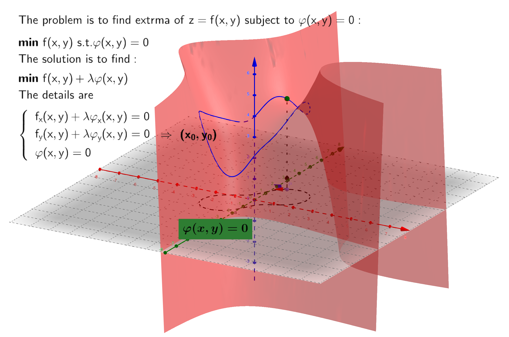
</a>
</center>


---
**小结**

拉格朗日乘数法为，首先由目标函数$f(x,y)$和条件函数$\varphi(x,y) = 0$构造拉格朗日乘数函数：

<center>
$L(x, y, \lambda) = f(x,y) + \lambda \varphi(x,y)$
</center>

求解方程组

<center>
$\left\{\begin{array}{l} f_x(x, y) + \lambda \varphi_x(x, y) = 0 \newlin f_y(x, y) + \lambda \varphi_y(x, y) = 0 \newline \varphi(x, y) = 0 \end{array}\right.$
</center>

求得问题的解即可。


---

## 📚参考书目

📖1. 《高等数学》上下册（第七版），同济大学，高等教育出版社，2014.7.

📖2. 《数学分析》上下册（第二版），陈纪修、於崇华、金路，高等教育出版社，2004.

📖3. 《数学分析》上下册（第二版），华东师范大学数学系，高等教育出版社，2010.

📖4.  Mathematical Analysis I,II, 2nd ed. V. A. Zorich,  Springer, 2015.

📖5.  数学分析中的典型问题与方法, 裴礼文, 高等教育出版社, 2015.

📖6.  Thomas's Calculus, Weir, Maurice D etc., Addison-Wesley, 2010.


---

# Calculus and its Visualization: an Introduction

<center>
<a href="https://www.geogebra.org/material/edit/id/yxadpqun#bookcontent">
   
</a>
</center>


---

# 👏 THANKS

<center>

<a href="https://www.geogebra.org">
   
</a>

<a href="https://www.geogebra.org">
   
</a>

<a href="https://www.wikipedia.org/">
   
</a>
</center>
