这部分介绍多元函数重积分及其应用。

## 目录
+ [第一节 二重积分概念](#cotes1)
+ [第二节 二重积分计算方法](#cotes2)
+ [第三节 三重积分](#cotes3)
+ [第四节 重积分的应用](#cotes4)

---

## 📌**1. 二重积分的概念与性质**

☘︎ **二重积分的概念**

考察一个**曲顶柱体**: 它的底是$xOy$面上的具有零边界的有界区域$D$，顶是非负连续函数$z = f(x,y), (x,y) \in D$所确定的曲面，侧面是以$D$的边界曲线为准线，母线平行于$z$轴的柱面。如下图所示([本图来源于Thomas' Calculus, 13/e](https://www.pearsonhighered.com/thomas13einfo/))：

<a href="https://www.pearsonhighered.com/thomas13einfo/">
   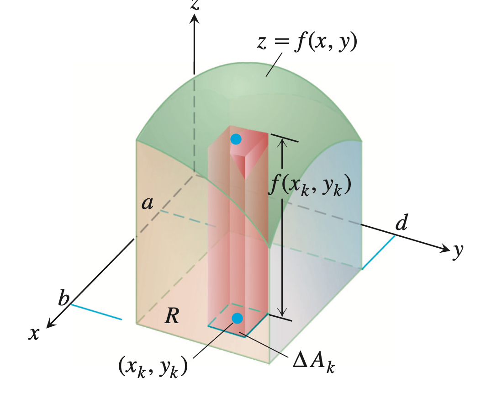
</a>

为了得到该曲顶柱体的体积:

+ 我们采用一系列平行于坐标轴的直线把区域$D$分割为一系列的小矩形(这个分割记为$P$)。第$k$个小矩形的面积为$\Delta A = \Delta x \Delta y (k=1,2,\cdots,n)$，见下图：

<a href="https://www.pearsonhighered.com/thomas13einfo/">
   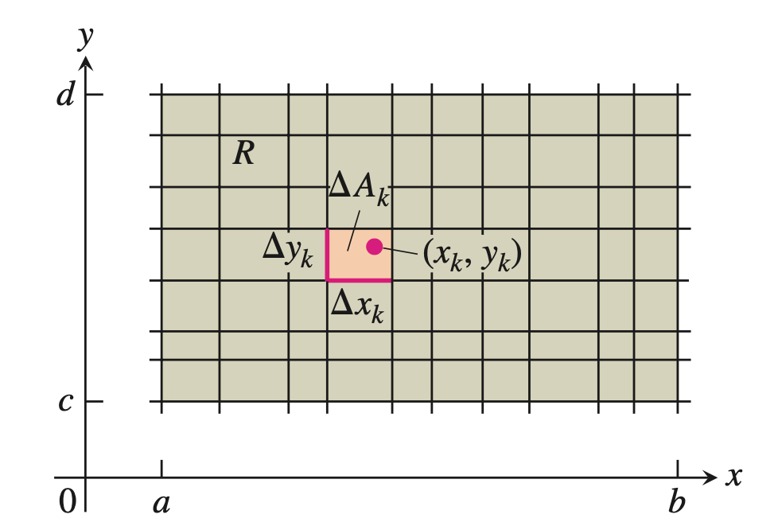
</a>

+ 在第$k$个小矩形上任意取一点$(x_k, y_k) \in A_k(k=1,2,\cdots,n)$，然后求和(**黎曼和**)得到：

  

  $S_n = \sum\limits_{k=1}^n f(x_k, y_k)\Delta A_k$
  

  

  <a href="https://www.geogebra.org/3d/mrqw8ehc">
     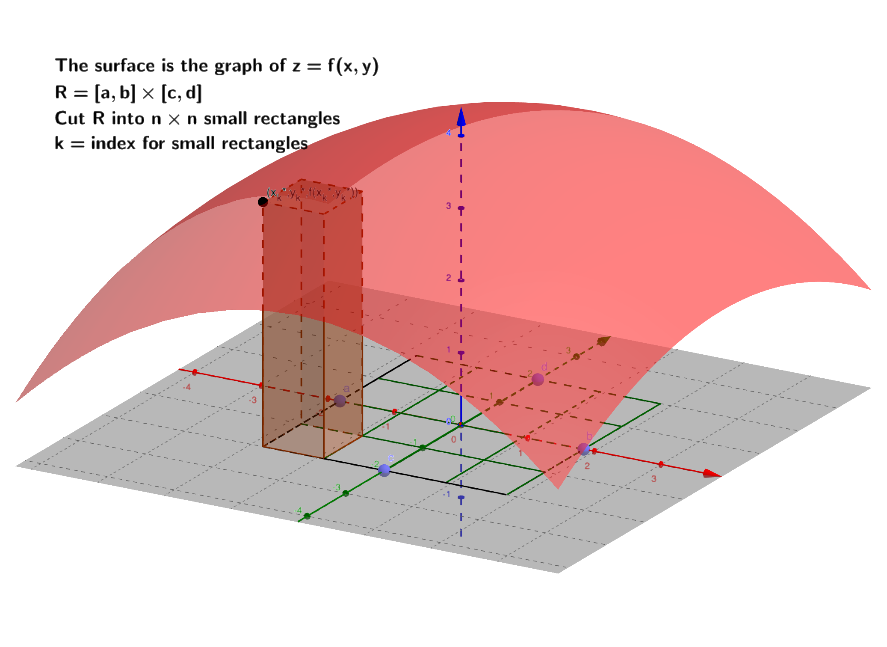
     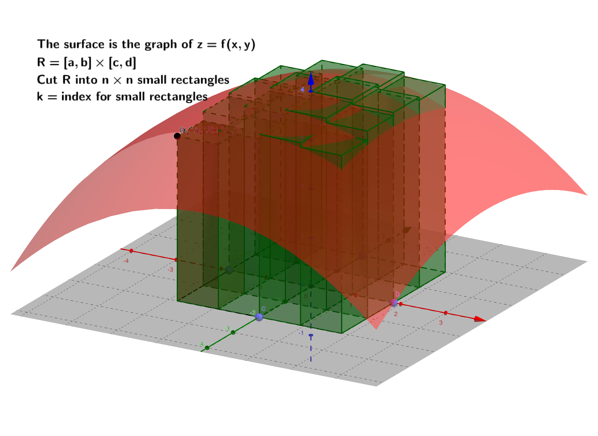
  </a>
  

+ 把每个小矩形的**直径**记为$\lambda_k$，这里直径指的是小矩形中两点连线最长的长度。令
  

  $\Vert P \Vert = \mathbf{max}_{1 \le k \le n}\left\{\lambda_k\right\}$
  

  称$\Vert P \Vert$为**分割细度**。黎曼和对分割的细度取极限，讨论极限：

  

  $\lim\limits_{\Vert P \Vert \to 0} \sum\limits_{k=1}^n f(x_k,y_k)\Delta A_k$
  

  

  <a href="https://www.geogebra.org/3d/mrqw8ehc">
     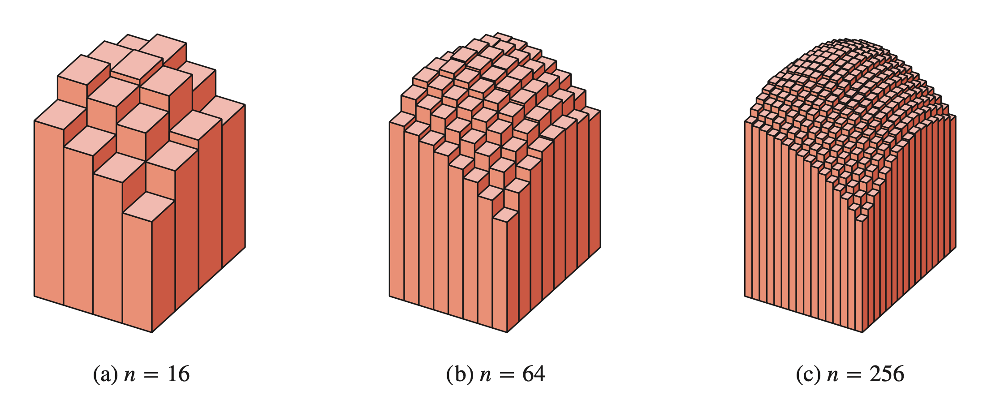
  </a>
  

如果随着分割细度趋于零，黎曼和的极限存在，我们称此极限值为$f(x,y)$在$D$上的**定积分**。记为：

$\iint\limits_{D} f(x, y)\mathrm{d}A$ 或者 $\iint\limits_{D} f(x, y)\mathrm{d}x\mathrm{d}y$  

  >  **除了采用平行于坐标轴的直线网分割外，也可以采用曲线网分割定义域。不同的分割会得到不同的积分方法。**

---
☘︎**二重积分的性质**

二重积分$\iint\limits_{D} f(x, y)\mathrm{d}x \mathrm{d}y$具有以下性质：
  
  + 线性： 
  

  $\iint\limits_{D} \left[\alpha f(x, y) + \beta g(x,y)\right]\mathrm{d}x \mathrm{d}y = \alpha \iint\limits_{D} f(x,y) \mathrm{d}x \mathrm{d}y+ \beta \iint\limits_{D} g(x,y)\mathrm{d}x \mathrm{d}y$;
  

  + 区域可加性：
  

  $\iint\limits_{\substack{D_1 \cup D_2 \newline D_1 \cap D_2 = \emptyset}} f(x, y)\mathrm{d}x \mathrm{d}y = \iint\limits_{D_1} f(x, y)\mathrm{d}x \mathrm{d}y +  \iint\limits_{D_2} f(x, y)\mathrm{d}x \mathrm{d}y $;
  

  + 保号性：如果在$D$上，$f(x,y) \le g(x,y)$，那么有：
  

  $\iint\limits_{D} f(x, y)\mathrm{d}x \mathrm{d}y \le \iint\limits_{D} g(x, y)\mathrm{d}x \mathrm{d}y$;
  

  + 特别的有：
  

  $\left\vert\iint\limits_{D} f(x, y)\mathrm{d}x \mathrm{d}y\right\vert \le \iint\limits_{D}\left\vert f(x, y)\right\vert\mathrm{d}x \mathrm{d}y$;
  

  + 设$M \ge f(x,y) \ge m$，则有：
  

  $ms(D) \le \iint\limits_{D} f(x, y)\mathrm{d}x \mathrm{d}y \le Ms(D)$
  

  ，其中$s(D)$表示区域$D$的面积;

  + 中值定理：设函数$f(x,y)$在闭区域$D$上连续，$s(D)$表示区域$D$的面积，则至少存在一点$(\xi, \eta) \in D$满足：
  

  $\iint\limits_{D} f(x, y)\mathrm{d}x \mathrm{d}y = f(\xi,\eta)s(D)$.
  

---
 
📚**第一次作业:**

+ 根据二重积分的性质，比较下列积分的大小：
    
    - $\iint\limits_{D} (x+y)^2\, \mathrm{d}A$ 与$\iint\limits_{D} (x+y)^3\, \mathrm{d}A$，其中积分区域$D$是由$x$轴，$y$轴与直线$x+y=1$所围成。

    - $\iint\limits_{D} \ln(x+y)\, \mathrm{d}A$ 与$\iint\limits_{D} \left[\ln(x+y)\right]^2\, \mathrm{d}A$，其中积分区域$D$由$3 \le x \le 5, 0 \le y \le 1$所围成的区域。

+ 根据二重积分的性质，估计下列积分的大小：

  - $I = \iint\limits_{D} xy(x+y)\, \mathrm{d}\sigma$，其中$D$由$\vert 0 \le x \le 1, 0 \le y \le 1$所围成的区域；

  - $I = \iint\limits_{D} (x^2 + 4y^2 + 9)\, \mathrm{d}\sigma$，其中$D$由$x^2 + y^2 \le 4$所围成的区域.

---

## 📌**2. 二重积分的计算方法**

下面讨论二重积分$\iint\limits_{D} f(x, y)\mathrm{d}x \mathrm{d}y$的🧮计算问题。

---
**直交坐标下二重积分的计算：Fubini定理**

假设我们计算由$z = f(x,y)$在区域$D: -1 \le x \le 3, -2 \le y \le 3$上围成的曲顶柱体的体积。由截面法求体积得到，该曲顶柱体的体积为：

$$V = \int_{-1}^3 A(x)\mathrm{d}x \tag {1}$$

其中$A(x)$为：

$$A(x) = \int_{-2}^3 f(x,y)\mathrm{d}y \tag {2}$$

将$(2)$式代入$(1)$式得到：

$$V = \int_{-1}^3 A(x)\mathrm{d}x = \int_{-1}^3 \left(\int_{-2}^3 f(x,y)\mathrm{d}y\right)\mathrm{d}x \tag {3}$$

见下图：

  

  <a href="https://www.geogebra.org/3d/hmb9zbyq">
     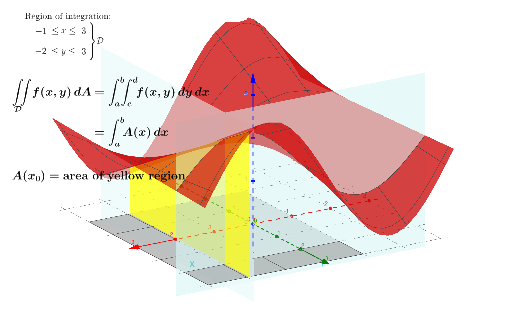
  </a>
  

对称地，先对坐标$x$积分，然后对坐标$y$积分，得到：

$$V = \int_{-2}^3 A(y)\mathrm{d}y = \int_{-2}^3 \left(\int_{-1}^3 f(x,y)\mathrm{d}x\right)\mathrm{d}y \tag {4}$$

见下图：

  

  <a href="https://www.geogebra.org/3d/hmb9zbyq">
     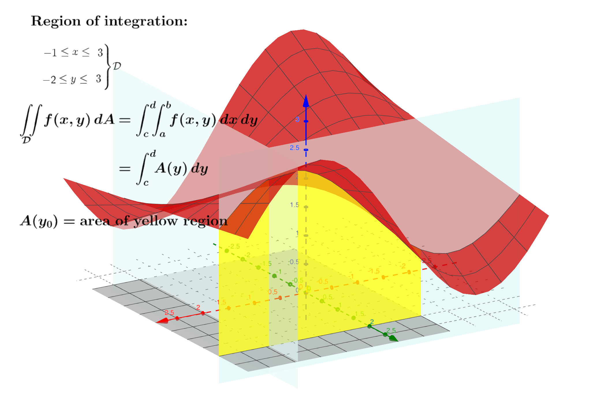
  </a>
  

---
**Fubini定理**

设$z = f(x,y)$在区域$D: a \le x \le b, c \le y \le d$上连续，则有：

$$\iint\limits_{D}f(x,y)\mathrm{d}x\mathrm{d}y = \int_{c}^d \left(\int_{a}^b f(x,y)\mathrm{d}x\right)\mathrm{d}y = \int_{a}^b \left(\int_{c}^d f(x,y)\mathrm{d}y\right)\mathrm{d}x  \tag {5}$$

---
对于一般性区域$D$，分析以下两种情形：

+ 情形一： $D: a \le x \le b, g_1(x) \le y \le g_2(x)$. 对于该类型区域积分可以表示为：

  

    $$\iint\limits_{D}f(x,y)\mathrm{d}x\mathrm{d}y = \int_{a}^b \left(\int_{g_1(x)}^{g_2(x)} f(x,y)\mathrm{d}y\right)\mathrm{d}x  \tag {6}$$
  

+ 情形二： $D: c \le y \le d, h_1(y) \le x \le h_2(y)$. 对于该类型区域积分可以表示为：

  

    $$\iint\limits_{D}f(x,y)\mathrm{d}x\mathrm{d}y = \int_{c}^d \left(\int_{h_1(y)}^{h_2(y)} f(x,y)\mathrm{d}x\right)\mathrm{d}y  \tag {7}$$
  

见下图([本图来源于Thomas' Calculus, 13/e](https://www.pearsonhighered.com/thomas13einfo/))：

  

  <a href="https://www.pearsonhighered.com/thomas13einfo/">
     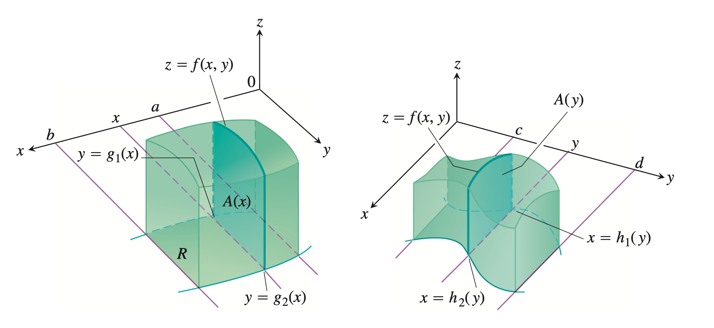
  </a>
  

---
**Fubini定理**

设$z = f(x,y)$在区域$D$上连续，如果

+ $D: a \le x \le b, g_1(x) \le y \le g_2(x)$，这里$g_1(x), g_2(x)$为$[a,b]$上的连续函数， 则有：

  

    $\iint\limits_{D}f(x,y)\mathrm{d}x\mathrm{d}y = \int_{a}^b \left(\int_{g_1(x)}^{g_2(x)} f(x,y)\mathrm{d}y\right)\mathrm{d}x$
  

+ $D: c \le y \le d, h_1(y) \le x \le h_2(y)$，这里$h_1(x), h_2(x)$为$[c,d]$上的连续函数，则有：

  

    $\iint\limits_{D}f(x,y)\mathrm{d}x\mathrm{d}y = \int_{c}^d \left(\int_{h_1(y)}^{h_2(y)} f(x,y)\mathrm{d}x\right)\mathrm{d}y$
  

---
**✏️例子**

计算$\iint\limits_{D}xy\mathrm{d}x\mathrm{d}y$，其中$D$是由直线$y = 1, x = 2, y = x$所围成的闭区域。

解法1. 

$\begin{split}
\iint\limits_{D}xy\mathrm{d}x\mathrm{d}y &= \int_1^2 \left(\int_1^x xy\mathrm{d}y\right)\mathrm{d}x = \int_1^2\left[x\cdot \dfrac{y^2}{2}\right]_1^x\mathrm{d}x \\
& = \int_1^2 \left(\dfrac{x^3}{2} - \dfrac{x}{2}\right)\mathrm{d}x = \left[\dfrac{x^4}{8} - \dfrac{x^2}{4}\right]_1^2 = \dfrac{9}{8}
\end{split}
$

解法2. 

$\begin{split}
\iint\limits_{D}xy\mathrm{d}x\mathrm{d}y &= \int_1^2 \left(\int_y^2 xy\mathrm{d}x\right)\mathrm{d}y = \int_1^2\left[y\cdot \dfrac{x^2}{2}\right]_y^2\mathrm{d}y \\
& = \int_1^2 \left(2y - \dfrac{y^3}{2}\right)\mathrm{d}y = \left[y^2 - \dfrac{y^4}{8}\right]_1^2 = \dfrac{9}{8}
\end{split}
$

  

  <a href="https://www.geogebra.org/geometry/mhdnucpv">
     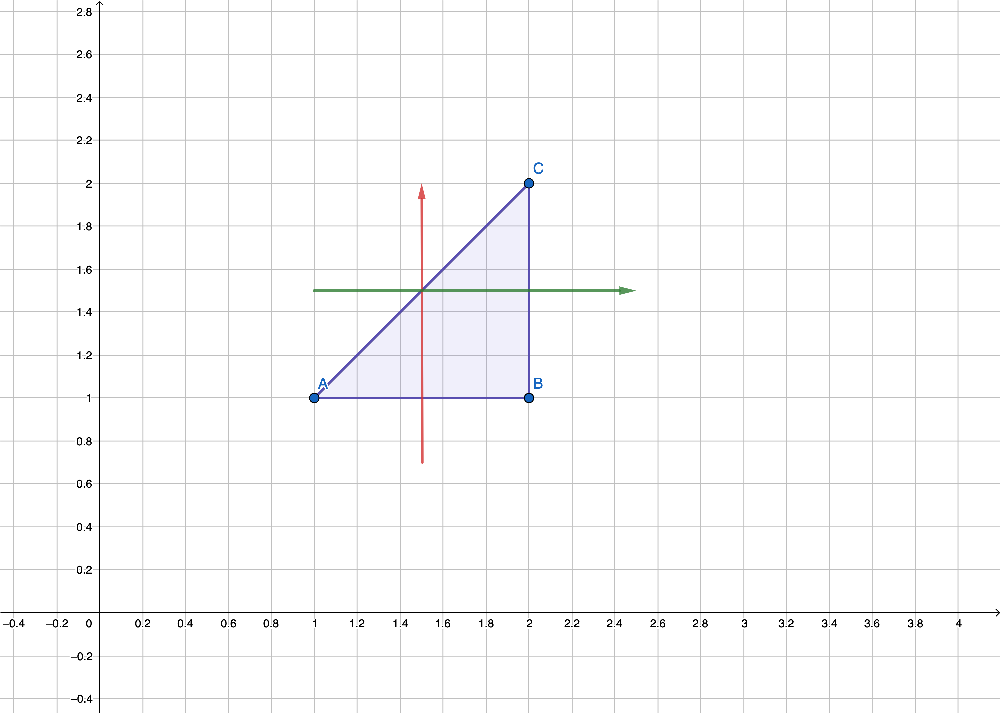
  </a>
  

💡积分顺序：先$x$后$y$还是先$y$后$x$与积分区域又关系

从该题目还可以得到：

$\int_1^2 \left(\int_y^2 xy\mathrm{d}x\right)\mathrm{d}y = \int_1^2 \left(\int_y^2 xy\mathrm{d}x\right)\mathrm{d}y$

---
**✏️例子**

计算积分$\iint\limits_{R} \dfrac{\sin x}{x}\mathrm{d}x\mathrm{d}y$，其中$R$由$x$轴$y=x$及$x=1$围成的闭区域。

解： 

$\iint\limits_{R} \dfrac{\sin x}{x}\mathrm{d}x\mathrm{d}y = \int_0^1\left(\int_0^x\dfrac{\sin x}{x}\mathrm{d}y\right)\mathrm{d}x = \int_0^1\left[y\dfrac{\sin x}{x}\right]_0^x\mathrm{d}x = \int_0^1 \sin x\mathrm{d}x = 1 - \cos 1$

💡积分顺序可以是先$x$后$y$么？积分顺序和哪些因素有关？

---
**✏️例子**

求两个圆柱面$x^2 + y^2 = R^2, x^2 + z^2 = R^2$所围成立体的体积。

解： 所围成的立体在第一卦限可以看成一个曲顶柱体，它的底是：

$D =  \left\{(x,y)\vert 0 \le y \le \sqrt{R^2 - x^2}, 0 \le x \le R\right\}$

于是有：

$\begin{split}
 V = 8V_1 = \iint\limits_{D}\sqrt{R^2 - x^2} \mathrm{d}x\mathrm{d}y & = 8\int_0^R \left(\int_0^{\sqrt{R^2 - x^2}} \sqrt{R^2 - x^2}\,\mathrm{d}y\right)\mathrm{d}x \newline & = 8\int_0^R\left[\sqrt{R^2 - x^2}y\right]_0^{\sqrt{R^2 - x^2}} \mathrm{d}x = 8\int_0^R R^2 - x^2\mathrm{d}x = \dfrac{16}{3}R^3
\end{split}$

  

  <a href="https://www.geogebra.org/classic/ceb8fqkm">
     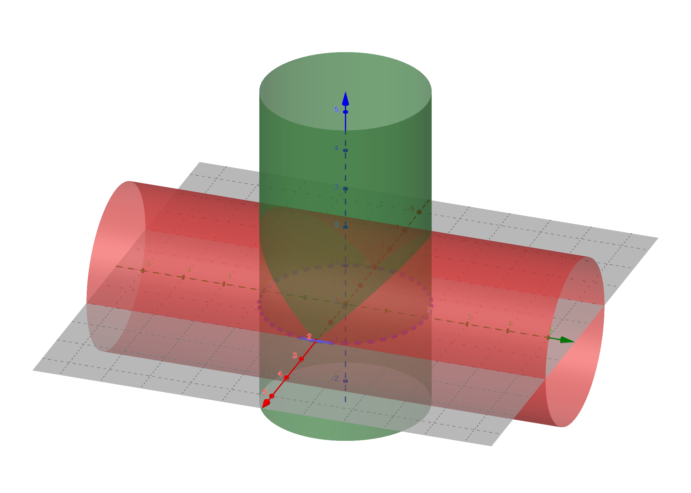
  </a>
  

---
**✏️例子**

交换积分的顺序$\int_0^2 \int_{x^2}^{2x}(4x + 2)\mathrm{d}y \mathrm{d}x$

  

  <a href="https://www.pearsonhighered.com/thomas13einfo/">
     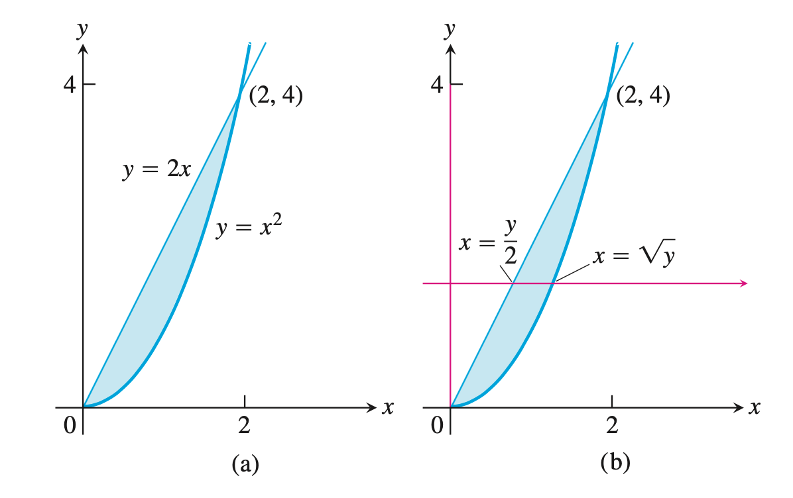
  </a>
  

$\int_0^2 \int_{x^2}^{2x}(4x + 2)\mathrm{d}y \mathrm{d}x = \int_0^4 \int_{y/2}^{\sqrt{y}}(4x + 2)\mathrm{d}x \mathrm{d}y$

---
**极坐标下二重积分的计算**

---
**极坐标**

平面上的点可以用直角坐标$(x,y)$表示，也可以用极坐标$(r, \theta)$表示，见下图：

  

  <a href="https://www.geogebra.org/geometry/yjnsjwv7">
     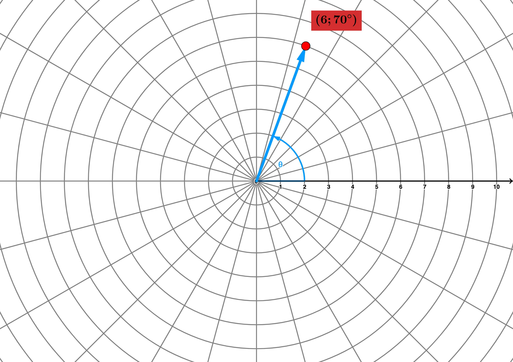
     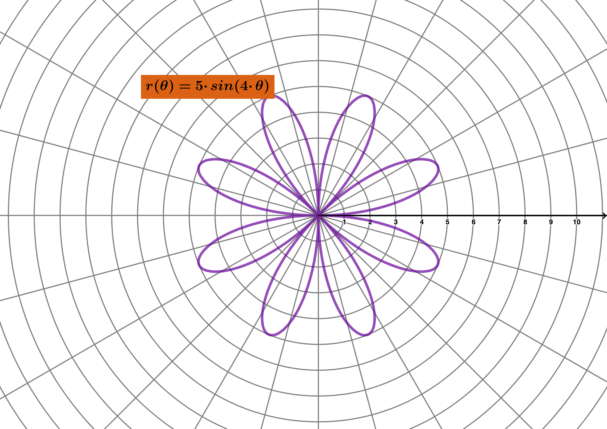
     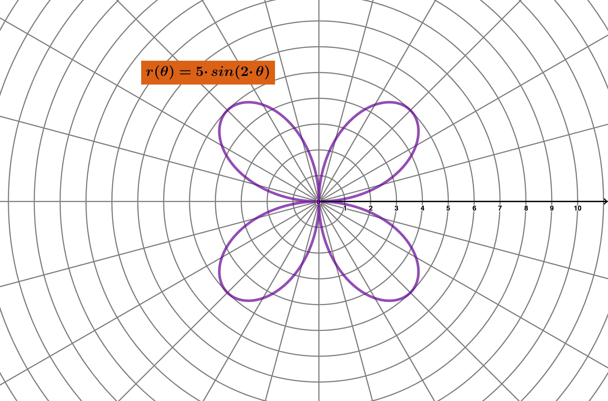
     
     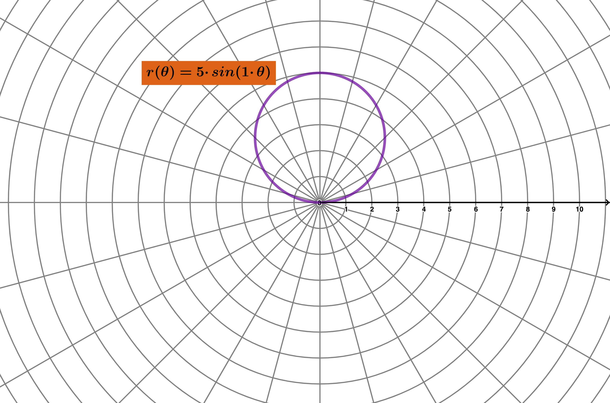
  </a>
  

  

  <a href="https://www.geogebra.org/geometry/qbmcdeun">
     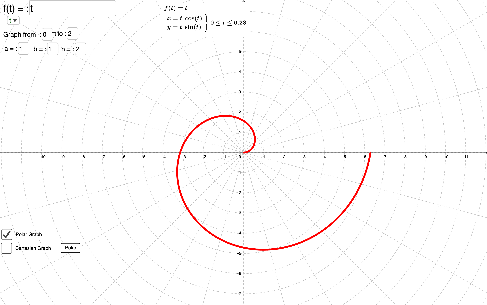
     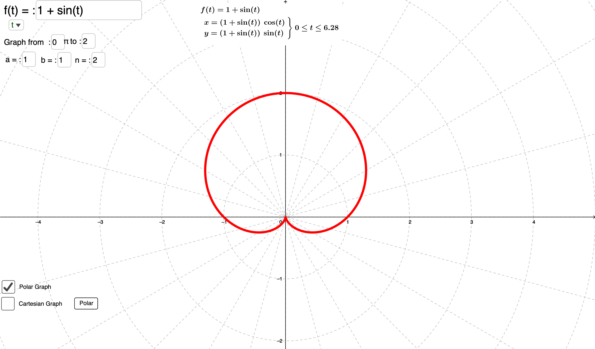
     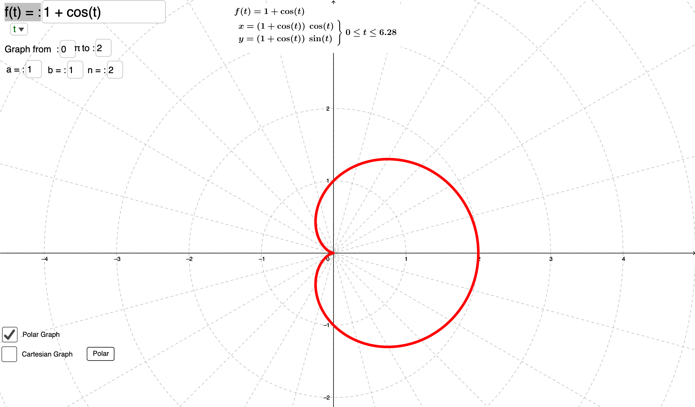
  </a>
  

---
**极坐标系下求区域的面积**

定积分为求解不规则问题的一种方法，该方法简而言之可概括为“分割，取近似（微分或者线性化），求和，取极限。”

+ 求曲边梯形的面积：$\int_a^b f(x)\mathrm{d}x = \int_a^b \mathrm{d}F(x)$，积分为微分的累加，而微分为所求问题增量的线性近似。

+ 下面探讨极坐标下图形的面积：

  

  
  

  $S = \int_{\alpha}^{\beta}\dfrac{1}{2}r^2(\theta)\mathrm{d}\theta$

**极坐标下求二重积**
  
  首先推导一下极坐标下求二重积分。设区域$R: \alpha \le \theta \le \beta, g_1(\theta) \le r \le g_2(\theta)$。采用
  

  $\Delta r, 2\Delta r, 3\Delta r, \cdots, m \Delta r$
  

  

  $\alpha = \theta, \theta = \alpha + \Delta \theta, \theta = \alpha + 2\Delta \theta, \cdots, \theta = \alpha +  m\Delta \theta = \beta$
  

  分割该区域，则定义在区域$R$上的二重积分可以近似的表示为：

  

  $S_n = \sum\limits_{k=1}^n f(r_k, \theta_k)\Delta A_k$
  

这里$\Delta A_k$表示第$k$块小区域的面积，$r_k, \theta_k$为在地$k$块区域上的取值。见下图：

  

  <a href="https://www.pearsonhighered.com/thomas13einfo/">
     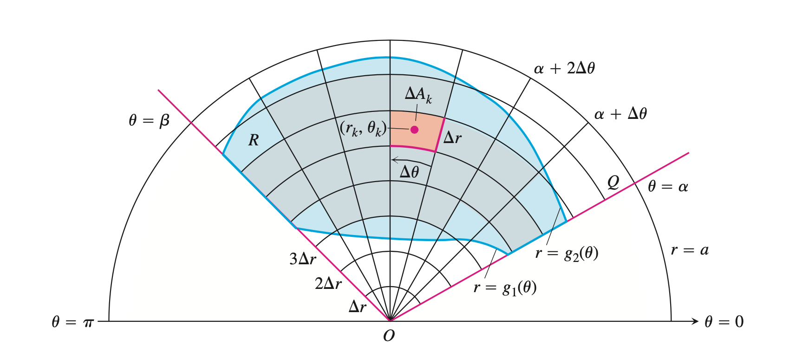
  </a>
  

二重积分可表示为：

  $$\lim\limits_{n \to \infty}S_n = \iint\limits_{R}f(r,\theta)\mathrm{d}A \tag {8}$$

接下来我们来分析$(8)$式中$\mathrm{d}A$的表示。

  

  <a href="https://www.pearsonhighered.com/thomas13einfo/">
     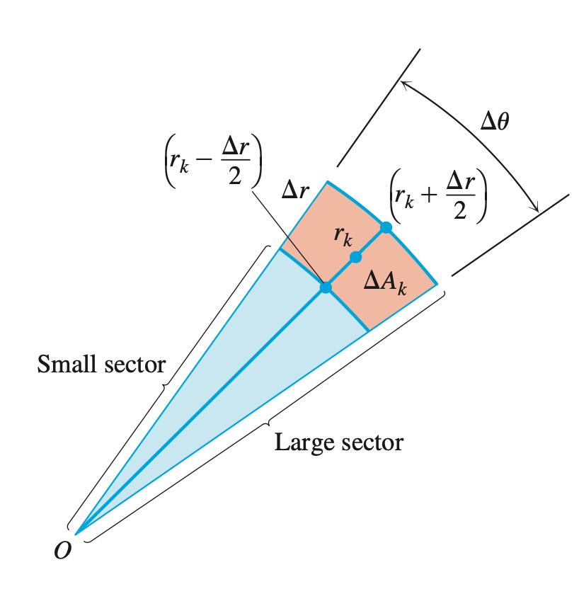
  </a>
  

$\Delta A_k = \dfrac{1}{2}\left(r_k + \dfrac{\Delta r}{2}\right)^2 \Delta \theta - \dfrac{1}{2}\left(r_k - \dfrac{\Delta r}{2}\right)^2 \Delta \theta = r_k \Delta r \Delta \theta$

所以有：

  

  $S_n = \sum\limits_{k=1}^n f(r_k, \theta_k)r_k \Delta r \Delta \theta$
  

故

  $$\lim\limits_{n \to \infty}S_n = \iint\limits_{R}f(r,\theta) r \mathrm{d}r  \mathrm{d}\theta \tag {9}$$

---
**确定积分范围的步骤**

+ 画出图形，写出边界曲线方程和交点的坐标；

  

  <a href="https://www.pearsonhighered.com/thomas13einfo/">
     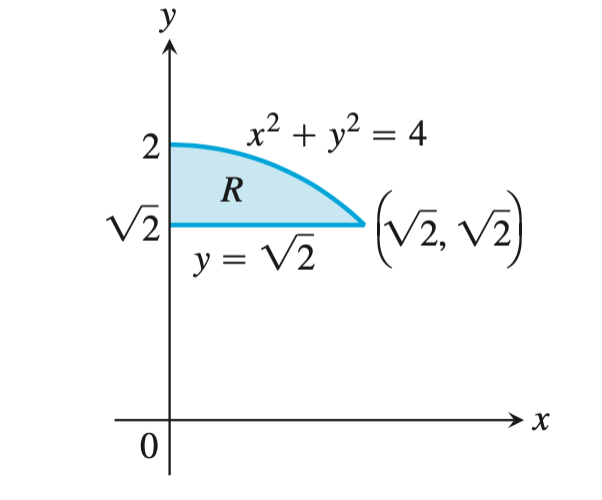
  </a>
  

+ 找到极坐标中$r$的上下限，通俗的讲，找到极径的起始穿入边界和终止穿出边界。

  

  <a href="https://www.pearsonhighered.com/thomas13einfo/">
     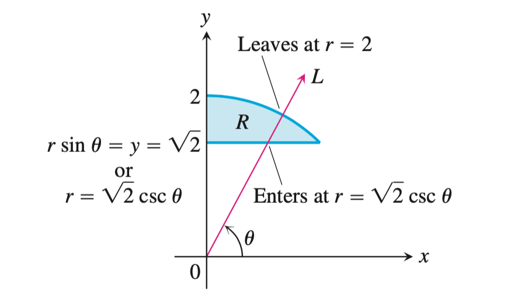
  </a>
  

+ 找到极坐标中$\theta$的上下限，找到$\theta$的最小、最大值使积分区域落入该区域中。

  

  <a href="https://www.pearsonhighered.com/thomas13einfo/">
     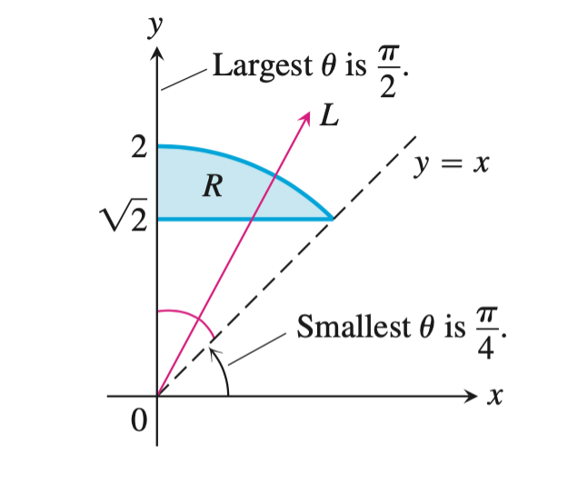
  </a>
  

+ 写出积分表达式：
  

  $\iint\limits_{R} f(x,y)\mathrm{d}A = \int_{\dfrac{\pi}{4}}^{\dfrac{\pi}{2}} f(r, \theta) r \mathrm{d}r\mathrm{d}\theta$
  

---
**✏️例子**

求位于曲线$r = 1$的外面，$r = 1 + \cos \theta$内部区域的面积。
  

  <a href="https://www.geogebra.org/classic/zbmvscgy">
     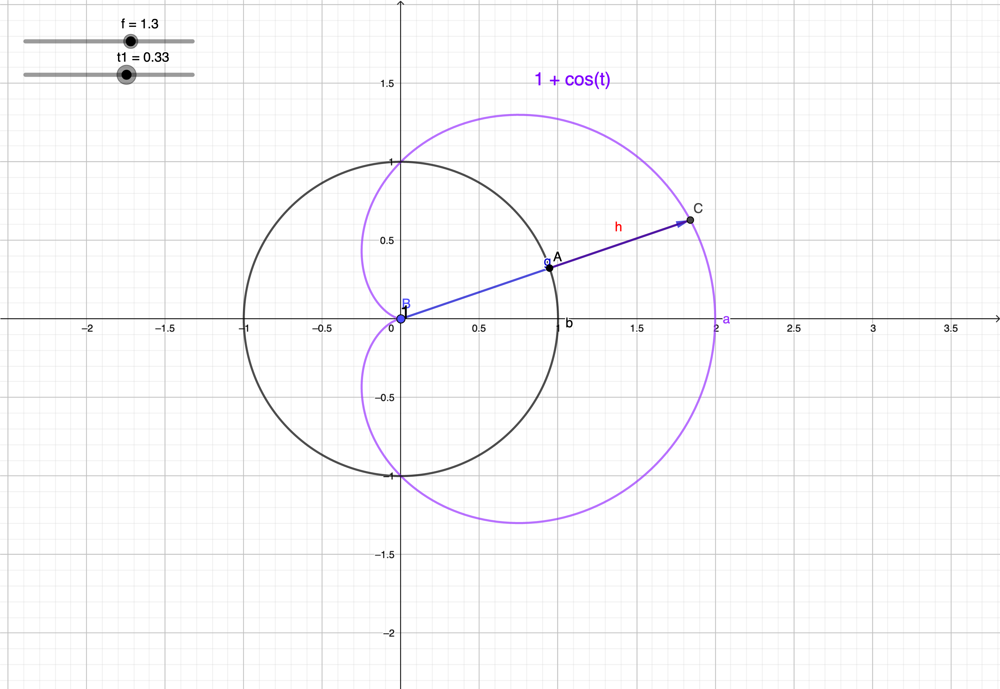
  </a>
  

解： 
$S = \iint\limits_{D} 1\mathrm{d}A = \int_{\dfrac{-\pi}{2}}^{\dfrac{\pi}{2}} \int_{1}^{1+\cos \theta}r \mathrm{d}r\mathrm{d}\theta = \int_{\dfrac{\pi}{2}}^{-\dfrac{\pi}{2}} \dfrac{1}{2}(1 + \cos \theta)^2 - \dfrac{1}{2} \mathrm{d}\theta = 2 + \dfrac{\pi}{2}$

---
**✏️例子**

求球体$x^2 + y^2 + z^2 \le 4R^2$被圆柱面$x^2 + y^2=2Rx(R>0)$所截所得的(含在圆柱面内的部分)立体的体积。见下图：

  

  <a href="https://www.geogebra.org/3d/truf9xmb">
     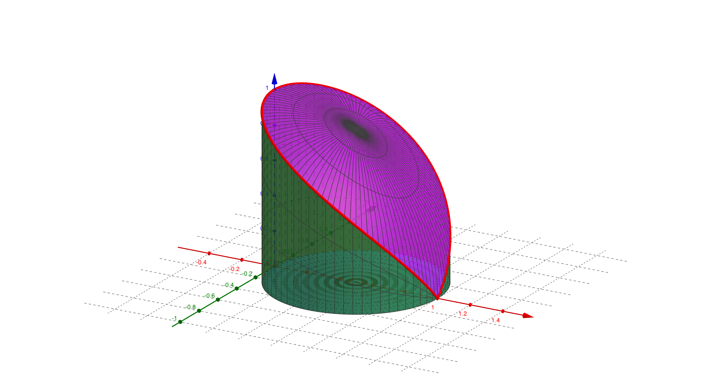
  </a>
  

  

  <a href="https://www.geogebra.org/geometry/f39dg9wx">
     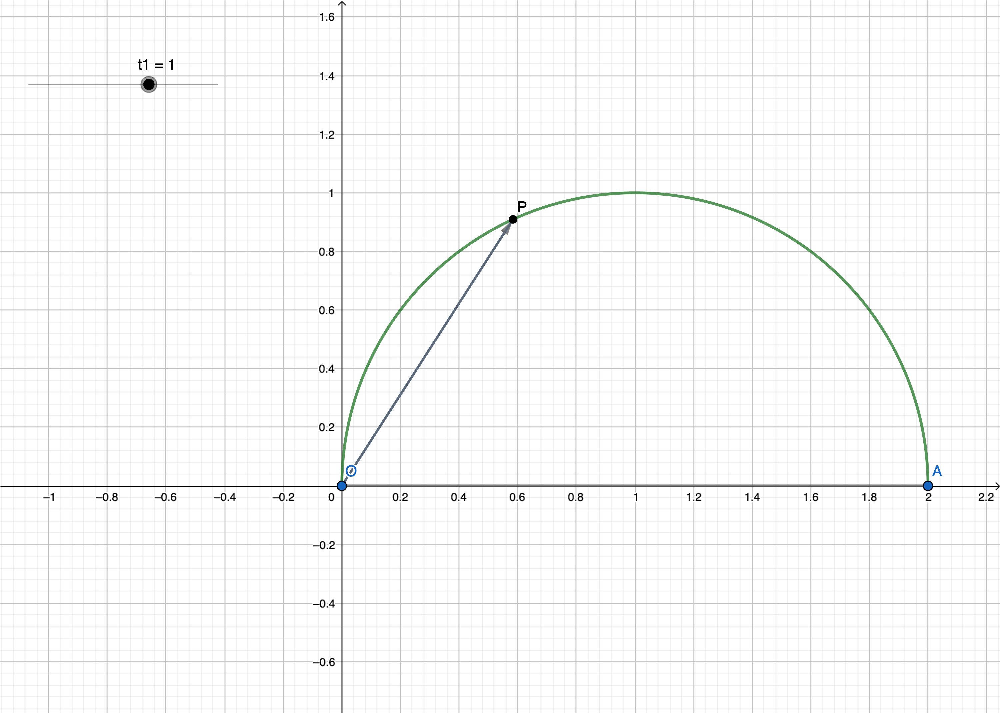
  </a>
  

解： 根据对称性，有

$\begin{split}
V = 4V_1 = 4 \iint\limits_{D} \sqrt{4R^2 - x^2 - y^2}\mathrm{d}A &  = 4 \int_0^{\dfrac{\pi}{2}}\int_0^{2R\cos \theta} \sqrt{4R^2 - r^2}r\mathrm{d}r \newline & = \dfrac{32}{3}R^3 \int_0^{\dfrac{\pi}{2}}\left(1 - \sin^3\theta\right)\,\mathrm{d}\theta = \dfrac{32}{3}R^3\left(\dfrac{\pi}{2} - \dfrac{2}{3}\right) \end{split}
$

---
**✏️例子**

转换直角坐标为极坐标积分$\int_0^{+\infty}\int_0^{+\infty} e^{-x^2 - y^2}\,\mathrm{d}x\,\mathrm{d}y$，并计算泊松积分$\int_0^{+\infty} e^{-x^2}\, \mathrm{d}x$

解：

$
\begin{split}
  \int_0^{+\infty}\int_0^{+\infty} e^{-x^2 - y^2}\,\mathrm{d}x\,\mathrm{d}y & = \left(\int_0^{+\infty} e^{-x^2}\,\mathrm{d}x\right)^2 = \int_0^{\dfrac{\pi}{2}} \int_0^{+\infty} e^{-r^2}r\,\mathrm{d}r\,\mathrm{d}\theta \newline
   & = \int_0^{\dfrac{\pi}{2}} \left(-\dfrac{1}{2}e^{-r^2}\right)_0^{+\infty}\,\mathrm{d}\theta = \dfrac{\pi}{4}
\end{split}
$

所以，

$\int_0^{+\infty} e^{-x^2}\, \mathrm{d}x = \dfrac{\sqrt{\pi}}{2}$

---
 
📚**第二次作业:**

+ 设$f(x,y)$在区域$D$上连续，试将二重积分$\iint\limits_{D}f(x,y)\,\mathrm{d}A$化为不同顺序的累次积分：

  - $D$由不等式$0 \le x \le 2, x \le y \le 2x$所围成的区域;

  - $D$由不等式$y \le x, y \ge 0, x^2 + y^2 \le 1$所围成的区域；

  - $D$由不等式$x^2 + y^2 \le 1, x+y \ge 1$所围成的区域；

  - $D$由不等式$\vert x \vert + \vert y \vert \le 1$所围成的区域.

+ 改变下列累次积分的顺序：

  - $\int_{-1}^{1}\, \mathrm{d}x \int_{-\sqrt{1-x^2}}^{1-x^2}f(x,y)\,\mathrm{d}y$;

  - $\int_{0}^{2a}\, \mathrm{d}x \int_{\sqrt{2ax-x^2}}^{\sqrt{2ax}}f(x,y)\,\mathrm{d}y$;

  - $\int_{0}^{1}\, \mathrm{d}x \int_{0}^{x^2}f(x,y)\,\mathrm{d}y + \int_{1}^{3}\,\mathrm{d}x\int_0^{\dfrac{1}{2}(3-x)} f(x,y)\,\mathrm{d}y$.

+ 计算下列二重积分

  - $\iint\limits_{D}x\sqrt{y}\, \mathrm{d}A$，其中$D$由抛物线$y = \sqrt{x},y = x^2$所围成的区域；

  - $\iint\limits_{D}xy^2\, \mathrm{d}A$，其中$D$由圆周$x^2 + y^2 = 4$及$y$轴所围成的区域；

  - $\iint\limits_{D}e^{x+y}\, \mathrm{d}A$，其中$D$由圆周$\vert x \vert + \vert y \vert \le 1$所围成的区域；

+ 化下列二次积分为极坐标的累次积分：

  - $\int_0^1\,\mathrm{d}x\int_0^1f(x,y)\,\mathrm{d}y$;
  
  - $\int_0^2\,\mathrm{d}x\int_x^{\sqrt{3x}}f(\sqrt{x^2+y^2})\,\mathrm{d}y$;

  - $\int_0^1\,\mathrm{d}x\int_{1-x}^{\sqrt{1-x^2}}f(x,y)\,\mathrm{d}y$;

  - $\int_0^1\,\mathrm{d}x\int_0^{x^2}f(x,y)\,\mathrm{d}y$;

+ 计算下列二重积分(极坐标系)：

  - $\int_0^{2a}\,\mathrm{d}x\int_0^{\sqrt{2ax-x^2}}x^2 + y^2\,\mathrm{d}y$;

  - $\int_0^{a}\,\mathrm{d}x\int_0^x \sqrt{x^2 + y^2}\,\mathrm{d}y$;

  - $\iint\limits_{D} e^{x^2 + y^2}\,\mathrm{d}A$,其中$D$由圆周$x^2 + y^2 \le 4$所围成的区域.

---

## 📌**3. 三重积分**

假设$F(x,y,z)$为定义在空间区域$D$上的一个连续函数(比如说是密度函数)，采用平行于坐标平面的平面网分割区域$D$。在第$k$个小长方体任意取一点$(x_k, y_k, z_k) \in \Delta V_k$，该长方体的边长分别为$\Delta x, \Delta y, \Delta z$。作和式：

$$S_n = \sum\limits_{k=1}^n F(x_k, y_k, z_k)\Delta V_k$$

如果当分割的细度趋于零时，上式的极限存在，即

$$\lim\limits_{\Vert P \Vert \to 0}S_n =\lim\limits_{\Vert P \Vert \to 0} \sum\limits_{k=1}^n F(x_k, y_k, z_k)\Delta V_k$$

存在，我们称$F(x, y, z)$在$D$上可积，记为：

$$\lim\limits_{\Vert P \Vert \to 0} \sum\limits_{k=1}^n F(x_k, y_k, z_k)\Delta V_k = \iiint\limits_{D} F(x,y,z)\,\mathrm{d}x\,\mathrm{d}y\,\mathrm{d}z$$

---
**直角坐标下计算三重积分**

计算步骤如下：

+ 画出积分区域，并画出在坐标平面上的投影区域。

  

  <a href="https://www.pearsonhighered.com/thomas13einfo/">
     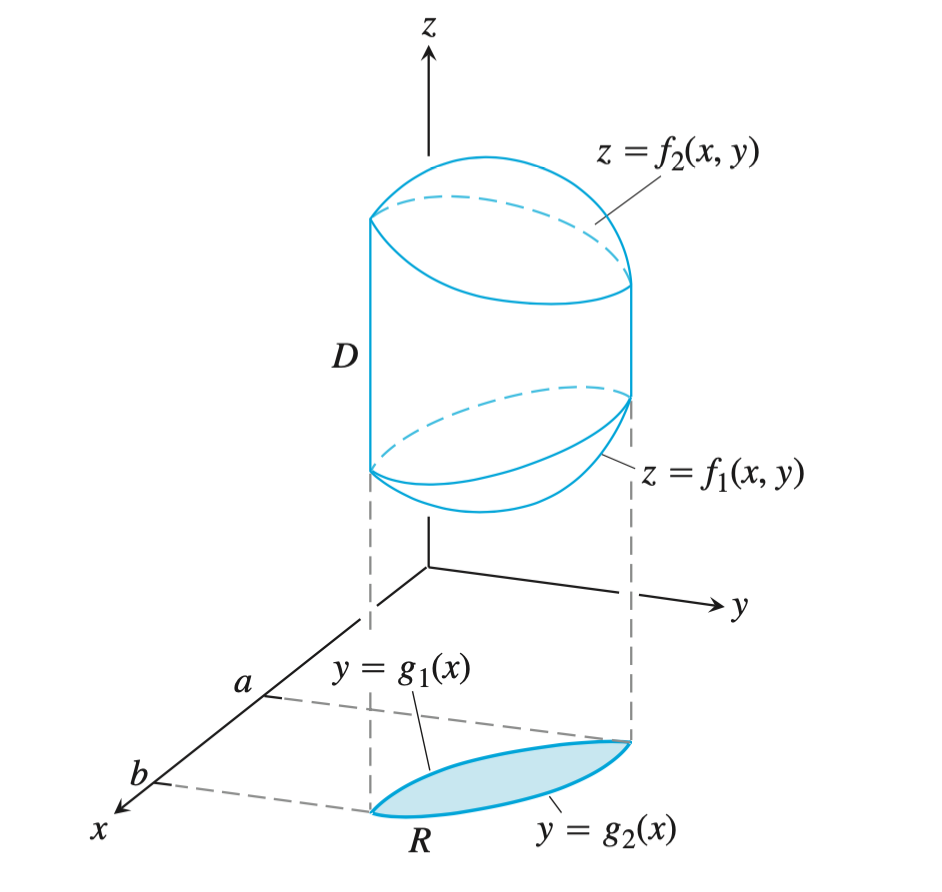
  </a>
  

+ 在投影区域上选取一点$(x,y)$，平行于$z$轴作射线，找到区域$D$的穿入曲面(积分的下限)和穿出曲面(积分的上限)。

  

  <a href="https://www.pearsonhighered.com/thomas13einfo/">
     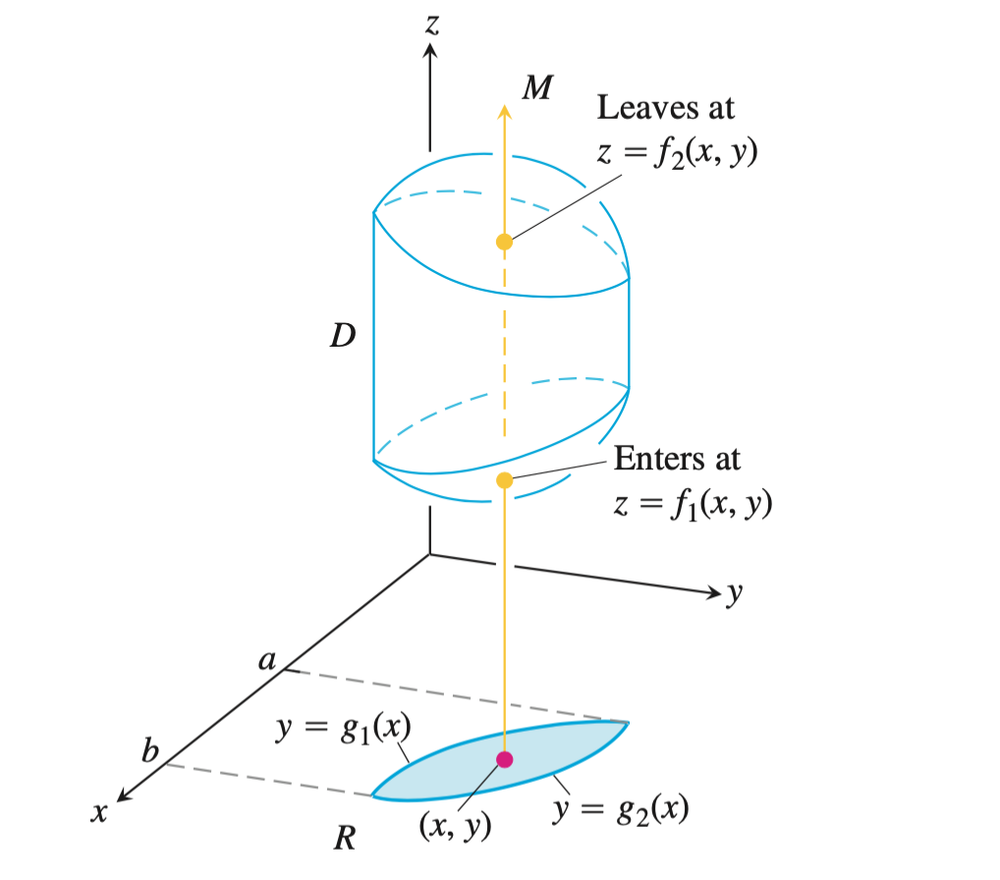
  </a>
  

+ 在投影区域上$R$作射线，找到$y$的穿入边界和穿出边界。下图：射线的穿入边界为$g_1(x)$，穿出边界为$g_2(x)$。这些是$y$的积分上下限。

  

  <a href="https://www.pearsonhighered.com/thomas13einfo/">
     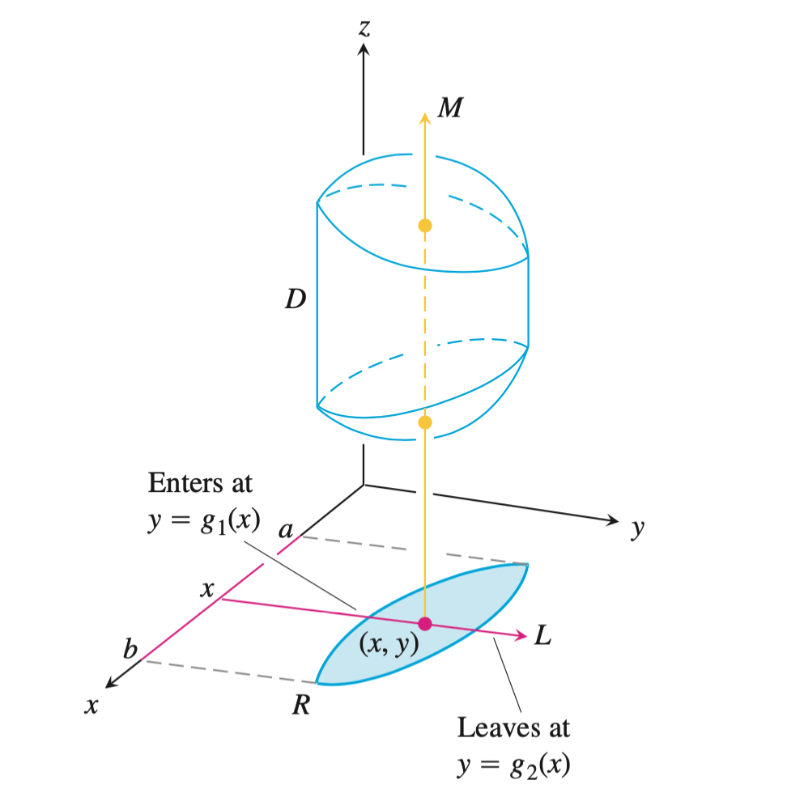
  </a>
  

+ 找到$x$的变换范围，最后将重积分转化为累次积分：

  

    $\iiint\limits_{D}F(x,y,z)\,\mathrm{d}V = \int_a^b \int_{g_1(x)}^{g_2(x)} \int_{f_1(x,y)}^{f_2(x,y)} F(x,y,z)\,\mathrm{d}z\,\mathrm{d}y\,\mathrm{d}x$
  

---
**✏️例子**

<a href="https://www.geogebra.org/3d/kvpsxyeq">
   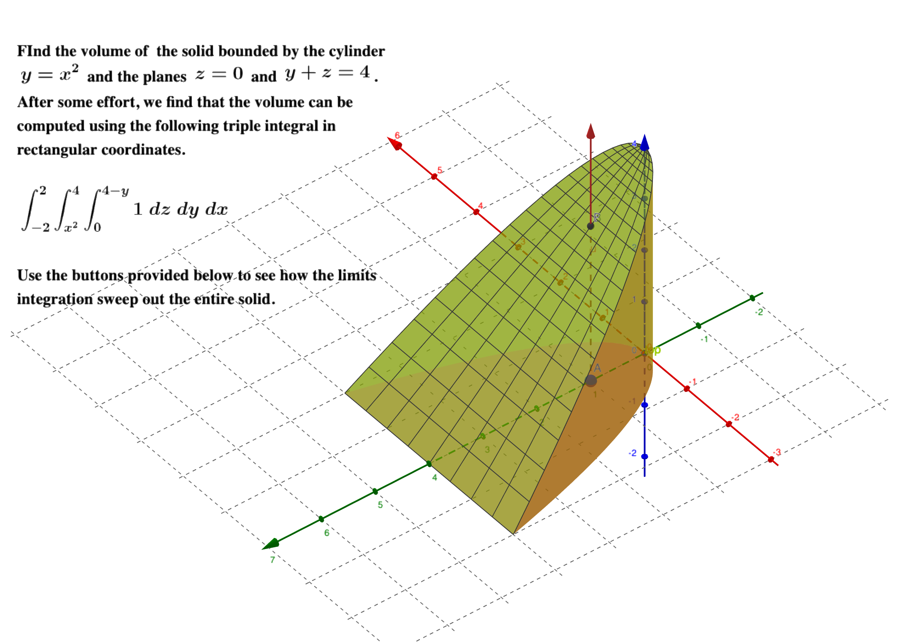
</a>

---
**✏️例子**

<a href="https://www.geogebra.org/3d/vyk4pdrg">
   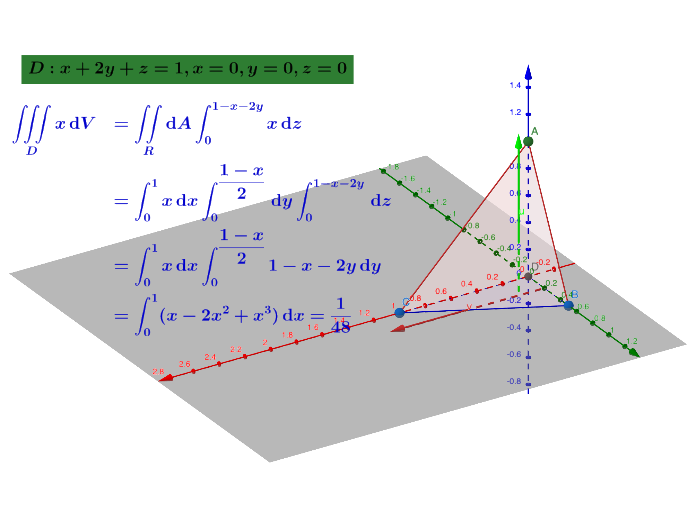
</a>

---
**✏️例子**

<a href="https://www.geogebra.org/3d/gzapyvkr">
   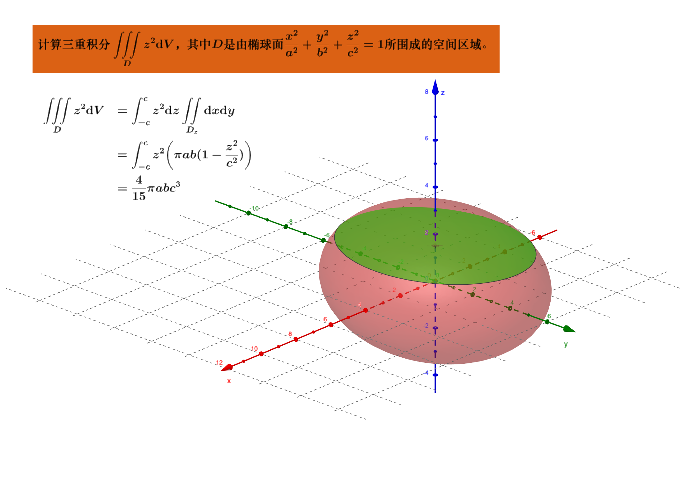
</a>

---
**✏️例子**

<a href="https://www.geogebra.org/3d/xdrxsu7n">
   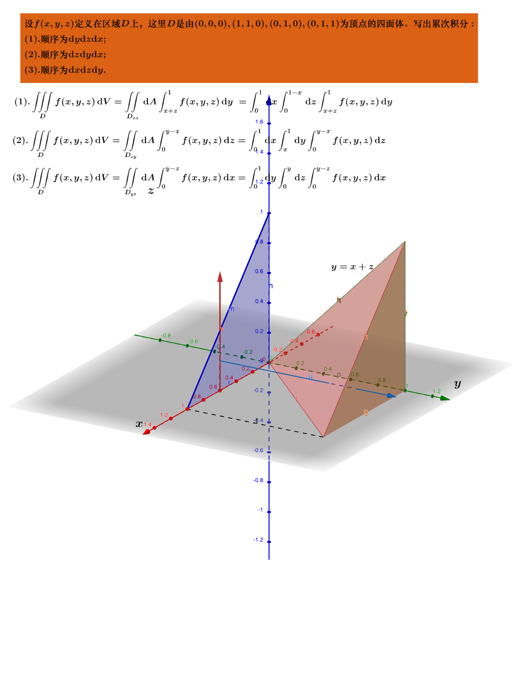
</a>

---
**柱坐标下三重积分的计算**

+ 柱坐标：

---
设$f(x,y,z)$定义在空间几何体$D$上，采用$r = r_1, r_2, \cdots, r_m, \theta = \theta_1, \theta_2, \cdots, \theta_n, z = z_1, z_2, \cdots, z_k$分割几何体$D$(该分割记为$P$)。这是体积元素为:

$\Delta V = r \Delta r \Delta r \Delta z$

其计算见下图：

<a href="https://www.pearsonhighered.com/thomas13einfo/">
   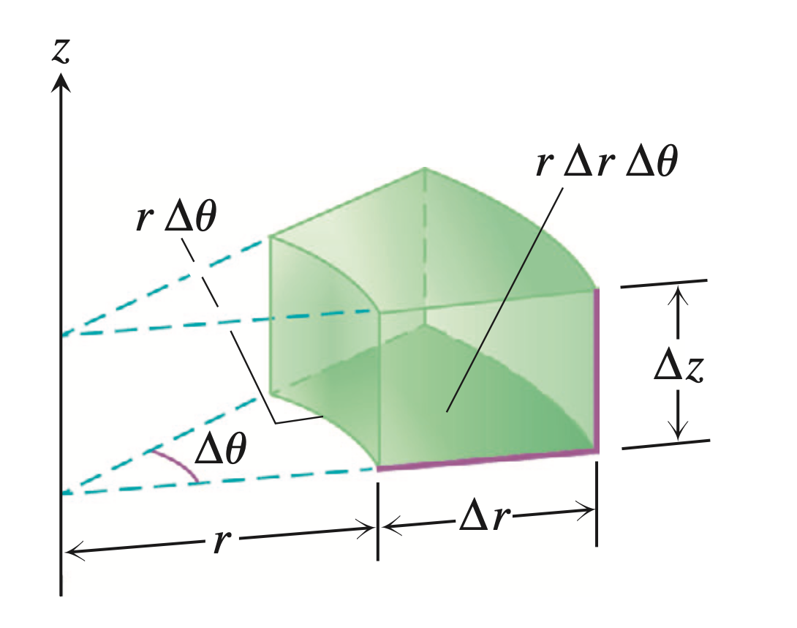
</a>

$S_n = \sum\limits_{k=1}^n f(r_k, \theta_k, z_k)r_k \Delta r_k \Delta \theta_k \Delta z_k$

当分割的细度趋于零时，若极限存在，记为：

$\lim\limits_{\Vert P \Vert \to 0}\sum\limits_{k=1}^n f(r_k, \theta_k, z_k)r_k \Delta r_k \Delta \theta_k \Delta z_k = \iiint\limits_{D}f(r, \theta, z)\mathrm{d}z\,r\mathrm{d}r\,\mathrm{d}\theta$

**柱坐标下积分计算的步骤**

+ 画出空间区域$D$,并画出该几何体在坐标平面上的投影，写出边界曲面的方程。

  

  <a href="https://www.pearsonhighered.com/thomas13einfo/">
     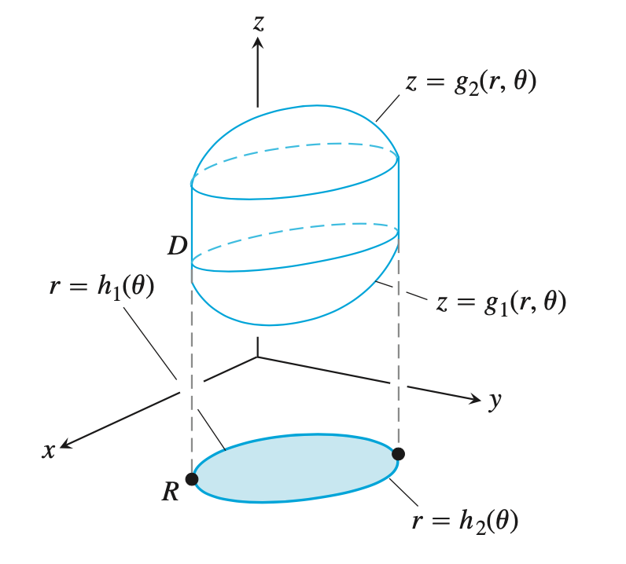
  </a>
  

+ 在投影区域上任取一点，作平行于$z$轴的平行线，找到射线的穿入边界(曲面)和穿出边界(曲面)。注意把边界曲面表达为极坐标的形式。

  

  <a href="https://www.pearsonhighered.com/thomas13einfo/">
     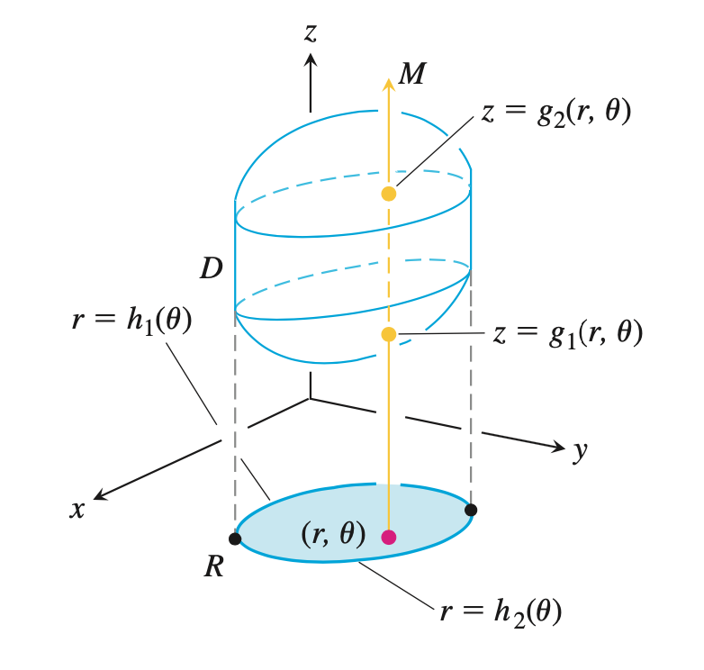
  </a>
  

+ 对投影区域，找到$r,\theta$的变化范围。在$xOy$平面上从原点出发画射线穿越投影区域，确定$r,\theta$的变换范围。

  

  <a href="https://www.pearsonhighered.com/thomas13einfo/">
     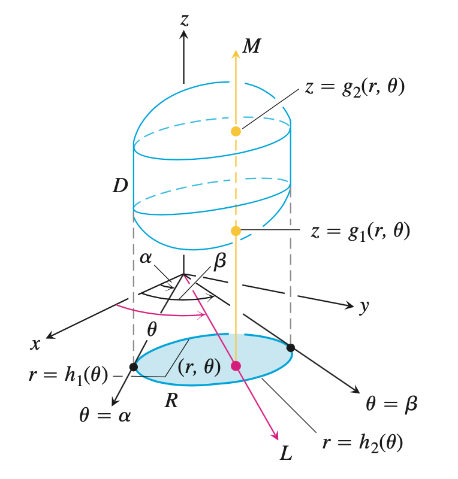
  </a>
  

+ 把重积分写为累次积分的形式，注意积分元素为：$\mathrm{d}zr\mathrm{d}r\mathrm{d}\theta$.

$$\iiint\limits_{D} f(x,y,z)\,\mathrm{d}V = \int_{\alpha}^{\beta}\int_{r = h_1(\theta)}^{r = h_2(\theta)}\int_{z = g_1(r, \theta)}^{z = g_2(r,\theta)}\,\mathrm{d}z\,r\mathrm{d}r\,\mathrm{d}\theta$$

---
**✏️例子**

<a href="https://www.geogebra.org/3d/wcgtgarn">
   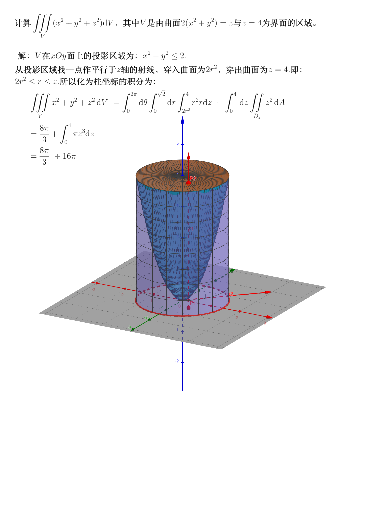
</a>

---
**球坐标系**

<a href="https://www.geogebra.org/3d/bwx6xvgv">
   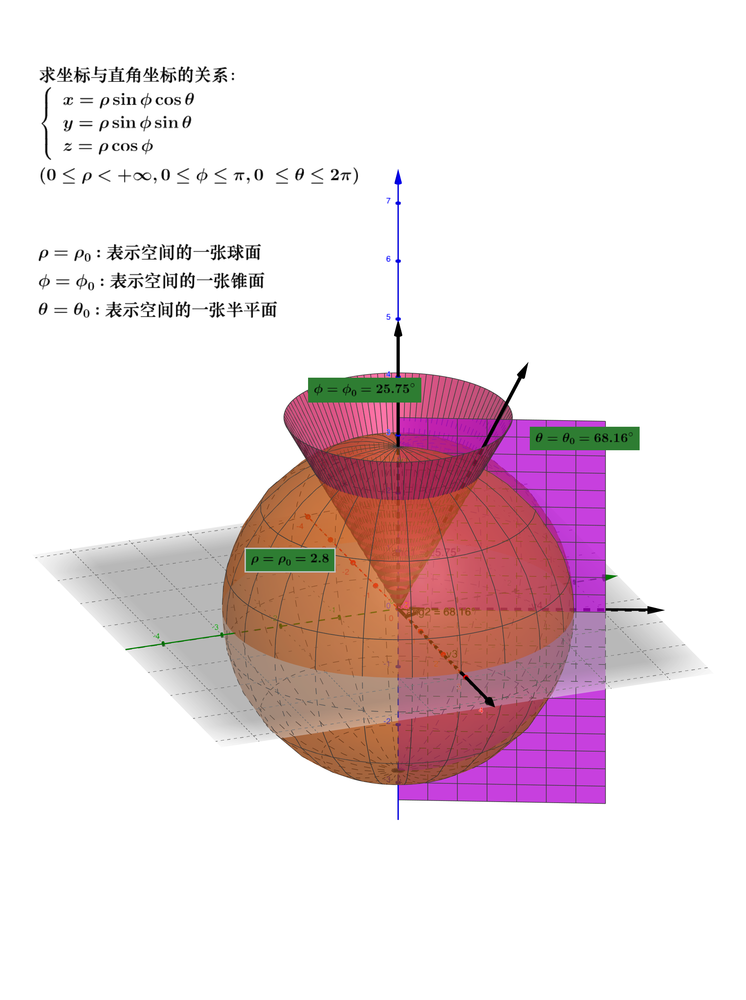
</a>

---
**球坐标下的三重积分**

设$f(x,y,z)$定义在空间几何体$D$上，采用$\rho = \rho_1,\rho_2,\cdots,\rho_m, \phi = \phi_1,\phi_2, \cdots, \phi_n, \theta = \theta_1, \theta_2, \cdots, \theta_k$分割几何体(分割记为$P$)。体积元素为：$\Delta V_k = \rho_k^2 \sin \phi_k \Delta \phi_k \Delta \rho_k \Delta \theta_k $

  <a href="https://www.pearsonhighered.com/thomas13einfo/">
   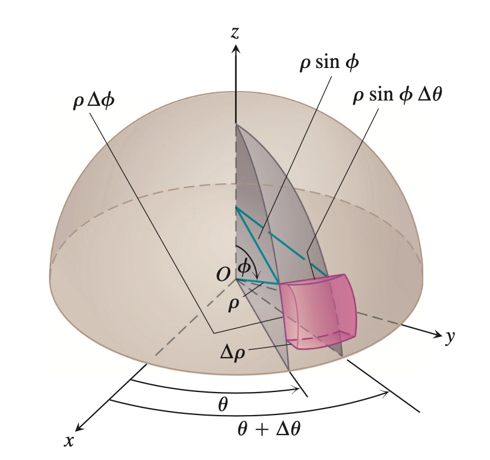
</a>

若当分割$P$的细度趋于零时，和式极限存在，记为：

$$\lim\limits_{\Vert P \Vert \to 0}\sum\limits_{k=1}^n f(\rho_k, \phi_k, \theta_k)\rho_k^2 \sin \phi_k\Delta \rho_k \Delta \phi_k \Delta \theta_k = \iiint\limits_{D}f(\rho, \phi, \theta)\rho^2\mathrm{d}\rho\,\sin \phi\mathrm{d}\phi\,\mathrm{d}\theta$$

---
**球坐标系积分计算步骤**

+ 画出空间积分区域，写出几何体边界曲面的球坐标表达式，并画出在坐标平面上的投影;

  <a href="https://www.pearsonhighered.com/thomas13einfo/">
   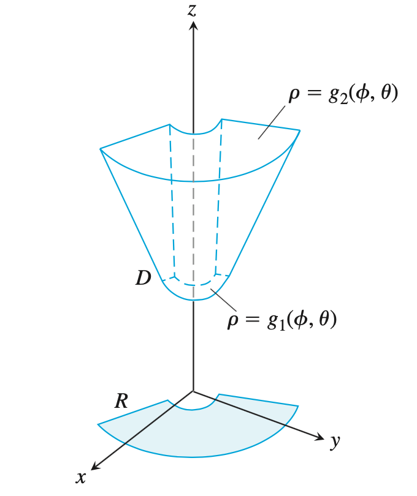
</a>

+ 找出$\rho$的积分上下限。过原点作射线，该射线穿越积分几何体。找到射线的穿入边界(积分下限)和穿出边界(积分上限)。注意：几何体的边界曲面需要用球坐标表示;

+ 找到$\phi$的变化范围:从$z$轴的正向开始，向$xOy$面倾斜。找到$\phi$的变化范围，即$\phi$的积分下限和上限；

+ 找到$\theta$的变化范围：从$(0,0,0)$点出发，在$xOy$面上作射线穿越投影区域，找到$\theta$的变化范围，即$\theta$积分的下限和上限。

  

+ 转换三重积分为球坐标系下的累次积分。

  

    $$\iiint\limits_{D}f(x,y,z)\, \mathrm{d}V = \int_{\theta = \alpha}^{\theta = \beta} \mathrm{d}\theta \int_{\phi = \phi_{min}}^{\phi = \phi_{max}}\sin \phi\mathrm{d}\phi\int_{\rho = g_1(\phi, \theta)}^{i\rho=g_2(\phi,\theta)}\rho^2\mathrm{d}\rho $$
  

---
**✏️例子**

<a href="https://www.geogebra.org/3d/gsr7bcjj">
   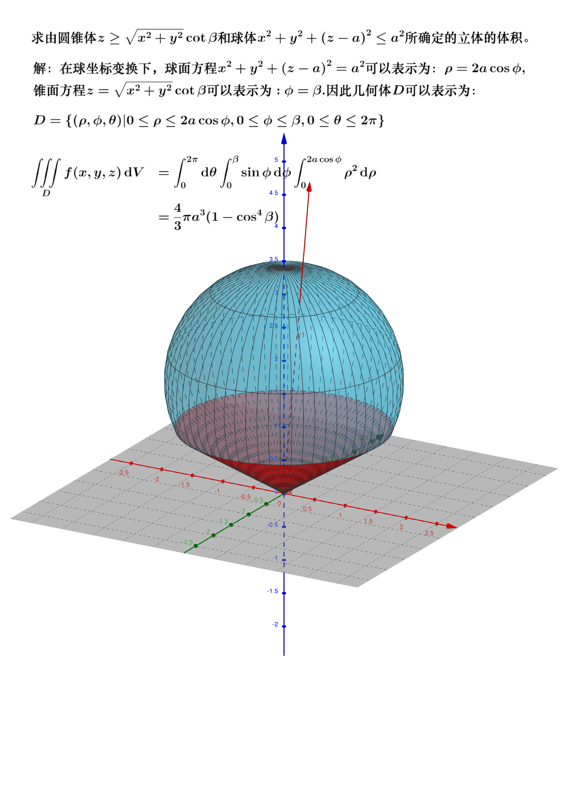
</a>

---
 
📚**第三次作业:**

+ 计算下列积分：

  - $\iiint\limits_{V} (xy + z^2)\, \mathrm{d}v$，其中$V = [-2, 5] \times [-3, 3] \times [0,1]$;

  - $\iiint\limits_{V} x \cos y \cos z\, \mathrm{d}v$，其中$V = [0, 1] \times \left[0, \dfrac{\pi}{2}\right] \times \left[0, \dfrac{\pi}{2}\right]$;

  - $\iiint\limits_{V} (x + y + z)^2\, \mathrm{d}v$，其中$V$由曲面$z = \sqrt{2 - x^2 - y^2}$以及$z = x^2 + y^2$所围成的闭区域;

  - $\iiint\limits_{V} (x + y + z)^2\, \mathrm{d}v$，其中$V$由曲面$z = \sqrt{2 - x^2 - y^2}$以及$z = 0$所围成的闭区域;

---

## 📌**4. 重积分的应用**

---
**曲面的表面积**

设一空间曲面，其方程为$f(x,y,z)=c$，其在坐标平面上的投影为$R$,见下图。如何求解该曲面的面积？

  <a href="https://www.pearsonhighered.com/thomas13einfo/">
   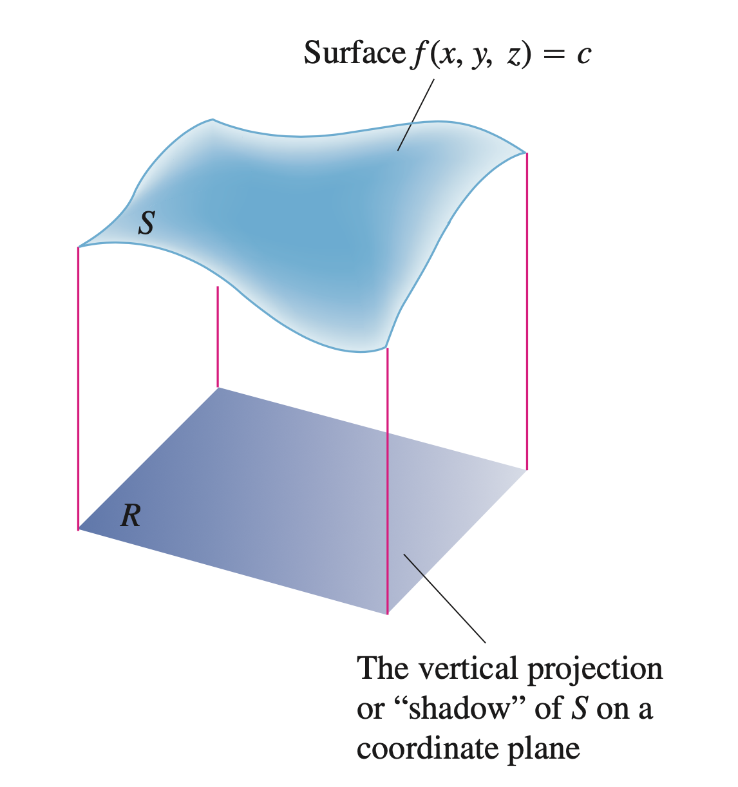
</a>

+ 对区域$R$进行分割，在第$k$块小区域上向上作柱面截得曲面的面积为$\Delta \sigma_k$，截的曲面在$T_k(x_k,y_k,z_k)$处且平面的面积为$\Delta P_k$。则有

$S = \sum\limits_{k}^n\Delta \sigma_k \approx \sum\limits_{k}^n\Delta P_k$

+ $\mathbf{p}$在$T_k(x_k, y_k,z_k)$处垂直与投影平面$R$，$u_k, v_k$为且平面上截出部分两个边的向量。则有以下关系：

  <a href="https://www.pearsonhighered.com/thomas13einfo/">
   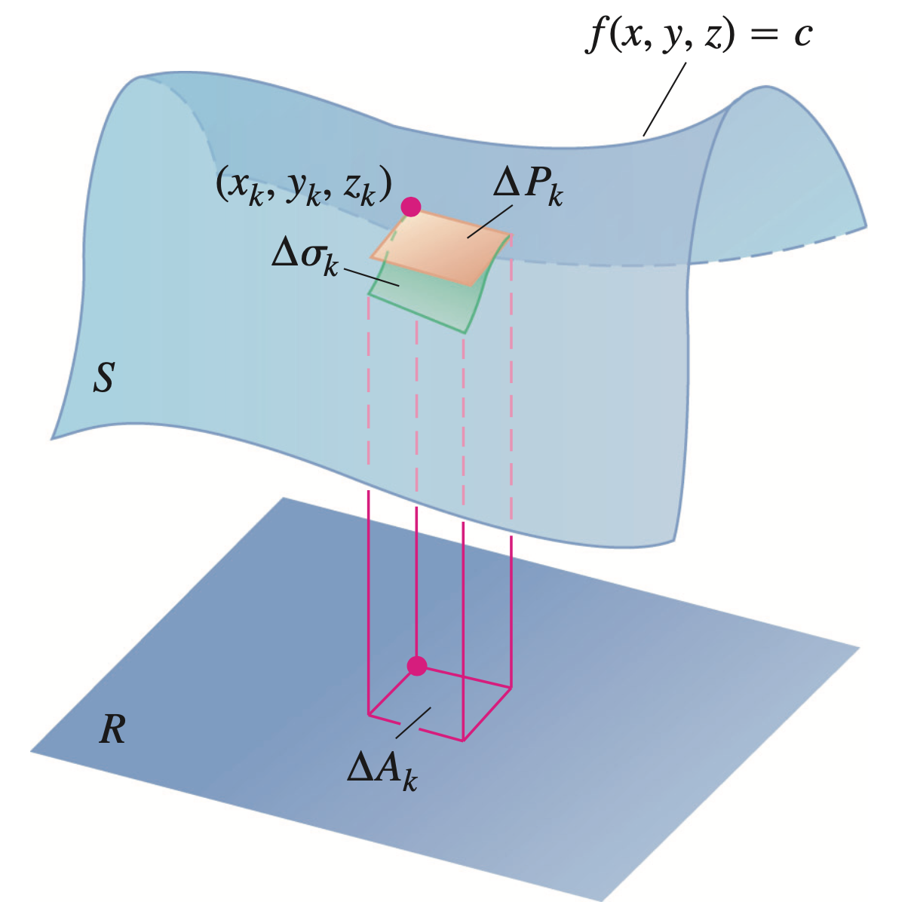
</a>

$\Vert \mathbf{u}_k \times \mathbf{v}_k \cdot \mathbf{p} \Vert = \Delta A_k$

则有：

$\Delta P_k = \dfrac{\Delta A_k}{|\cos \gamma_k|}$

  <a href="https://www.pearsonhighered.com/thomas13einfo/">
   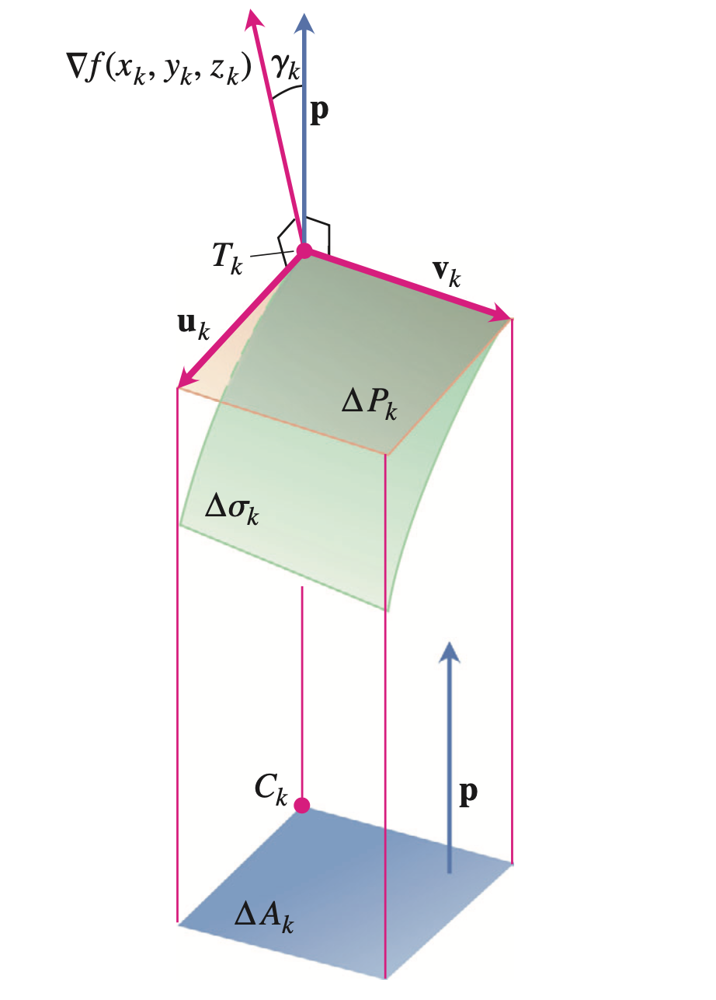
</a>

+ 所以有曲面的面积为：

$$S = \iint\limits_{R} \dfrac{1}{|\cos \gamma|}\, \mathrm{d}A$$

---
**空间曲面如果可以表达为$z=f(x,y)$**

若空间曲面的方程为$z = f(x,y),(x,y) \in R$，则

$\vert \cos \gamma \vert = \dfrac{1}{\sqrt{1 + f_x^2(x,y)+f_y^2(x,y)}}$

这时，曲面的面积表达式为：

$$S = \iint\limits_{R} \sqrt{1+f_x^2(x,y) + f_y^2(x,y)}\, \mathrm{d}A$$

---

**✏️例子**

<a href="https://www.geogebra.org/classic/nsnu7vqt">
   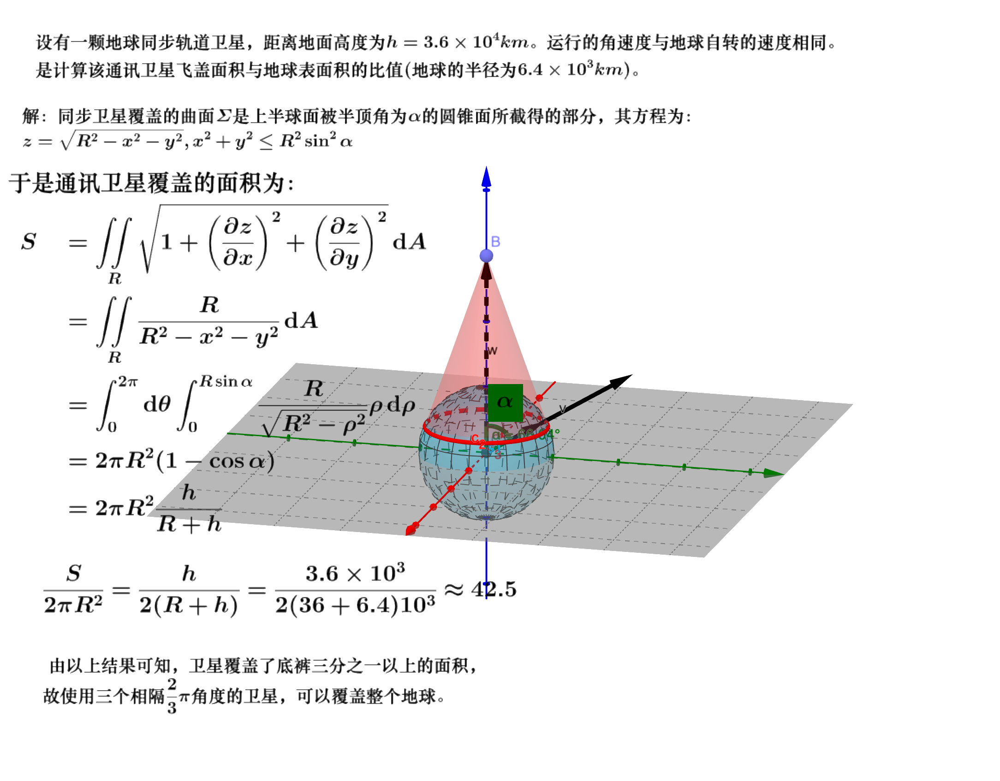
</a>

---
 
📚**第四次作业:**

+ 求球面$x^2 + y^2 + z^2 = a^2$含在柱面$x^2 + y^2 = ax$内部的那部分面积。

+ 求底圆半径相等的两个直交圆柱面$x^2 + y^2 = R^2$及$x^2 + z^2 = R^2$所围立体的表面积。

---

## 📚参考书目

📖1. 《高等数学》上下册（第七版），同济大学，高等教育出版社，2014.7.

📖2. 《数学分析》上下册（第二版），陈纪修、於崇华、金路，高等教育出版社，2004.

📖3. 《数学分析》上下册（第二版），华东师范大学数学系，高等教育出版社，2010.

📖4.  Mathematical Analysis I,II, 2nd ed. V. A. Zorich,  Springer, 2015.

📖5.  数学分析中的典型问题与方法, 裴礼文, 高等教育出版社, 2015.

📖6.  Thomas's Calculus, Weir, Maurice D etc., Addison-Wesley, 2010.

---

# Calculus and its Visualization: an Introduction

<a href="https://www.pearsonhighered.com/thomas13einfo/">
   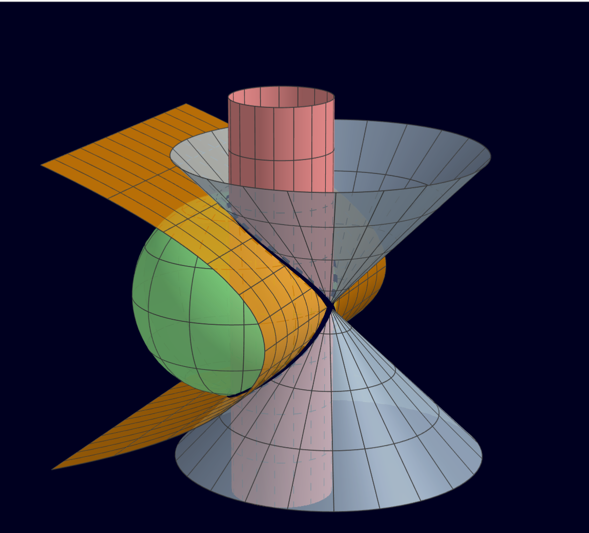
</a>

---

# 👏 THANKS

