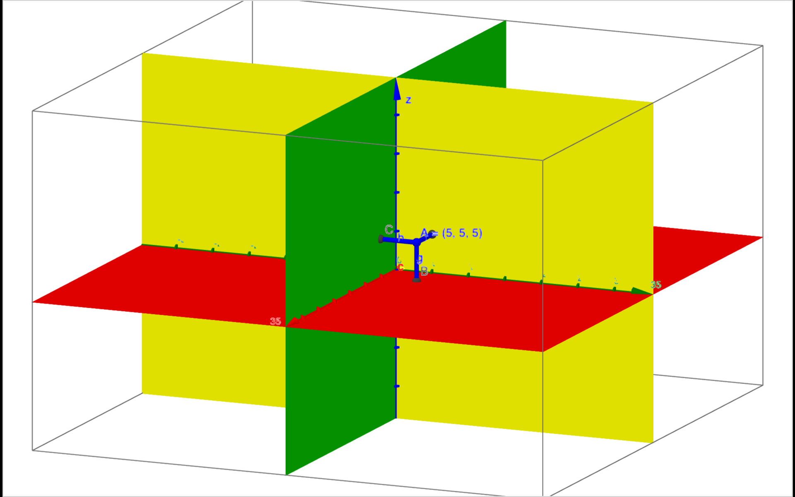

二次曲面指任何n維空間中的超曲面，其定義為多元二次方程的軌跡。其方程可以寫為：
$$\sum_{i,j=0}^D Q_{i,j}  x_i  x_j + \sum_{i=0}^D P_i  x_i + R = 0$$

這裡是常見的二次曲面，該軟件主要借助於[**GeoGebra**](https://www.geogebra.org/)

## 三維空間

## 自己畫一張平面

<iframe  
   height=850 
   width=90% 
   src="https://www.geogebra.org/m/Pd5mkw3j"  
   frameborder=02
   allowfullscreen>
</iframe>

## 橢球面
$$\dfrac{x^2}{a^2}+\dfrac{y^2}{b^2}+\dfrac{z^2}{c^2} = 1$$

<iframe  
   height=850 
   width=90% 
   src="https://www.geogebra.org/m/MxGcbbRM"  
   frameborder=02
   allowfullscreen>
</iframe>

