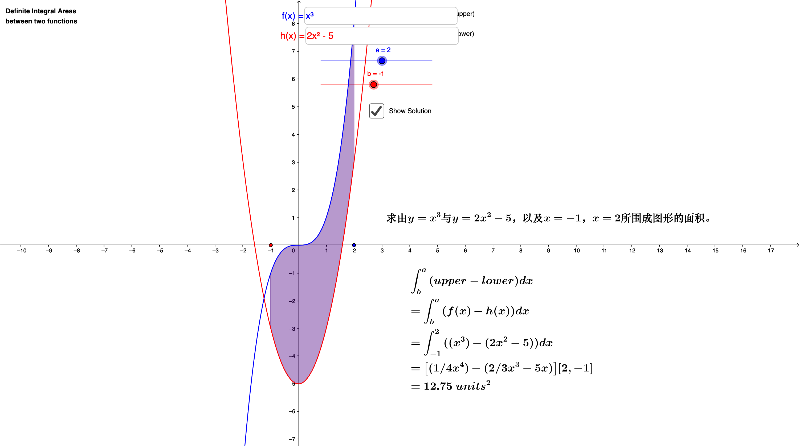
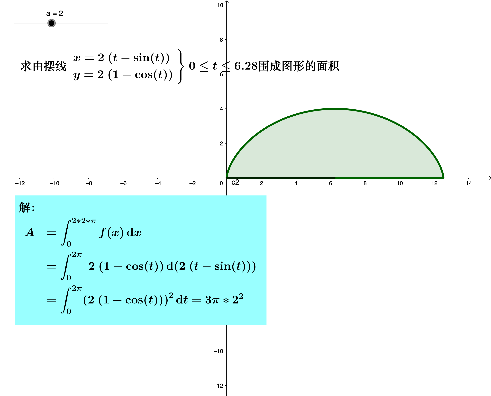
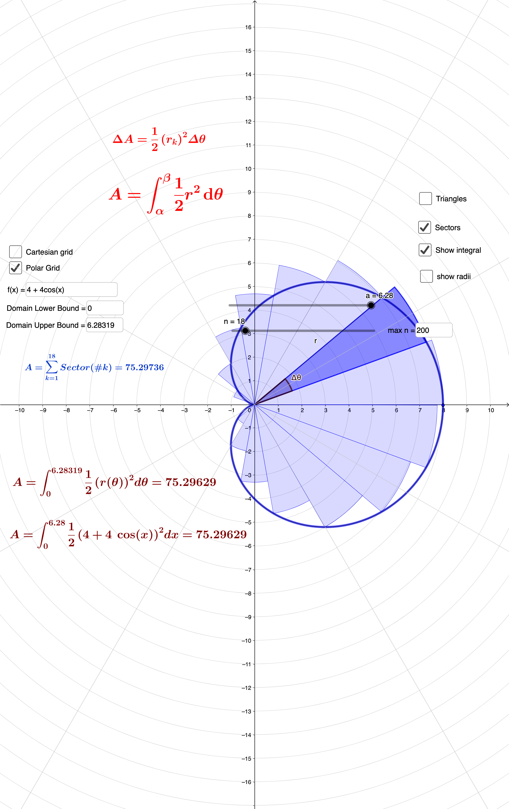

这部分介绍一元函数定积分的应用。

## 目录

+ [第一节 求平面图形的面积](#cotes1)
+ [第二节 由平行截面求体积](#cotes2)
+ [第三节 平面曲线的弧长和曲率](#cotes3)
+ [第四节 物理应用](#cotes4)

---

## 📌**1. 求平面图形面积**

**直角坐标下求面积**

一般地，求由$y = f_2(x), y = f_x(x)$以及两条直线$x = a, x = b$所围成的图形的面积为：

  $A = \int_a^b \vert f_2(x) - f_1(x) \vert\, \mathrm{d}x$

  

---

**参数方程下求面积**

  

---

**极坐标下求二重积**

  

  
---

## 📌**1. 求旋转体的体积**

---

# Calculus and its Visualization: an Introduction

---

# 👏 THANKS

