#随机采样黎曼和：定积分数值算法

- 武国宁

## 引    言

在一些工程模型求解中，往往遇到以下问题：（1）实际问题中有些函数无具体的表达式，只知道函数在一些离散点的函数值。例如函数来自采样；（2）有些函数的原函数不能够用基本初等函数表达；（3）一些函数的原函数需要采用函数级数或者函数的无限乘积来表示。还有的函数的原函数需要借助于特殊函数来表示。这些问题使得数值积分具有了重要的意义。常见的数值积分方法有：（1）利用函数在一些点的加权和来表示定积分。例如梯形公式、辛普森积分公式、高斯节点积分法等等。该积分方法主要针对一元函数求解，若求解的函数为多元函数，虽然可以采用Fubini定理将重积分转换为一元函数积分。但是，随着维数的增加，计算量曾指数增长。（2）另一种数值积分法为蒙特卡洛方法。该方法采用随机投点的方式计算定积分，该方法提高了多元函数数值积分的计算速度，应用较为广泛。
定积分与函数的黎曼和息息相关，而黎曼和与对积分区间分割后在每个小区间上如何取点相关。若把每个小区间上的选点，看作一个在该小区间上服从均匀分布的一个随机变量的取值，则黎曼和为随机变量函数的函数。大数定律说明：对于独立重复试验，频率稳定于概率。当分割给定，可以通过分析黎曼和的重复试验来研究函数的定积分。数值试验表明：随着试验次数的增多，黎曼和的平均值收敛于函数的定积分；随着分点个数的增加，黎曼和呈现正态分布（中心极限定理）。其均值随着试验次数的增多收敛于积分值，其标准差随着试验次数的增加趋于零。

## 随机采样黎曼和

在微积分中，定积分的定义如下：
设$f(x)$为定义在$[a,b]$上的有界函数，在$[a,b]$中任取分点$\left\{x_i \right\}_0^n$,做成一种划分：

$$P:a=x_0<x_1<x_2<⋯<x_n=b$$

并任意取点$ξ_i∈[x_{i-1},x_i]$。记小区间的长度为$Δx_i=x_i-x_{i-1}$,并令$λ(P)=max_{1≤i≤n)}\left\{Δx_i \right\}$，若极限

$$lim_{n\to ∞}∑_{i=1}^nf(ξ_i )Δx_i $$,

存在，且极限值既与划分$P$无关，又与$ξ_i$的取法无关，则称$f(x)$在$[a,b]$黎曼可积。其极限值I称为$f(x)$在$[a,b]$上的定积分，记为：

$$lim_{n\to ∞}∑_{i=1}^nf(ξ_i )Δx_i=I=∫_a^bf(x)dx$$

在上述定义中，任意取点$ξ_i∈[x_{i-1},x_i]$这一要求可以认为$X_i$为区间$[x_{i-1},x_i ]$上服从均匀分布的一个随机变量。当函数$f(x)$和划分$P$给定时，函数的黎曼和

$$σ(f;ξ,P)=∑_{i=1}^nf(ξ_i )Δx_i $$

可以看作随机变量$X_i=ξ_i$的表达式，这里$ξ=(ξ_1,ξ_2,⋯,ξ_n )$。
分析黎曼和$σ(f;X,P)$作随机向量$X=(X_1,X_2,⋯,X_n )$的函数，我们可以从两个方面展开：（1）当分割给定，通过增加重复试验的次数研究黎曼和的稳定性（频率趋于概率）；（2）当分割加细，随机变量增多时黎曼和是否近似于正态分布？
    
   为了回答以上问题，我们进行以下数值实验：讨论积分$∫_0^1x^2 dx$，这里我们把$[0,1]$区间$n$等份：
   
$$P:0/n<1/n<2/n<⋯(i-1)/n<i/n<⋯<n/n=1$$

假设$X_i$为区间$[(i-1)/n,i/n]$上服从均匀分布的一个随机变量：$X_i~U([(i-1)/n,i/n])$。黎曼和$σ(f;X=ξ^1,P)=∑_{i=1}^nf(ξ_i^1 )Δx_i $为一次试验，这里$ξ^1=(ξ_1^1,ξ_2^1,⋯,ξ_n^1 )$。类似于投币试验，我们定义如下：

$$p_m=\dfrac{\sum_{j=1}^m \sigma(f;ξ^j,P) )}{m}=\dfrac{∑_j^m∑_{i=1}^nf(ξ_i^j )Δx_i }{m}$$

p_m表示区间[0,1]n等份后前m次试验黎曼和的平均值。
    
图1为n=10，前100次试验p_m的值；
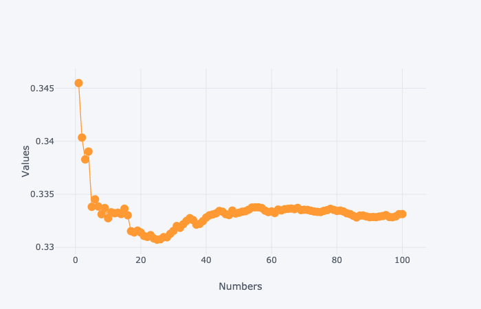

图2为n=10,前10000次试验p_m的值。从图中可以看出，随着试验次数的增加，黎曼和的平均值趋于真实的积分值。这里验证了频率稳定于概率这一事实。
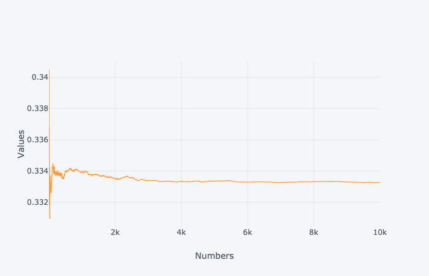

图3（a）为n=10，试验次数为10000次黎曼和分布直方图；（b）上面曲线为每次试验黎曼和的值的分布，下面为黎曼和与真实值的误差；（c）为n=10，试验次数为100000次黎曼和分布直方图；（d）上面曲线为每次试验黎曼和的值的分布，下面为黎曼和与真实值的误差；（d）中上方为每次随机试验黎曼和的值，下方为试验值和真实值的差。（e）为n=100，试验次数为10000次黎曼和分布直方图；（f）中上方为每次随机试验黎曼和的值，下方为试验值和真实值的差。从图中可以看出黎曼和近似与正态分布，该分布的中心为积分的精确值。随着试验次数的增加分布函数愈发趋于一个正态分布。当分割的份数为100时，其计算的精度达到了较大的提高（误差限由0.02减小为0.001左右）。
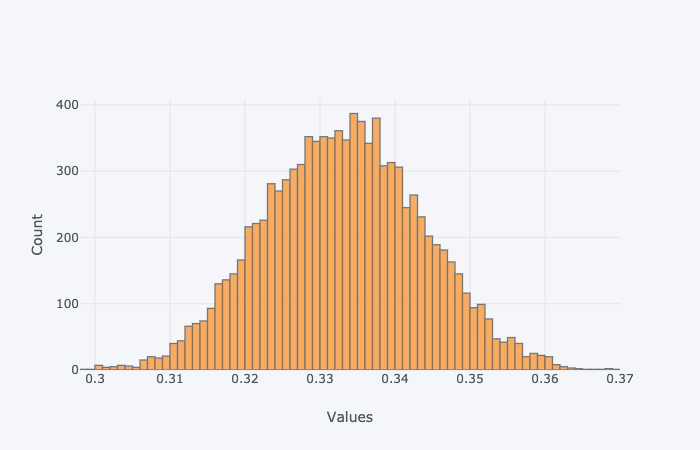
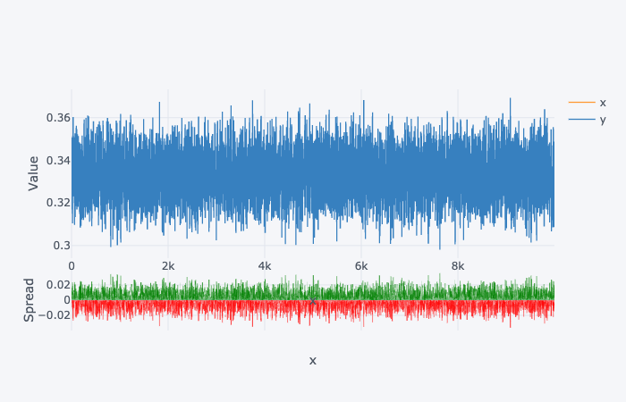
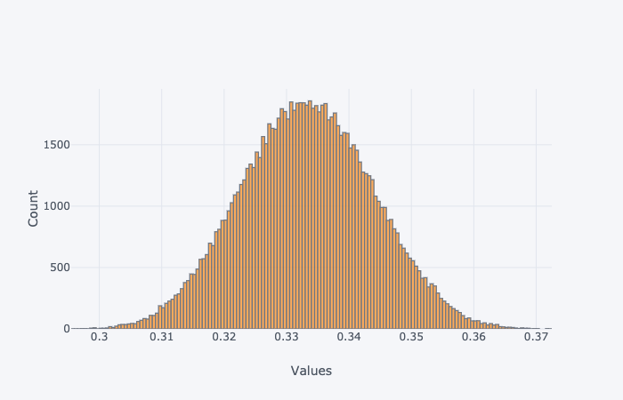
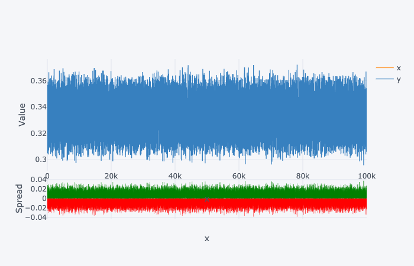
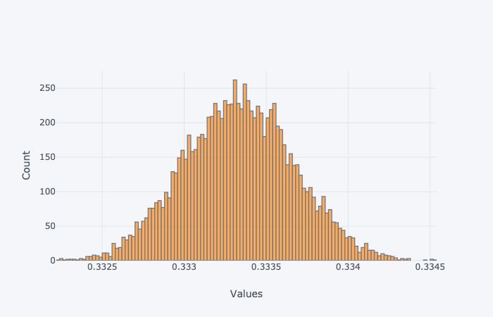
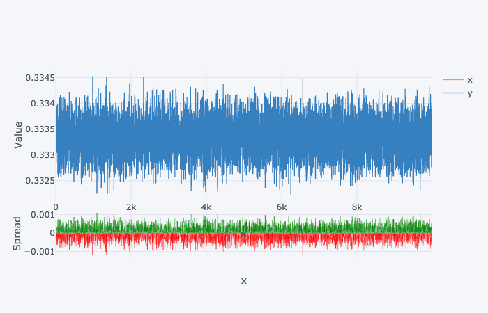

图4为等份的小区间的份数分别为10，20，30，…，500。对于每个分割，试验次数为10000次，分析平均值的变化趋势。从图中可以看出：随着分割次数的增加，黎曼和的均值收敛于真实的积分值。为了分析黎曼和与真实积分值的偏离程度。

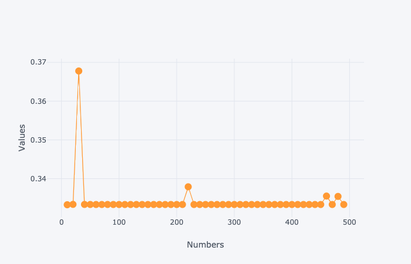
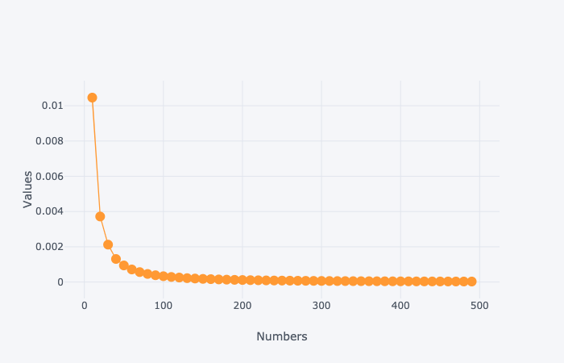
图5分析了针对不同分割的黎曼和的标准差，从图中可以看出：随着分割次数的增加，黎曼和的方差趋于很小的值。

图6为采用蒙塔卡洛随机试验得到的模拟图，其中投点个数为10000次。该方法得到的积分的近似值为0.3300。

为了对比随机黎曼和与蒙塔卡洛方法的收敛速度，我们做了以下试验：对于随机黎曼和，分割的份数为10份（n=10），试验的次数分别为10，20，30，…，1000次。对于蒙塔卡洛方法，投点的个数分别为：100，200，300，…，10000个。这样保证了每次试验两种方法的点数相同。图7、图8、图9、图10分别为定积分
$$∫_0^1x^2  dx，∫_2^{10 }\dfrac{1}{ln⁡x}  dx, ∫_0^1\dfrac{sin⁡x}{x} dx, ∫_0^1e^{-x^2 }  dx$$
两种数值算法结果对比示意图。从图中可以看出：在相同点数的情况下，随机黎曼和方法具有较快的收敛速度。
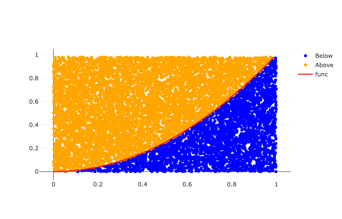
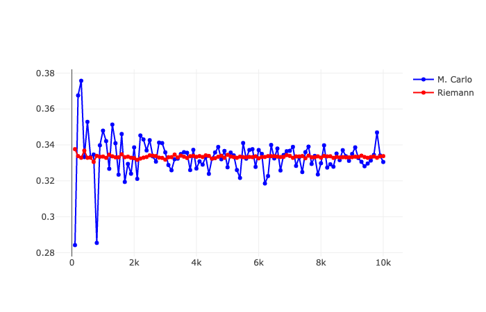
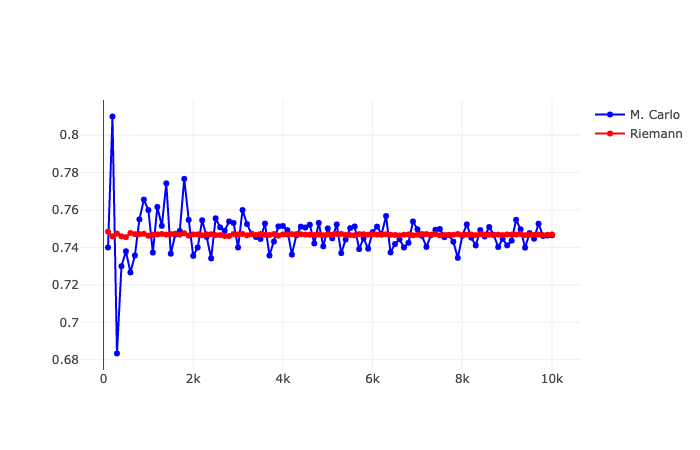
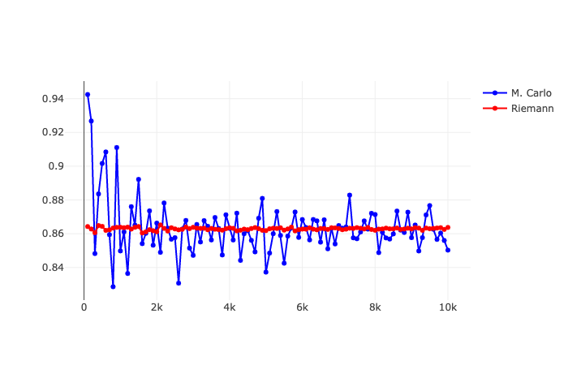
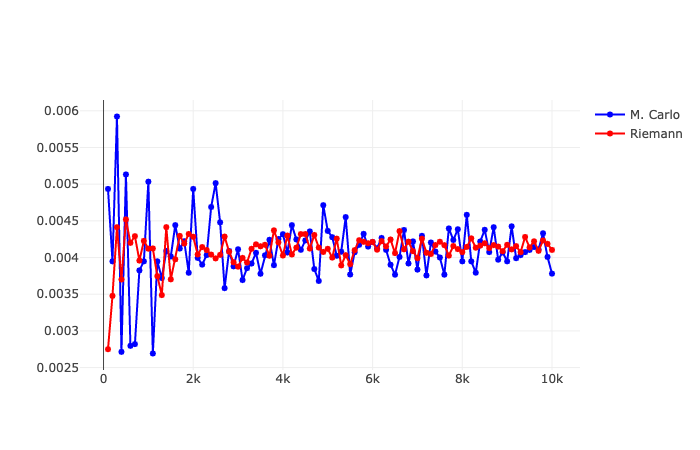

